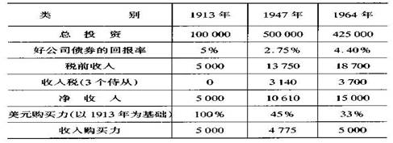

# 第一篇 投资的一般方法

聪明的投资者将获得什么

每个人都知道，在市场交易中，大多数人最后是赔钱的。那些不肯放弃的人，要么不理智，要么想用金钱来换取其中的乐趣，要么具有超常的天分。在任何情况下，他们都并非投资者。

本章将列出本书所要阐述的主要观点。作为开始，我希望重点阐述一下关于个人和非专业投资者的适当的证券组合的概念。但是，首先应明确一下本书题目的定义。作者关于"投资者"的定义是什么?这里，它和"投机者"的定义是不同的。在(证券分析)一书中曾明确给出二者的区别："投资操作是基于全面的分析，确保本金的安全和满意的投资回报。不符合这些要求的操作是投机性的。"

这一定义也许和传统的有点不同。这使得我们在"投资"的标题下包含了对不支付股息的股票，甚至是拖欠的债券的购买，只要投资者确信它们的价值最终将高于它们的成本。在这种情况下，"满意的回报"是以资本收益的形式而非固定收入的形式。

但是，这种操作只是特殊情况。作者主要是讨论一般意义上的投资概念。例如，典型的投资者将注重本金的安全；他将及时购买证券，一般将长时间持有这些证券；他将注重年收入，而非价格的迅速变化。

但在这一点上，现在的投资者和以前的，比如说40年前的投资者是不同的。现在的理性投资也不能完全忽视价格变化，至少应注意避免价格反向剧烈波动时带来的损失。因税务及其他原因，投资者应把重点放在长期本金价值的增长上，而非每年收入，但这并不应被理解为传统交易中利润的快速积累(一个重要的税收利益附属于在获利销售之前至少持有证券6个月)。

本书中"理智"的意思是"有知识和理解能力"，而非"聪明"或"机灵"，或超常的预见力和洞察力。实际上本书所说的理智更多的是指性格上的特点而非脑力上的。这一点对于占投资者大部分的我们称作防御型或保守型的投资者来说尤其正确。我们可以设想这个投资者是一个寡妇，靠留给她的钱为生--她首先必须避免严重的错误或损失；她的第二目的就是不必努力，不必烦恼，不必经常做决定。

但是现代拥有大笔财富的女性，如处在此位置，绝不会把金融事务完全交给别人。她要知道--至少在一般条件下--她的钱被用来做什么了，为什么如此做。她可能要参与投资政策的制定，追踪投资结果，独立地判断别人给予她的忠告。对于把投资的主要事务交给别人的男性来说也是这样。对于所有这些防御型的投资者，理性投资主要是严格遵守一些合理的相当简单的原则

现在我们再讨论第二类投资者，被称为进攻型的或有进取心的投资者。他们和其他人不同就在于他们愿意承担风险--在那种情况中，他们应该被称为投机者。他们的性使得他们愿意花许多时间小心地选择那些合理的且有吸引力的投资。这并不是说这类投资者是该领域的专家。他们的信息或想法很有可能是来自其他人，特别是证券分析家，但最后作决定的是他们自己，决策之前进行估计是根据自己的理解和判断。有进取心的投资者理性行为的第一条原则是他决不会购买没有经过自己研究的或根据自己的经验觉得不满意的证券。

第一次世界大战前的投资和当今投资之比较

让我们暂时回到1914年，当时情况是有趣的和有启发作用的，那时，作者第一次来到华尔街。其时投资的概念刚刚形成，实际限于公司债券领域，而且大多数是铁路债券。那时--就像现在一样--优先股在投资组合中起着很小的和不为人懂的作用。普通股投资亦是如此，但普通投资者或不投资，或小规模地实践，且只限于几种证券。

那个年代，在那些安逸的日子里，退休的商人或寡妇，谋求依赖比如10万美元的资本金，投资于15~20种高质量公司证券，每年的收入就会在4．5％--5．5％之间。每年5000美元的收入足够他或她生活得相当奢侈。

现在投资者的情况在两个重要方面已有所不同。首先，一个人仅靠10万美元投资于高等级的债券所得的收入，别想生活得舒适。这种情形在1947年7月《商业和金融记事》中的一篇小文章中被很好地描述过，文中显示一个靠领取年金生活的人，要想活得舒适，在1914年需10万美元，而在1947年就需50万美元。表2给出了这两个时期及1964年收入和购买能力的比较。因为从1947年以来利率上升和1964年通过税收减免，所以在1964年42．50万美元的年金仅相当于1913年的10万美元。

但是，现在一个有42．50万美元资金的投资者不可能把它们都投入到高等级债券。对债券部分，他很可能被一些免税的州及它们的分支机构的债券所吸引，这些债券中非常质量的种类可能会有3.5％的收益率，而且会减免他的收入税。这个利率开始对于他是比较高的，后来就下降了。

表2 
1913、1947和1964年的收入和购买能力(以美元为单位)

但是最大的改变还在于对普通股的态度，人们不再像50年前那样对普通股持反对态度。对普通股的投资已经成为一个好的投资规划中重要的和不可缺少的一部分。大部分投资者投资于普通股的资金占总投资的比率，低的为25％，高的为75％。造成从以前的保守型做法到这一巨大的变化有几个原因，其中一个原因是人们错以为会赢得比债券更高的收入。但如果因为普通股风险高，便认为其回报也高，那么这种高回报率就是靠不住的，在普通股上的冒险就是不合理的．尽管普通股在有些情况下确实会偶尔带来更高的回报。

一些投资者投资于普通股是基于税收方面的考虑①，出售持有6个月以上的证券所得利润的税率是股息或利息的一半或更少。有的人选择普通股是强调它们可能以现在的收入为代价带来资本收益。当然，这里真正的危险还在于，过于注重资金的增值会导致投机的心理和操作，最后导致金融崩溃。显而易见，除非普通股得到满意的税前利润，否则也就没有税收上的优惠条件。

投资普通股更有力的支持是根据长期的投资经验，而不是仅仅根据更高收益和税收节约的渴望。过去80年或可能更长的历史表明，长线持有多种有代表性的普通股，会带来比债券更高的利润，周期性牛市后期购买的除外。在各种不同的时间周期，也会有巨大的损失，但最后总是证明耐心的持有者是正确的。然而．最不利的情况--股票购于1929年--股票的业绩超过债券用了25年。

在过去许多年中，从普通股得到的出色结果是人们喜欢它们的有力证据。但是，在一定条件下，它可能是产生极强误导的证据。看一下1941年至1960年的情况，在这个时期，普通股整体上以高于15％的复合年速率上涨。这个数据确实太好了，但不可能是真实的，至于将来则是令人担心的。普通股在即将到来的几年继续保持这个上涨速度是不可想象的，因为果真如此，那么每个人都能通过股票致富--就像几乎每一个人认为在1929年他能够做的那样。更严重的是过去的高速率有可能意味着目前股票的价格已过高。1941年以来，惊奇的结果可能预示将来不是好的结果而是坏的结果。在以下讨论中我们必须回到这个问题的两面性解释。

最近几年，使防御型投资者转向普通股的主要的和令人注目的原因是他们思想中的新因素--经验和害怕通货膨胀。1964年的价格水平是1913年的3倍，这主要是由于政府借债及第一次和第二次世界大战引起的货币供应的扩张。在始于朝鲜战争，继而演变为"冷战"的全球紧张的新时期，价格水平呈不规则的但清楚明白的上涨趋势。没人能够确定将来的价格水平，但每个人都意识到，在过去50年，美元的购买力锐减。那些只持有美元--或只能获得固定数量的美元权利，例如债券--的人，他们的实际财富大大贬值。尽管普通股并不总能使投资者不受或通过套购保值以防止通货膨胀的影响，但整体上它们确实增加了投资者的本金价值和年收人．几乎抵消了美元购买力的下降。

如果我们面临更严重的通货膨胀--现在几乎已是普遍接受的假设--那么，以合理的价格购买的普通股就会再度提供比债券更强有力的保护。这一考虑为以下结论提供了极强的逻辑基础：在正常市场水平下，应投资一定比例的资金于普通股(如投资者有其他类型的资产，例如持有自己的企业或商业不动产，这一结论就不那么吸引人了，因为这些本身就是防止通货膨胀的套期保值)。

防御型投资转向普通股与大学捐赠基金的历史有关。开始，法律或传统规定这些资金只能投资于债券或不动产。在30年代，斯坦福大学向法院申请，要求把一部分资金投资于普通股，以在一定程度上减小通货膨胀的影响；赫伯特·胡佛，作为一个大学的理事声明支持这项申请。1964年vance，sanders和company发表的一项调查报告揭示．65个主要大学56％的资金投资于普通股。

在任何情况下都应投资一定比例的资金于普通股，这个建议是不可改变的。我在这本书中接受这个建议，并仅建议投资者考虑这个比例在最低限为25％而最高限为75％以内。

但读者必须充分认识到，把资金投资于普通股会带来严重的并发症和危险。这些不是普通股所固有的性质，而更多的是来自持有者面对股市时的态度和行为。普通股可能是药。理论上来讲，合理地、保守地、心平气和地投资于普通股并不难，但是，实际上投资者要受内在的和外在的混乱的诱惑所困扰。法国人说，从崇高到荒谬仅一步之遥。从普通股投资到普通股投机似乎也只有一步之遥。许多有关华尔街的语言和文学，如果不是编造的，都分析了投资与投机方法之间微小但重要的区别。在这个写照的另一方面，在投资者的潜意识和性格里，多半存在着一种冲动，它常常是在特别的心境和不同于常规的欲望驱使下，未意识到地去投机、去迅速且够刺激地暴富

投资和投机的区别

   
1962年6月，一家权威金融杂志首页刊载了一篇标题为《小投资者卖空，引起跌风》的文章。没有任何术语可以生动地表达盛行于金融界多年的、在普通股投资和普通股投机概念之间的混淆(有必要指出，该文章刊载时，股市已经历了一次暴跌，正呈大的上涨趋势。这不是卖空的好时机)。

这本杂志在这里用"投资者"一词是因为，在华尔街通俗的语言中，任何人只要买卖证券，就成为投资者，而不管他买什么，什么目的，什么价格，用的是现金还是保证金。将此和1948年公众对普通股的态度比较一下，那时超过90％接受询问的人表示他们反对购买普通股。一半人是因为投资普通股"不安全，是一个赌博"，一半人是因为"不熟悉"。令人啼笑皆非(但不奇怪)的是：当普通股以极具吸引力的价格出售时，人们普遍认为购买普通股是投机或冒险行为；相反，当股票剧涨到根据过去的经验毫无疑问是极危险的水平时，购买股票反而成了投资，购买者反而成了投资者。

分析普通股的投资和投机之间的区别总是有用的，且它的消失正是人们所关切的。华尔街，作为一个机构，应该更好地提出忠告以重复这一区别，并在和公众交往中强调这一区别。否则，总有一天，交易所会因没有警告那些投机者而使他们遭受损失，并因此受到谴责。我相信本书的读者一定会形成这样一个明确的概念：风险是普通股交易所固有的--风险和赢利机会是不可分的，这两点投资者都应计算在内。

我刚才所说的表明，对于典型的普通股可能不再有真正的投资，从某种意义上讲，投资者可以等到其价格不包含巨大损失的风险时购买它们。投资者必须认识到普通股投资固有的投机因素，如果股票市场的特点在将来可能发生根本变化，他的任务是把它限制在合理的范围之内．并在财务上和心理上做好出现逆境的准备--这个逆境是重要的尽管可能是暂时的。

应该增加两段来讨论投机的本质，以与现在大多数有代表性的普通股所固有的投机成分相区别。完全的投机既不合法也不道德，并且(绝大多数人)也不能通过它致富。但是，某些投机也是必要的和不可避免的，因为在许多普通股情形中，获利和损失的可能性都很大，风险必须有人来承担。就像有理性投资一样，也有理性投机。但在许多情况下，投机是非理性的，尤其是以下三种情况：(1)意识不到自己的投机行为；(2)缺乏足够的知识和技巧时，严重投机；(3)动用比你能承受的损失更多的资金。

按保守的观点，每个用保证金操作的非专业人土都应该认识到，他事实上是在投机，因此，他的经纪人有义务提醒他。每个人购买所谓的热门股，或作类似的购买，他就是在投机或赌博。投机使人着迷，如果你在这个游戏中获利，你就会更加着迷。如果你想试试你的运气，最好拿出一定比例的资金专作此用，且这个比例越小越好。无论是在操作上，还是在思想上，都不要把投资和投机混淆起来。

防御型投资者将能获得什么

我们已把防御型投资者定义为那些主要感兴趣于投资的安全性和不愿烦恼的投资者。他应该遵循一个简单的把证券划分成两部分的投资规划，一部分是合适的债券，另一部分是多样化的主要普通股。胜任的证券分析者或投资顾问都应备有这样的股票清单。投资者必须在与投资于普通股的有价证券比例有关的两种行动之间做出选择。一种是把这个比例固定，例如永远是50％；当市场水平大幅度上升或下降使这个比例改变后，例如到55％或45％，他将进行不经常的调整以恢复到50％的比例。另一种选择是，当他感觉到市场水平高得危险时，他可以减少普通股的持有量，使其低于50％(低到25％)；相反，如果他认为股票价格的下跌使得它们很有吸引力时，他可以提高这个比例(可能高到75％)。

有价证券中债券比例比较容易确定。如果本金不多，最好投资于美国储蓄债券，它给予持有者各种权利以弥补比其他高等级债券的收益率低的缺陷。其他投资者可在可提取的银行存款和美国政府债券之间选择，现在可得的收益率为4 .25％；可投资于顶级公司债券，收益率接近4．5％；也可投资于a级州和市政免税债券，收益率可达3．5％(后者当然仅适用相当高的税收等级)。

重要的普通股的股息率不能像高等级债券的回报率那样精确预测。在1964年末，低于3％；但过去10年，市场水平平均约为3．7％。对于每年的收入，股票持有者有权要求用来增加未分配利润或再投资利润。这就意味着，除非将来发生意外，典型的普通股的基本价值会稳定增长，这反映平均或"正常"市场价格也会相应增长(这一事实以及通货膨胀的影响，是使股票的平均价格自美国内战以来明显呈上涨趋势的原因)但这个保证性的陈述并没有包含当前(1964年)的价格水平可能是高得危险的可能性。就像上面所说的，股票正常或平均价格的稳定增长，不能防止股民的股票严重的和可能是持续的贬值。这种风险不可避免，相反，你如不投资于普通股，假如市场水平保持现有或较高水平，你就会承受相应的惩罚。

在正常市场水平下，如果防御型投资者能把一半的本金投资于在市场正常水平上获得的普通股--无论这些普通股是什么--另一半投资于收益率为3，5％的免税债券，他的收入回报率就会在3．5％和4％之间，约有一半免税。另外，他的股票也会随着利润的再投资而升值，从而使他的回报率可能会高达4．5％。这个成果虽不能说惊人，但可比较轻松地取得。另外，它可保护投资者不受大规模的通货膨胀引起的购买力下降的影响。

在前一版中，我在这一点增加了下列陈述："……还有一个好的机会，即使没有进一步的通货膨胀，股票的投资回报率也很有可能比我们估计的更好。因此，只要防御型投资者的购价不高于正常价值，他就会收到满意的投资结果。"自1949年以来，普通股的回报率比初始的4％高得多，且后来比我允诺的5％也高得多。这是对过去的结果满意的源泉，但我已经指出，在股票市场价格大幅度上升的情况下，产生这个好的结果可能对将来是威胁而不是促进。

我简要地提一下三个与防御型投资者相关的补充概念和实践。第一个是购买主要的投资基金股份以作为产生自己普通股组合的替代(我们将使用术语"投资基金"而不是现在不精确的"投资信托"或它的官方的但含糊的"投资公司"的说法)。作为替代，他可以利用在许多州由信托投资公司和银行操作的"普通信托基金"或"混合基金"；或者，如果资金雄厚，他可以利用投资顾问机构提供的服务。这将会沿着标准线对他的投资规划进行专业性的管理。第二就是"美元成本平均值"方法，其隐含着每月或每季度投资等额的资金于普通股上。用这种方法，在价格水平较低的股市上购买的股票就比水平较高时多，最终，持有的所有股票就有满意的平均价格。第三为"方程式计划"，就是前面提到的投资者希望普通股持有量在最低25％和最高75％之间变化，与市场的行动保持相反关系。这些思想对于防御型投资者很有价值，在后面章节还将详细讨论。

进攻型投资者将能获得什么

进攻型投资者，当然有比防御型的或被动的同伴赚更多钱的欲望和期望。首先他要相信，他的结果不会更糟。但是，将大量的精力、研究和天生的能力带入华尔街，结果不是赢利而是遭受损失，这是常有的事。这些有利条件如利用不当，就与不利条件没有区别了。因此，进攻型投资者开始就应清楚，什么策略成功机率大，什么方针成功机率小。

我给出5种标准方法，进攻型投资者可用来赚取超额利润。

1，普通交易--全面参与市场活动，就像"平均指数"反应的那样。

2．有选择的交易--选择在一年左右时间中比一般股票在市场上表现更好的证券。

3．买低卖高--当价格及行情较不乐观时入市，等到两者都上升时卖出。

4．长线选择--选择将来比一般企业更成功的公司(这些股票常被称作为"成长型股")。

5．廉价购买--购买那些经可靠的方法衡量，价格大大低于它们真实价值的证券。

冒着疏远读者的危险，我明确地说本人并不认为普通交易或有选择的交易在投资实践中有什么作用。二者都有投机的特点，因为要使其取得成功，靠的不仅是投资者的预见力和交易能力，还要求比同一领域的大量的竞争者更聪明。投资，涉及到将来，依靠将来以证明现在是否正确。但是，投资者若要利用现有资金得到尽可能多的现钱，除非他根据过去的记录和经验进行判断，并能看到潜在的危险并进行防范，而不是误以为靠自己的预见力就能赚钱，投资才有意义。

投资需要并预先假定安全边界，以防事态的发展与预料的相反。在市场交易中，就像在其他形式的投机中一样，错误是没有边界的；你要么对，要么错，错了就意味着损失。因此，尽管我相信普通的理性的读者可以学会在市场交易中赚钱，我还是建议他们去尝试其他的方法。每个人都知道，在市场交易中，大多数人最后是赔钱的。那些不肯放弃的人，要么不理智，要么想用金钱来换取其中的乐趣，要么具有超常的天分。在任何情况下，他们都并非投资者。

第三种形式的努力--买低卖高原理，好像只有在特殊情况下才能做到，不太实用。其实，这一方法和其他方法有根本的区别．它注重的是已有价值，而非期望市场的下一个运动；低价购入的股票，即使价格不再上涨，其收益和红利也不会让购买者失望。当然，在过去，后者是不真实的；在市场萧条情况下，购买者最后总能以比购价高得多的价格卖出；因此，等待购买机会，直到价格明显很低，也属于投资的内容、这件事并不容易，因为市场具有不规则的大幅波动的特征，特别是近40年；而且，如果投资者试图在将来遵循它，结果将有错误计算的危险。因此，有关这一技巧的意见不是确定的，尽管它确实出现，但对普通智力的投资者我不能在财政和心理上证明他一定能成功(其实，大多数有关的时机准则，本质上都是买低卖高准则的折中运用，并被用来保证它的优点，而不必冒着完全"错过市场"的内在风险)。

是否投资者应该试图买低卖高，或是否他应该满足于不管行情如何持有合理的证券--仅接受它们的内在品质的周期性检验--是个人必须做出的几个选择之一。这里，投资者的性格和个人地位是决定因素。一个和市场相关的人，如果习惯根据经济前景形成判断并据此采取行动，那么，对于一般的股票价格，他可能会形成类似的判断。这样的投资者极有可能受买低卖高技术的吸引。但是，专业人员及富有的人，可能更容易从一年年的价格波动中清理他们的思想。对这群人，更有吸引力的选择可能是，当资金允许时谨慎地购买，并注重几年的收入回报。

下一章将更深入地讨论投资者和市场运动。

根据第四种方法．投资者选择证券，特别是选择普通股时，也要关心它们的长远收益。选一个好的公司，几年后，收入可以翻3倍，股票可以翻4倍甚至更多；而选一个不好的公司，几年后则会大大损失股票的价值。因此，大多数进攻型投资者，应把主要精力花在正确估计他们检验的公司的发展前景上。怎样才能做好这一工作呢?如果这一工作做好了，即使不用简单、防错的规则或甚至

复杂但很好定义的技术，也能取得成功。一个公司的长期将来至多是"付学费的猜测"。某些最花学费的猜测，虽然耗了许多精力进行研究，但结果完全是错误的。其实，成功的主要障碍在于这样一个固有事实：如果一个公司前途明显比较好，那几乎肯定已经在当前的股票价格中得到反映--经常过分贴现。你买这样的股票，就像在赛马比赛中下赌注，机会可能在你一边，但结果往往并非如此。你可以把这当作一条公理：在华尔街，如果总是做显而易见或大家都在做的事，你就赚不到钱。

相反，尽管大多数人不赞成你的判断，你仍应遵循自己的独立判断；如果你是正确的，你就有机会获得丰厚的收益。但具有在别人判断都错误时判断正确的能力的人几乎是不存在的。这种预见力不能被看作理性投资的特点。

因此，即使在适用投资技巧的情况下，我也倾向于强调投资的风险而非可能的收益。选择了前景较好的股票，但小心不要为将来的许诺支付太多。总之，有利于成长股哲理的平衡不可能被如此清楚地分开。在这个领域，有损失的机会也有获利的可能。

对进攻型投资者，最后的机会种类在于购买价值过低或廉价的股票。这种股票和成长股相反。由于成长股很受欢迎，所以经常价格过高。那么，非成长股因不受欢迎，所以经常价格过低吗?我相信对这个问题的回答一定为"是"。在不好的市况和一个不受欢迎的股票之间有非常类似酌情况，就像由于公众的情绪低落，整个股市呈进一步下跌的趋势一样，由于许多股票的将来不被看好，于是它们的价格降到特别低的水平。当不利的情况出现时--就像真实的发展过程一样，也许仅是预期--人们反应可能过激，从而为那些理性的和有勇气的投资者创造了真正的机会。在萧条的深处或熊市出现时，一般人看不到希望，只认为情况会更糟。同样，当某个企业或工业略呈不景气之势时，华尔街就认为它的将来完全没希望了，因此不管它的股票价格多低都不买。这两种推理都是相似的，同样是荒谬的。

如果购买价值过低的证券的做法是正确的，那么，只在市场水平普遍较低时购买就会收到较高的回报。前者出现的机会在市场任何时候都可能发生，而后者只会间断性地出现。多年的经验使我可以断言，价值过低的证券值得进攻型投资者购买。同样，在许多情况下，普通股价格过低是因为它们设能引起投资者的热情和兴趣，而非该公司地位的下降。用华尔街的说法，它们缺乏"性吸引"，因而它们通常只能廉价销售。发生如此情况的一个很好的例证可以在1960年大的石油公司股票下跌中找到，这个下跌是由于失去对它们的收益预期的信心而造成的。作为最重要企业的新泽西标准石油公司，那年，其股票售价比利润低12倍(而1963年，据报道，它的利润达到了历史最高水平，股价比1960年的最低价翻了一番)。

因为选择这样的股票需要较多的知识和技巧，所以不是那些新手和专业知识较少的投资者的事情。如此的交易应被一个有能力的证券分析者拒绝，是合乎要求的且可能是必须的，因为他能够摆脱他的同行某些困扰人的偏见。但其与众不同的特点，正像我们看到的：一旦足够的分析已经完成．并且显著的特点出现，那么理性投资者要有必要的资料使自己确信该投资是正确的、有吸引力的；他不应盲从他的建议者，而应有自己的判断力。在其他证券操作中这也是必需的。

价值低估的证券可能包含公司债券和优先股以及普通股。事实上，在1947年，我们导出一个极端的陈述：惟一适合于投资者的公司债券和优先股类型是价格下跌到价值以下的那些证券。无论一级高级证券或普通的二级证券，都没有美国储蓄债券更具吸引力。虽然高等级债券的收益使单独的投资者更有兴趣，但高收入的投资者没有充足的理由在这个时间离开美国政府债券程序的简单性或放弃高等级的免税债券的确定的收益。

一些二级或低等级债券，价格有时有降到较低水平的趋势，这是当它们的价格处于正常水平时不要购买的原因，也是它们有时表现出相当有吸引力的购买机会的原因。

为完整起见，最后我要提及，可转换债券或优先股有时非常值得购买，甚至尽管它们以全价，即以大约票面价值出售。我必须说明，可转换债券实际并不像理论上那样好。

以上分析了进攻型投资者的各种行为，除了给出一些建议外，更多的是警告。"比一般人做得更好"，看似容易做到难，而且风险不可避免。但我愿冒险地猜测，哪怕是一个智力平平的人，只要遵循正确的原则，并听从有能力的证券分析者的忠告，询问正确的问题，那么几年后，他就可能比懒散的、被动的或防御型的投资者多赚1倍的钱。

投资者必须回答的问题

我以下面的形式给出了自认为适合两种投资者的投资种类：

   
a．防御型投资者应该购买：

   
1．政府债券和(或)免税证券；

   
2．各种最主要的普通股，或

   
2a．主要的投资基金股份。

   
b．进攻型投资者应该购买：

如上的1，2，2a；

   
3．成长股，但应小心；

   
4．重要的公司股票，其不被看好从而卖价大大低于平均

收入增值率；

   
5．在廉价水平上购买二级普通股、公司债券和优先股；

   
6．一些特殊的可转换债券．甚至以全价。

如果读者接受作者关于机智的个人投资者将买什么的论证，那么，我还给出了几类范围很广且重要的证券，投资者不应购买。这些是：

   
1．投资级别的公司债券和优先股，除非它们的税后收入和高质量免税证券的收入相当；

   
2．以比平均收入增值率高得多的价格出售的热门股；

   
3．二级普通股，除非其价格特别低；

   
4．作为上一类的推论，一般情况下，不要购买普通股的新股(不包括主要证券认股权的行使)。

反对购买公司债券和优先股，除非它们超过政府债券的利率比过去几年的更大，并且同样警告不要购买"新商标"的普通股，这个防止误解的说明，毫无疑问有某些使人为难的隐含。我们似乎怀疑所建立的经济过程，依靠这个过程国家的企业进入市场以获得它们需要的基金。但我们的想法没有走那么远。首先，公司没有任何困难，以现行利率或股息率，将高等级的优先股售予主要的机构投资者。第二．已建立的并被公众持股的企业，通过提供证券认股权，对它们的股东还能够增加附加的股权资本。

投资者有权选择那些足够安全而且有适当的收益的股票或证券。因此，除非新发行的证券的安全性和收入能和政府债券以及正常市场价格下的最主要公司的普通股相比，否则，投资者就不应投资这种证券。

作为证券持有人的投资者

对机智的投资者有另外一种完全不同形式的成就--成为证券持有人后，就应以机警的和有条理的方式行事。这个方面一直被严重忽视；但这一点很重要，尤其是当我们把投资者看作一个集体而非个人时。假设所有或几乎所有投资者(已经充分学习了他们的课程)的行为都是理性的，那么，投资的收益将像在过去经常做的那样，不是来自证券的买卖，而是来自拥有并持有证券以获取利息或股息及从长期价值的增长获利。如果所有投资者对待证券的态度都是正确的，那么对于交易商或廉价货搜寻者来说就没有赚钱的机会了。

投资者作为一个整体不是也不能是证券交易商。他们是国家更大的企业的主人。他们不是从同伴手中赚钱，而是通过企业赚钱。因此，作为投资者，他们主要的精力和智慧应该--至少在理论上如此--用于确保公司的良好运行。这也意味着他们应确保公司得到诚实的和良好的管理。

我认为，普通股投资者及华尔街的咨询人员关于公司管理的观点是极其愚昧和有害的。他们的观点总的来说就是："如果你不喜欢管理，那就卖掉你的股票。"很明显，该行为丝毫不能改善公司的管理，只能降低股票的价格和使所有权转换。由于这个根深蒂固的观点，作为总体的投资者没有做任何事情以改进需要修正的管理。如此的改善，就像经常发生的那样(由于特殊的原因而发生)，反映了对大众拥有者--其作为一个整体根本不对他们的财产管理人加以控制--的不信任。

从更广的意义上来讲，证明投资者的最佳机会在于处理股票持有人和管理者之间的关系；这里，投资者是作为一个整体而不是个人发挥作用。
