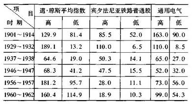
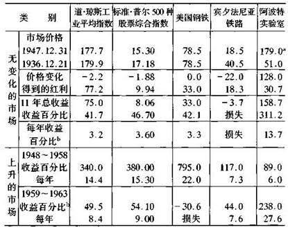
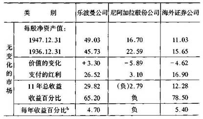
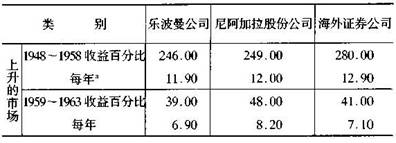
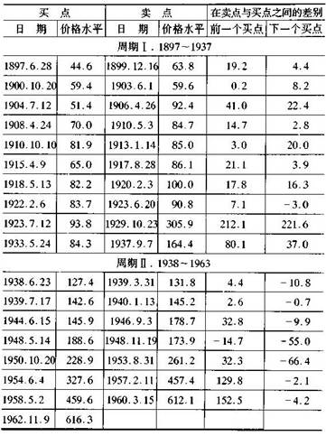
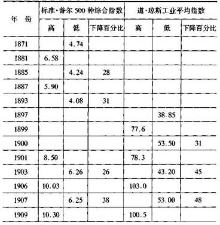
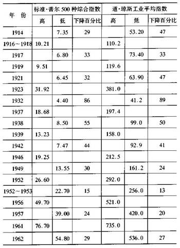
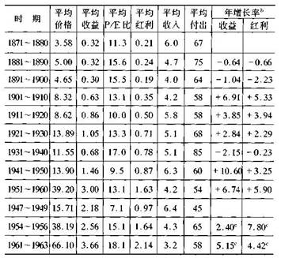

# 投资者与股市波动

投资者和投机者最实际的区别在于他们对股市运动的态度上。投机者的兴趣主要在参与市场波动并从中谋取利润；投资者的兴趣主要在以适当的价格取得和持有适当的股票。本章我们重点讨论普通股价格波动时投资者应持有的正确态度。投资者越来越难保持警惕和超然的态度，而这正是投资者和投机者的区别所在。对于理性投资，精神态度比技巧更重要。我相信在目前的形势下，对待价格波动的正确的精神态度是所有成功的股票投资的试金石。

如果一个采取节制方式的典型投资者遵循第一章建议的行为模式，他的投资组合就应该包括价格波动不大的高等级债券(或政府储蓄债券，它没有波动)和市场价格波动较大的普通股。

所报价格的波动可能在两个方面对投资者有明显的影响：

   
1．作为投资项目成功与否的衡量。

   
2．作为选择证券及交易时机的指南。

这两方面具有内在的联系，但为了讨论方便，我将分别来讲。

价格波动是投资效益的指示计

随着股票价格的上升或下降，投资者是否更富了或更穷了呢?过去，回答肯定是"否"：以前，只有投机者和交易商才关心价格的波动；真正的投资者，被认为不受股票自动收报机和市场报告的影响，只关心股票带来的收入及其长期增值。这也许不完全正确，但就第一次世界大战前投资级普通股的特征来看，这是完全可能的。即使在经济萧条时期，这类股票的股息都极其稳定，谓到牛市，其价格也不会高得不可思议，并且即使在恐慌时期，其价格也不会跌入深渊。因此宾夕法尼亚铁路公司或通用电气公司或美国电话电报公司股票的长久持有人，完全可能忽视其价格波动，而只坚持他自己的目的和哲理。

现今的情况已经不同了，没人相信普通股投资者会对价格的波动无动于衷，原因在于股市本身的变化。第一次世界大战前，普通股分成少量的投资股和大量的投机股。即使是在整个股市波动较大的情况下．投资股的波动也很小，因此其持有者没有真正的心理压力以关心市场。

但自1920年牛市开始，情况改变了。因为当投机热情高涨时，高等级证券的价格升到了极高的水平．接着而来的熊市则有暴跌的趋势。表3说明了这两个阶段之间的差异，给出了道·琼斯铁路股票平均指数和宾夕法尼亚铁路公司股票价格在1914年前和以后的市场波动中的价格下跌范围(以前投资级别的普通股主要在铁路工业)，也给出了价格波动更大的通用电气公司的有关数据。

从表中可以看出，在1937年3月至1938年3月的12个月内--仅一个暴跌期--这些铁路股票价格的跌幅比1901年至1914年14年之内的跌幅还要大，而后者还包含了1907年的著名的恐慌期(在1929年至1947年，通用电气股票的价格与1901年至1914年相比应该乘以35，而在1956年至1962年，应乘以105)。

表3 
1901~1962年被选出的股票的价格范围

   
a在所有情况中．低价格总是紧接在高价格之后。

   
b在这些周期中，股票分割没有调整。

自从1929年遇到价格波动以来，现今投资者不可能无视这些变化。很明显，他投资普通股成功与否取决于它们的价格，但是，他应在多大程度上关心市场的运行，通过何种市场测试来判断他投资的正确性呢?肯定不是根据短期和小的波动。由于这个态度使得他与股票交易者有所不同。

目前，许多有经验的投资者倾向于用较长时期内的股息回报率及价格变化的组合来判断其投资成功与否。过去，这些可能是在相隔日期、年数之间所作的计算，在这段时间中．一般市场水平没有明显变化。我们用这一测试方法来看一下几个典型的投资股和板块在较有代表性的一段时期内的情况。从1949年以来附加的比较不可避免地包括了股市大幅度增长时期。

表4 从投资计算结果的方法

a，调整。 
b，混合。

表4的数据有力地说明：在开始的11年内，对阿波特实验室的投资是成功的，而对宾夕法尼亚铁路的投资则是失败的。由于使用了"中性的"结束日期且包含了股息，所以该方法测试投资效果是很满意的。在像1949年以来那样的股市上涨时期，该方法尽管不是那么具有结论性，但仍不失为较有价值的方法(在这样的经历中，更加投机的策略的选择比更保守的策略的选择获得更大的收益，但并不能证明前者比后者更合理且更聪明)。表4的"上升的市场"部分标明，美国钢铁公司和阿波特相关的业绩与以前明显呈反向变化，这说明不能简单地把过去的记录作为未来的导向。未来应注意什么将在第13章给出。

这一方法可用来测试投资者证券组合的所有业绩，或进行投资基金之间的比较，或评估替代性投资准则的优点，例如，买成长股还是买低估了价值的股，正像我在后一章将要做的。表5给出了用这一方法比较三种投资基金管理结果的例子。

表5 计算投资基金业绩的方法

续表

这个标准但复杂的方法要求资本收益分配的再投资。由这种方法计算的平均结果见表24。  b复合。

当股市价格波动较大时，几乎所有投资者的投资组合价值都有类似的变化。但我认为，投资者不应太受这些价格波动的影响，除非他采用前面建立的买低卖高的方法。当他在一个上升的市场买进，并且市场持续上升时，他也不一定是一个聪明的投资者。直至他以好的利润兑现时，那才是真的，除非他肯定不购买股票--一个不可能的故事--或他决定仅在相当低的价位再投资。在一个持续的规划中，不会实现市场利润，除非后来的重新投资确实发生，交易收益的真正度量是前面卖出价格与新买入价格之间的差。

让我再一次指出，投资成功与否应该用长期的收益或长期市场价格的增长来衡量，而非短时间内赚取的差价。成功的最好证明在于，在普通市场水平上，在连续的平衡点之间，价格的上升。在大多数情况下，这个合理的价格行为将与平均收益、红利和负债表状况很好的改进所伴随。因而在长时间内，一个成功的股权投入的市场实验和普通企业实验趋于非常一致。

对于股市下跌和不成功的投资情况则有所不同。这儿短期的和长期的影响是有区别的，除非价格跌幅较大，比如，大于1／3，或是反映了该企业地位下降，否则价格下跌对真正的投资者没有太大的影响。在熊市时，许多较好的股也许售价极低，持有者的票面价值也许会损失50％左右．但这不一定说明其将有长期的影响。让我以1937年至1938年间大西洋和太平洋茶叶公司的普通股为例来说明这一点。

大西洋和太平洋茶叶公司的股份于1929年在纽约场外交易所交易，售价高达494美元。到1932年跌到了104美元．而该公司的收入即使是在这灾难性的一年．也几乎和以前一样高。1936年，股价范围在111美元至131美元之间．接着在1938年的经济衰退和熊市时，跌到了36美元的新低。

这一价格低得惊人。这意味着该公司优先股和普通股的总价值仅为1. 26亿美元，尽管该公司刚刚报告其拥有的现金就有8500万美元，还有1．34亿美元的净资产(或净流动资产)。大西洋和太平洋茶叶公司，即使不是世界上，也是美国最大的零售企业，多年来一直有良好的收益记录。但是1938年，这个优秀的企业的价值在华尔街被认为比它的流动资产还低，这意味着其营业值比清理值还小。为什么?第一，连锁企业受到了特别税的威胁；第二，净利润在前些年有所下跌；第三，因为股市普遍萧条。第一个原因被夸大了所以不必去害怕，而另外两个原因则是暂时的。

假设投资者1937年以其5年平均收益的12倍，或大约80美元的价格买入了大西洋和太平洋茶叶公司的普通股，那么价格跌到36美元时，他肯定不会无动于衷。他将会得到忠告，仔细检查一下图形，看是否做出了某些错误计算。但如果他的研究结果使其消除了疑虑--像它们应该是的那样--那么他就有权将股市的下跌作为暂时的反复无常的变化而加以忽视，除非他有资金和勇气利用股市所提供的廉价购买更多的该种股票(大西洋和太平洋茶叶公司的普通股后来上涨到超过与1938年等值的700美元，即在1股划分成10股后，于1961年上升到70．5美元，但第二年又跌了一半。这说明不规则的价格波动使绩优股也变得很脆弱)。

市场波动是投资决策的向导

由于普通股甚至投资级别的股票，其价格也呈周期性和大范围的波动，因此，许多机智的投资者就感兴趣于从价格的波动变化中谋取利润。可通过两种途径达到此目的：时机和价格。所谓时机，就是要致力于预测股票市场的行动--当认为将来市场进程是上升时．买入并持有，而当进程是下降时卖出或不买。所谓价格，就是应致力于当报价低于合理价格时买进股票，而当上升到超过该价格时卖出股票。较少野心的价格形式是你应努力确信，当你买的时候，你没有为你的股票支付得太多。这对长期投资者来说应该满足了，其强调的是长期持有，而它本身就表示了很少关注市场水平。

我相信不论通过这两种途径的哪一种，一个理性投资者最后都会收到满意的回报。我同样确信，如果他在预测的基础上，把重点放在时机上，他最后会成为一个投机者，从而得到投机者的结果。外行人不易看到二者之间的区别，且华尔街也不认为二者之间存在区别。作为商业实践，股票经纪人和投资咨询人员都普遍认为投资者和投机者都应对市场预测持极其谨慎的态度，而不是确信其正确性。一个人从华尔街得到的越多，他就越应对预测和时机持怀疑态度。投资者不必进行大量的预测，应他的要求所进行的预测几乎天天出现。然而，在许多情况下，他很注重它们，并依据它们而行动。为什么?如果投资者认为他能通过预测和时机赚钱．他就要每天作大量的预测，而他认为经纪人或咨询人员的预测比他更可靠，他就会经常去咨询，而很少自己去思考。

这一态度最后只会让投资者后悔不迭。如果没有认识到这一点，他将会发现自己成了一个市场交易商。在持续的牛市，在投机潮中很容易赚钱，他会慢慢对所买证券的质量和价值失去兴趣，越来越投入到与市场作对这一诱人的游戏中。但实际上"与市场作对"等于与自己作对，因为是他和他的同伴形成了市场。

这里，我们没有空间详细讨论以前的和最近的市场预测，大量的脑力已投入了这一领域。毫无疑问，某些人可从对市场的很好分析中赚到钱，但认为一般公众都能通过市场预测赚到钱就荒唐了。假如在某一信号下，公众在获利的前提下，都去抛售股票，那谁会去买呢?假如你，读者，想通过市场预测赚钱，你的投资目标必须和其他投资者一致，并且能够比你的同伴做得更好才行。无论是在理论上还是在实践中，一个独立的参与市场运动的一般或典型的投资者都不可能比公众更加成功。

关于时机的理论还有一点很容易被忽视。对于投机者，时机具有心理上的重要性，因为他想在短时间内获取大笔利润，在他的证券上升之前等待一年的想法是不适合他的。而等待的时间对投资者来说则无关紧要。如果没有得到某一有价值的信号，说明购买时机已经来到，投机者就不会投资，那对他有什么利润呢?投机者只有在等待一段时间后，以相当的价格买入，才能赚取利润以抵消股息收入的损失。这也意味着对于投资者来说，时机没有真正的价值，除非它与价格一致．即，除非它使他能比以前的卖价低得多的价格再次买人。

在这方面，关于买入和卖出时机的著名道氏理论已有不同寻常的历史。简单地说，这一理论把股票平均值向上的一种特殊类型的突破作为买入的信号，而把向下的类似突破作为卖出的信号。用这一方法计算的结果--不一定准确--表明自1897年到今天在实际操作中一直是可以获利的。

让我们从关于"再购买测试"的观点来看一下表6。道氏理论是否像该表的测试结果那样，允许参与者以比其卖出价低的价格买回呢?答案是奇怪的且不那么尽如人意。在开始的40年(1899年至1938年间)10次购入中有9次实现了真正的利润；但在自1938年以来的7次购入中，交易者每次的买价都比售价高。因此，假如他一直持有的话情况反倒好些。因为那样的话，在这一阶段内他不但会获取本金价值，还会获取连续的股息收入。

经过对这一问题的大量研究，我认为，道氏理论运行结果最近的变化并非偶然，它显示了在商业和金融领域内预测和交易准则的一个固有特性。那些日益被人们接受和看重的准则之所以如此，是因为在一段时期内它们一直运行很好，或有时仅仅是因为它们似乎适合以前的统计记录。但是随着其日益被接受，其可信度也逐渐降低。其原因有二：首先，随着时间的推移，旧的准则不再能适用新情况。其次，在股市发展中，交易理论本身的流行性行为也会发生一定的影响，这从长远的观点来看降低了其获取利润的可能性(道氏理论的流行性似乎能证明其本身的正确性，因为当出现买入卖出信号时，它可以通过其追随者的正确行动使股市上涨或下跌。这种类型的"大崩溃"带给公众交易者的当然是危险而非利益)。

作为对由道·琼斯定理所产生的报告结果的检查，我们用阻力点技术来看一下1897年至1963年间道·琼斯工业平均指数每月的数字，显示结果整体上和传统的道氏理论所说的相似。1933年6月之前，证明这一方法一直是成功的，其显示的总体收入为234点．而这一部分如不进行交易的话．仅仅可能上涨58点。但是在1933年6月至1963年12月间情况发生了转变，10次中的8次出售和再购证明是无利可图的。因此，如果仅仅持有，获得的收入可达554点，而遵循阻力点技术的交易者仅仅可获得200点的收入。

低价买进高价卖出的方法

我认为一般投资者不能一直通过预测价格的波动来赚取利润。在每一个大幅下降后买进且在每一个大幅上升后卖出的情况下，他能从中获利吗?从1950年以前的价格波动情况来看，投资者可通过买低卖高方法从中获取利润。事实上，古典的"精明投资者"的定义是"在其他人都抛售的熊市中购入，在其他人都购入的牛市中抛出的人"。

在1897年至1949年间，有10个完整的市场周期，其运行特点是，从熊市到牛市再回到熊市，其中6个历时不到4年，4个长达6至7年。另有一个--1921年至1932年间著名的"新时代"周期--持续了11年，由低到高的增长率在44％-500％之间，大多数在50％一100％之间，而随后的降幅在24％-89％之间(大多数在40％-50％之间，应该注意，50％的降幅就抵消了前面100％的升幅)。

表6 从道氏理论应用与道·琼斯工业平均指数得到的结果

*买点和卖点来源于巴波的道·琼斯服务业，代理和其他相同的因素不考虑。

几乎所有的牛市都具有这样几个典型的特征：(，)历史性的高价位；(2)高价格收益比；(3)相对于债券收入较低的股息收入；(4)许多投机活动；(5)许多质量较低的普通股上市。因此，对学习股市历史的学生来说，机智的投资者应该能识别出周期性的熊市和牛市，从而在熊市上购入，在牛市上抛出，并且在大多数情况下以相当短的时间就价值因素或价格升降幅度或二者的综合情况，研究出各种确定市场是否处于购入或抛出水平的方法。

但是我必须指出，即使是开始于1949年的前所未有的牛市之前，在市场周期中仍有许多变化使买低卖高这一方法复杂化，有时甚至失败。最显著的一次是20年代末的大牛市，在这个牛市中，许多预测都失败了。然而，即使在1949年，也不能肯定投资者应该主要将其金融策略和投资过程基于在熊市时低价位买进，而在牛市时高价位卖出。

最后事实证明，反过来倒是正确的。在过去15年，市场行为没有遵循以前的模式，以前建立的危险信号及买低卖高的准则都不适用了。在下章中，将详细说明忽视1950年前先例的原因。我不敢确定以前的牛市-熊市模式最终是否还会出现，但我认为，投资者致力于将他现在的策略基于经典的公式，即在买入任何普通股之前，等待可证明的熊市水平，是不真实的。我的建议是，如果投资者选择这样做的话，那么应根据由价值标准衡量的股票价格水平吸引力的大小，相应地调整证券组合中股票和证券投资的比例。

投资计划分析技术

在1949年至1950年．股市呈涨势时．人们使用各种方法以从股市的周期运动中谋取利润。这些方法被称为"公式型投资计划"。所有这些计划，除了美元平均值情况外，其本质都是当股市涨幅很大时抛售一些普通股。按照这些计划，股市的大幅上涨将导致持有的所有普通股出售；其他的计划则认为，在任何情况下都应维持股票有一个较小的比例。

过去许多年，当追溯这些方法在股票市场的应用时，是相当符合逻辑的，并显示了优异的结果。但不幸的是，这些方法被普遍采用之时，正是其失去效力之时。在50年代中期，许多公式型投资者发现他们完全或几乎在某一水平离开了股票市场。确实，他们已经获得了丰厚的利润，但从广义上讲，市场在那之后"离"他们而去，他们的公式没有给他们机会以买回一个普通股的地位。

这些公式型投资者50年代的经历和约20年前道氏理论的信奉者的经历相似。在方法的流行之时正是其失去效力之时的情况下，我们用决定道·琼斯工业平均指数所指示买卖水平的"中心价值方法"时也有过类似的失败经历(这将在后面的章节中详细解释)。教训似乎是，任何容易在股市上被大多数人掌握和运用的赚钱方法都太简单和太容易结束。

  spinoza的总结性的评论应用于华尔街也是一条哲理："所有杰出的事情都像它们很稀有一样的困难。"

股市小史：1900～1963年

自1949年始，股市的行为和过去有根本性的差异。人们可以发现最相似的是1922年至1929年。总结这个根本性差异的方法是陈述，当股市上涨的幅度达到历史最高水平时，降幅也达到了历史最高水平--从1961年12月至1962年6月为27％--比过去任何15年跨度的水平都要高。难以置信的是，这一现象持续这么久竟没有结束的迹象，也就是说，这只不过是人们又一次的"超乎寻常的错觉"。我们几乎不知道这真正意味着什么；没人敢确定这一暴涨在多大程度上是对股票的固有价值合理的再评价，及多大程度上是投机情绪的高涨，这个高涨最终必须以极端的和痛苦的方式加以修正。

理性投资者应该了解股市历史上的一些基本事件。他不应想当然地以为1949年以前的任何情况都和现在无关，直到他知道他正在拒绝什么。因此，在表7和表8，我给出了1871年至1963年间股市的一些显著的数据。表7是关于价格波动的数据，从熊市的低价到牛市的高价再到熊市的低价。对于最近的1949年至1963年，我给出了这一大幅上涨时期中的三次主要回落的数据；这三次回落--即使幅度最大的一次出现在1962年--也不应被认为是真正的熊市出现时的下跌。表8给出了基于收益和股息的有关数据，及由此产生的比率。这些将在后面章节中提及。

在前一版中我强调了"市场的连续性"。我的意思是，如果在前一个牛市的高价位投资者出售了股票，那么他就有机会再以较低的水平买人。根据表7，1942年熊市的所有低价位都比前30年甚至更长时期中任何一个牛市的高价位要低，因此，1942年熊市的标准.普尔平均指数比1901年以来任何一个所记录的高点都要低。

表7 大的股票市场波动：1871～1962

续表

表8 股票市场行为的画像：1871--1960和1947-1963a

  a.数据主要取自n.molodovsky的(股票价值和股票价格)。

  b.年增长事数据由molodovsky汇编,覆盖了连续21年周期．端点是1890年、1900年等。

  c.这些增长率数据是1954~1956年对1947-1949年，1961~1963年对1954～1956年。

但在近20年情况就不同了。股市在1946年市场高点以后的下跌毫无疑问反映了真正的熊市，平均值再也没有回到以前(1939年)的高度。更惊人的是，1962年股市崩溃时的最低点是1946年的最高点的2．5倍。很明显，我们已经不能根据过去的经验来预测投资者何时应完全退出股市了。

最后一个论断并不是说防御型投资者没必要考虑股市的大崩溃，而是说，他不能预测(或可靠地了解)股市何时会崩溃，会有多严重。

个股的市场波动

根据以上讨论，我认为，进攻型投资者局限于利用市场周期性波动，在历史低位或中等水平买进并在市场达到历史高位时卖出的方法是不可行的。因此，买低卖高的原理可以更满意地作为个股的主要参考而几乎与一般市场水平无关。

如果投资者有意投资廉价股，那他就应持续关注廉价股的价格变化，而不是试图在广泛跨越的区间或以时间公式的变化尺度为基础运作最重要的股票。单个股票的廉价性可由在任何时间实际进行的证券分析过程来确定，除非整个股市都处于卖方市场，否则这类股票就能带来满意的回报。尤其是市场相对平和时，它们显示了最好的收益。这时，研究个股会发现许多获利机会。

购买廉价股的前提是市场目前对它的估价是错误的，或者，至少购买者关于其价值的估计比市场更正确。在这个过程中，投资者的判断和市场相悖。对某些人来说，这好像有点自以为是或愚蠢。事实上，许多人仍坚信这一老信念：当前的市场价格比任何个人的判断更有参考价值；每一个有关的当事人的知识、期望和判断，被认为在得到所谓的"不流血的市场判决"方面都起着它们适当的作用。因此，似乎朴实和平庸的感觉会使得投资者抑制他的推断--他比市场了解得更多。

根据这一信念，我们可以推出，华尔街认为预测对与众不同的市场运动的个股或特殊的工业群才有意义。假如一个投资者行动和市场相悖，就会被认为是股票将要发生大的变动的信号。以前，这经常预示着著名的"他们"将要对该股进行大的操纵。现今，随着"他们"的消失，这种信号被普遍解释为：如果该股"表现很好"，那就意味着有识之士认为该公司的业绩有高于一般企业的趋势．因此，现在应购买其股票。反之，华尔街有经验的人会建议你不要购买其股票，甚至抛掉那些近年"表现不好"的股票。同样，当股市平均指数在大的下跌后上涨到一个新的高度时--像1963年9月--这非常的成绩会吸引许多投资者进入股市。很明显，这些金融家认为，股票更加吸引人是因为其价格比以往更高。

我坚信，投资者不应以个股的市场运动提供的信号来进行操作。个股的"技术研究"和整个股市的技术研究基本相同，得到的信号有时是正确的，有时则是错误的。总之，对于保守性的应用它不是那么可靠，其只是交易和投机领域重要工具的一部分。因此，如果它们也是投资者的武库的话，那将是非常奇怪的。他们最熟悉的论据是，上升时买进股票，而下跌时卖出股票。假如投资真的有一条基本准则，那就应与其相反。

就典型的估值过低的股票情况来说，前述的市场行为不是鼓舞人心的；这些证券不为交易者和技术专家所接受，或因其很不知名而被忽视。完全没有理由期望这类股票的价格在投资者决定购买后会立即上涨。事实上，如果一个投资者购买了这类股票，他应想一想为什么其价格不会无限期的上涨并且可能增加低估值的度量，理论上没有根据说明这一结果不会发生。实践经验中，聪明的投资者将会发现安慰和鼓舞人心的事情。经过很长时间，证券趋向于以接近价格水平销售，接近于它们的指示值。这个观点中的时间是不确定的，被某些情况证明的时间实际上要被延迟好几年。投资者应基于他的策略与经验而不是例外。我自己的记录表明，一个被充分低估价值的股票得到修正，平均需要的时间在半年到两年半之间。

也许一些人会认为．证明他的可赢利性的高超判断和勇气需要的时间太长了。但事实上，如果我们的估计是正确的，那就意味着，股市总是特别偏爱投资于估值过低股票的投资者。首先，股市几乎在任何时候都会生成大量的真正估值过低的股票以供投资者选择。然后，在其被忽视且朝投资者所期望的价值相反方向运行相当长时间以检验他的坚定性之后，在大多数情况下，市场总会将其价格提高到和其代表的价值相符的水平。理性投资者确实没有理由抱怨股市的反常，因为其反常中蕴含着机会和最终利润。

最后我应该指出，在道·琼斯工业平均指数中，对那些被认为前景不好的股票经常估值过低。在过去30年，如果注意投资于这类不被普遭接受的昔通股，就会获取惊人的高利润。

企业估值和股市估值

当我们接着讨论辨别廉价证券的技术时，我将指出测试其估值过低还是过高的最基本的方法是，拿其价格和其所属企业整体的价值进行比较。如果通用汽车公司对投资者来说每股价值是100美元，这一定是因为这个巨型企业总的普通股所有权价值不少于294亿美元(2．94亿股乘100美元)。另一方面，对于大西洋和太平洋茶叶公司，当其普通股的价格在1938年降到36美元时．我们确信其一定被大大低估的一个原因是，这一价格意味着市场对该企业总的估值比其流动资本还要低。这件事情是非常荒谬的。

那么，1938年3月，大西洋和太平洋茶叶公司的10股、100股或1000股单个股份持有人真正拥有的是什么呢?他是否拥有该公司的一小部分，就像哈特福德家族拥有大部分一样呢，或其拥有的股票仅仅使其有权领到股息和股票出售时的收入?这个问题的另一种提出方式是，购买价格为80美元的大西洋和太平洋茶叶公司股票的投资者，当该股价格降到36美元时，他是否真的有所损失?他是否比以前要穷?这一问题的正确答案也是投资者与其持有股票价格波动之间的关系这一更广义的问题的关键。

正像我们看到的，投资者--股票持有者在部分真正的企业所有者和纯粹的股票持有人二者之间占据了中间或显著的地位。毫无疑问，他没有单个的或合伙关系的企业所有者固有的对企业的重要的控制权力。就这一点来说，当小股持有者非其控制群体的一部分时，他的地位无异于私营企业的小股持有人。但这实际上也是一个极其有利的条件，因为这样他可以在任何时候以牌价卖出他自己的股份。

但有这样一个事实：真正的投资者很少被迫出售其股份，一般情况下，他不必关心其股票的现行牌价；只有在牌价适合其准则时．他才注意它并采取相应的行动。因此，当其股票价格因某些人的误导而下跌时，这类投资者就惊慌失措，错误地把自己的有利条件变成了不利条件。如果他的股票没有市价，可能景况更好，因为他可能避免了由其他人的错误判断给他带来的精神痛苦。

顺便说一句，在1931年至1933年的大萧条时期，类似情况广泛存在，这时拥有公司非上市股权的投资者就有心理上的有利条件。例如，拥有企业不动产的第一债权的投资者，会不断地获取利息收入，会觉得自己的投资是成功的，这种投资没有市场价格的波动使他担心。另一方面，许多上市公司尽管业绩很好，且仍有发展的潜力，但其股票的牌价可能会发生损减，从而使其股票持有人误认为其业绩下滑。实际上，尽管其价位有时很低，上市证券的持有人仍有许多有利条件。因为，如果他们想或是被迫的话，他们至少可以出售这些证券--可能将它们转换成更好的廉价股。他们也可以把市场的运作看成是暂时的和基本无意义的。但如果认为你之所以没有受到任何价值上的损失，只是因为你的证券根本没有上市，那就是自我欺骗。

再看一下1938年大西洋和太平洋茶叶公司的股票持有人，我断言，只要他们不放弃该股，那么他们因价格下跌受到的损失就不会超过他们认为该公司股票内在价值或固有价值损减而发生的损失。如果该公司的固有价值根本就没有损减，那么他们就有理由认为其股票的牌价总会上升到它的成本价或是高过其买价。事实上，第二年的情况确实如此①.在这一点上，这类投资者的地位至少不低于私营非上市公司股份所有人的地位。在那种情况下，投资者因1938年经济大萧条的影响，也会根据公司的情况考虑是否抽回其大部分投资。

①  1939年，大西洋和太平洋茶叶公司的普通股价格高达117.5美元．后来

达到705美元。

股票投资价值方法的批评人士认为，用对待和评价一个相同私营企业利息的方法来对待和评价上市的普通股是不恰当的，因为存在"注入净资产所有权新的和非常重要的流动性的一个有组织的证券市场"。但这种流动性实际上意味着：第一，无论评价可能如何，投资者可通过每日股市行情对他所持有股票评价的变化而收益；第二，投资者可根据每天的价格调整其投资，如果他选择的话。因此，上市股票给了投资者一定的选择余地，而非上市的证券则不能。但它没有强加现行行情于投资者，投资者喜欢从某些其他来源取得自己的价值观点。

让我以寓言的方式来结束本节内容：假设你拥有某一私营企业1000美元的小额股份。你的一个同伴，不如称为market先生，非常乐于助人，每天告诉你关于他对你的股份价值的想法，另外根据他所告诉你的情况提出购买你的股份或是卖出你的一些股份。有时根据你自己对该公司的发展前景的了解，他的想法好像是可行的、正确的。但是，他经常过于兴奋和担心了，有时你甚至觉得他的建议有些愚蠢。

如果你是一个自信的投资者和明智的商人，你会让market先生每天的意见来决定你对自己1000美元股份的看法吗?在你同意他的想法时，或你想同他做交易时，或当他提供给你一个高得不可思议的价格时，你可能会很高兴把股份出售给他。而当他出一个极低的价格时，你可能也会同样乐意从他那里购买一些股份。但其他时候，你将更加明智地根据公司关于其运营和经济状况的报告来形成自己的判断。

真正的投资者，当他拥有上市普通股时，应处于这样的位置：根据他自己的判断和倾向，他既可从每天的市场价格中谋取利润，也可对此不予理会。他必须关注重要的价格波动．否则他的判断将无据可依。在想像中，它们可能给予他一个警告信号，他最好留意--这日常语言来讲，意味着他必须卖出他的股票，因为价格已经下跌，应防止更坏的事情发生。依我看，这些信号给投资者误导的次数不比有用的次数少。从根本上讲，价格波动对真正的投资者只有一个重要的意义：当价格大幅下跌后，提供给投资者购买机会；当价格大幅上涨后，提供给投资者出售机会。而其他时候，他如果忘记股票市场而把注意力放在股息收入和公司运作状况上，将会做得更好。

小结

投资者和投机者最实际的区别在于他们对股市运动的态度上。投机者的兴趣主要在参与市场波动并从中谋取利润。投资者的兴趣主要在以适当的价格取得和持有适当的股票；市场波动实际上对他也很重要，因为市场波动产生了较低的价格使他有机会聪明地购入股票，又产生了较高的价格使他不买进股票并有机会聪明地抛出股票。

投资者不应仅仅在等到市场价位跌到极低时才购入股票，因为这意味着可能要等较长的时间，从而损失大笔股息收入及大量投资机会。总的来说，投资者最好是在他有资金可以投入股市时就购人，除非市场价位比他用一些公认的价值标准判断的合理价位高出许多。他如果精明的话．应从一些廉价的个股中寻找投资机会。

在华尔街，人们除了预测股市的运动，还花大量的精力选择一些在较短时间内价格可能会比其他"做得更好"的股票或工业群。尽管这个努力似乎是合乎逻辑的，但我认为，这种尝试不适合真正的投资者的需要和性格--因为这意味着他将要同从事这一工作的许多股票交易商和一流的金融分析家竞争。就像其他把价格波动看得比固有价值重要的行为的结果一样，进行这一尝试的人绝大多数最终或是有所损失或是盈亏两抵。

具有良好的股票组合的投资者应预计到其股票价格会发生波动，但无论其涨跌，他都应避免过分激动。他应该知道，他既可从价格波动中谋取利润，也可忽视它们。他不应该因某一股票上涨了就购入，或是因某一股票下跌了就抛出。如果他记住这样一句格言他就不会犯大的错误："股票剧涨后莫买，股票暴跌后莫卖。"

附注：我应谈一谈作为经营竞争度量的平均市场价格的意义。股票持有人用股息收入或股票平均市场价格的长期变化趋势来衡量其投资的成功与否，这一方法也应被用来测试一个公司管理的有效性及其对股份持有人态度的正确性。

这好像是不言而喻的，但有必要强调一下。现在还没有可以接受的技术或方法使管理层形成市场观念；相反，公司管理层一直认为他们对其股票市场价格的任何波动不负有任何责任。确实，对于那些和固有价值状况毫无关联的价格波动--正像我一直坚持的--他们不应承担什么责任，但股票持有人不应认为，该管理层对所有的价格波动，包括长期的大大低于其固有价值或不满意的价格水平，没有责任。好的管理应产生好的平均市场价格，坏的管理则产生坏的市场价格。
