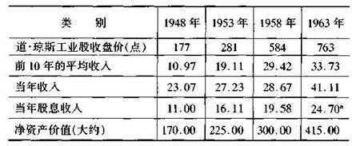
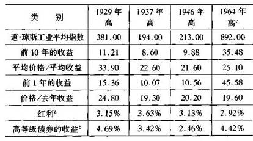
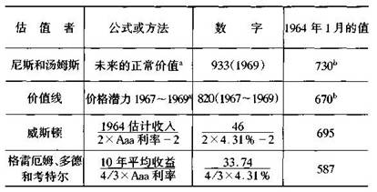
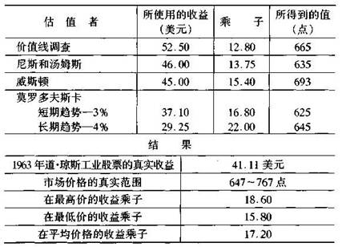

# 1964年股市行情

从金融历史中我们必然得出这样的结论：并不是通货膨胀本身使它成为股市的强有力的影响因素，而是受其影响的投资者的心理倾向使其成为牛市发生的内在因素。

在前几版中，本书已经讨论了在写作时的股市水平，并一直致力于回答这样一个问题：对于保守型购买它是否太高?我用保守型的标准对1948年为180点的道·琼斯工业平均指数进行了分析，发现很容易得出这样的结论：相对于固有价值来说，这个指数不是很高。到了1953年，市场的平均水平上涨到了275点，5年内的涨幅超过了50％。我提出了同样的问题，即：就我们的观点来看，高达275点的道·琼斯指数对理智的投资来说是否太高了?我不得不说我绝不敢确定1953年的市场水平极具吸引力，根据接下来股市惊人的涨幅，这好像有点奇怪。我确实认为，从价值指示的观点，我们主要的投资指南来看，1953年的股价是合理的。但是，注意一下这些事实：自1953年以来，平均指数上涨持续的时间比以往绝大多数牛市都要长，并且其绝对指数异乎寻常的高。根据这些因素，我建议采取谨慎或折中的策略。事实证明，这一建议不是太好。一个好的预言家应该预计到在接下来的5年股市水平还会上涨100％。但我应该自卫地指出，如果有，那也只是极少的专门从事股市预测工作的人--由于我不是--比我的预测更好。

在1959年初，道·琼斯工业平均指数最高达到了584点。我根据长期观察得出的结论是(1959年版第59页)；"总的来说，我不得不认为目前的价格水平很危险，因为价格太高了所以是很危险的。即使不是这种情况，市场的这一发展势头不可避免地会使价格上升到一个危险的高度。坦率地说，我不认为在将来的股市中不会有重大的损失，或是每个新手都能从股市中获取巨额利润。"

结果证明．我在1959年提出的这一警告比1954年相应的态度要正确，尽管远非完全正确.1961年，道·琼斯工业平均指数上涨到685点；接着该年晚些时候跌到584点以下(566点)，1961年底又涨到735点；而1962年5月跌到了536点，短短6个月跌幅达27％。同时绝大多数成长股的价格也急剧下跌，如著名的企业巨人ibm,从1961年12月的607美元降到了1962年6月的300美元。

这一时期，一些小企业的新股，即所谓的热门股彻底崩溃。这些股票上市时价格高得令人难以置信，接着在投机热潮的炒作下狂涨，而最后在短短几个月内，许多股票跌幅竟高达90％。

1962年前半年的股市大崩溃．对那些根据自己的知识进行投机的投机者和许多自称为"投资者"的人来说，如果不是灾难性的，也足以让他们惊慌失措。但该年股市接下来的发展趋势同样让金融界感到意外，其平均指数重又呈上升趋势，产生了如下结果：

普通股价格的恢复和新的上涨的确是很令人惊奇的，华尔街的情绪也逐渐高涨起来。1962年6月市场处于较低水平时，预测又明显引起下跌趋势。该年末股市有所恢复后，人们迷惑了，倾向于持怀疑态度。但在1964年初，经纪行的合乎自然规律的乐观重新显现，几乎所有的预测都认为将呈牛市，后来事实证明确实如此。

对于市场可能的行为，我们将持什么观点并确信这对读者会有所帮助呢?让我虚心地根据它的困难和我的经验来完成这个任务。我认为在这里，就像在其他地方一样，区别是：(1)事实；(2)足够的可能性，从而确保可依此作出决策；(3)一定会在脑中出现，但不可能引导我们的可能性。

1964年股市与前些年股市的比较

就前面的材料，我们可以根据以前的市场水平对1964年后期的股市作一个简短的分析。让我们首先记下这本书的前几个版本的每一个前一年的某些比较的数据。为方便起见，我仅用道·琼斯工业30种股票的平均指数，但其结果与包括工业、铁路和公用事业的详尽得多的标准·普尔500种股票指数相近。

华尔街的许多权威拒绝把股市作为一个整体来分析，理由是平均数或指数包括了许多不同的和相反的个体情况从而使综合结果失去意义。他们认为，人们不买平均指数，而只买相当少的个股。但我一般不这么认为。平均指数的走势和把所有投资者当作一个共同基金来看的投资成就惊人地相近。当这些指数发生大的升降后，个股的大多数也会发生类似的波动，虽然幅度不可能统一。更重要的是，至少在过去，投资者根据其综合收入和股息、债券的利息率等，并通过观察这些平均指数的走势，得到了许多有价值的信息，从而采取谨慎的行动。

表9给出了15年间极好的全面综合描述。在1948年至1963年间，道·琼斯工业股当年收入上涨了约80％，前10年的平均收入涨幅超过200％，当年股息收入涨幅超过100％；但股票价格则上涨了320％，其涨幅大大超过了收入和股息。

表9 道·琼斯工业股：1948、1953、1958和1963

   
(收入和价值以美元为单位)

  a，以一半平均价格．包含了股票红利。

下面，再看一下当年的市场价格对收益的比率，即熟悉的"p／e比"，我将对过去高低各异的几年进行比较。很明显，1964年末，p／e比接近前些年牛市最高潮时的值，并且大大高出接下来价格大幅下降时的值(见表10)。自然地，这是与保守型的人相关的事情。如果与过去的相似是有价值的话，那就应形成一个重要的警告信号。反过来，我们在理论上可以忽略这一信号，不需证明，过去的p／e比和现在的投资决策没有关联。

在这个方面有一点需要强调：那时折旧和分期偿付占净收益的比例比以前要大得多．这一部分是因为当时税法允许更自由的收入扣除。我仔细研究发现，这时的折旧费用比1954年以前还要高，但是对收入的影响并不像所说的那么大，因为工业投资大大扩张了，

表10 高水平年和1964年的数据(价格和收益以美元为单位)

a.使用前12个月的红利.b.除1964年所有年份的摩迪aaa债券的

年平均值.c.11月30日;收益包含了从1964年9月以来的数据.

股票收益与债券收益

以前，通过比较股息收入和高等级债券的回报，我们可以得到普通股价格是否合理的信号。这一关系是和前面讨论的价格/收益比紧紧联系在一起的。因为，当那个比值很高时，就像在前面的牛市和当前所反映的，这个市场价格会产生很低的股息回报率。普遍认为普通股的正常收入比债券高1／3到1/2。在1941年至1950年--正好在牛市前--股息的平均回报率实际上比最好的债券高出2倍，但这也有一部分是人为的因素使债券收入处于低水平。但是，在周期性的牛市中，股息收入将会降低直至接近或低于债券收益。

历时多年，这一现象为股价危险的高水平的出现提供了一个极其可靠的线索。确实，它不能用来预测几周或几月内牛市的结束，从而被投机者和股票交易商所注意(这一危险信号第一次出现后，他们会说市场水平在短时间内大幅上涨)。但那些出售迅速的防御型普通股投资者，在这一信号首次出现时可获得满意的利润，而把余下的牛市留给投机者。

在20年代的大牛市中，如1927年，或在股市开始暴跌的前两年，股票收入有时低于债券收入。那些当时跳出股市或仍在市外观望的投资者，发现后来股市价格上涨了100％，毫无疑问，他们会觉得自己的判断严重失误。但是接下来的价格崩溃--道·琼斯工业平均指数从391点降到41点--说明他们比自己想像的要理智。

但现在股票收益与债券收益相比较方法的有用性比在20年代更值得怀疑。1949年股市开始上涨时，标准·普尔综合指数显示股息收入率为7．18％，而所谓的aaa公司债券的回报率只有2．66％。1957年股息收入率为3，65％．低于债券回报率。7午后，这一状况继续，且债券回报率要比股息率高出1．3％(或130点)．而不是像人们根据过去经验预测的那样关系发生了逆转(即使是在1962年股市崩溃时，股息收入平均值仍低于债券)。一个信号，如果要用7年甚至更长时间才能证明其准确性，那么这一信号就不能作为实际投资的指南。

市场基本状况评估

在写作该书的第一版时，若想根据一些历史数据，在有效的范围内确定股市"适当的水平"好像并不困难。最简单的方法就是追踪自1897年道·琼斯工业平均指数出现以来的走势，并用其中心点来预测股市前景。如果人们认为这一中心点可显示正常的价值，那在1948年道·琼斯工业平均指数位于175点时，仅比它的适当水平稍低。

这一方法主要是根据过去的经验进行预测。在逻辑上也有其依据，中心价值每年2．9％的涨幅可能和投资额的稳定增长有关，因为企业每年都要把1／3利润用于再投资。在1926年至1933年间，中心价值相对于它的上限和下限发生了极大的偏差。有些金融方面的人土认为，这只是那些相似于南海泡沫和郁金香狂热的重大畸变中的一个，其发生在几个世纪之前且必须被排除在经济历史的主体之外。

还有一些更精确地确定道．琼斯工业平均指数适当水平的方法，它们是基于价格和收入，或股息，或资产价值，或国民生产总值之间的历史关系。1955年初，几乎用所有的方法获得的数据都集中在400点的正常价值水平，正好和道氏实际的市场水平一致。接着，当第二年该指数上涨到500点时，所有的估价好像都大大偏高，值得引起警惕，如果不是采用极端的售出策略的话。

但在1955年，传统的估价方法好像最后一次发生了偏离。尽管自那以后股市发生了三次下跌--1962年的一次接近恐慌--但市场在9年内再也没有回到用这一传统的、时间试验度量方法决定的"适当"水平。让我们看一下根据传统的方法，在1964年初"正确的市场水平"应该是多少。在表11-1，我从这些方法中选出了4种，给出了由其得到的1955年初和1964年初的数据。

表11-1 用1955年的方法，道·琼斯工业平均指数在1955年1月和1964年1月的近似值

这些数据仅仅具体证明了这样一个事先已知的简单结论，即市场水平比用以前标准获得的结果高出许多。只有那些极其顽固的人才会认为这些老方法仍然有用，而市场十多年来的实际行为只表示了过分投机。确实，这些老的估值标准从逻辑上可证明是正确的，但其权威性仅在于用它们取得的结果是否与长期的经验相一致。没有后者的支持，理论推断将失去其大部分力量．因为如果需要，就可以根据股票价格长期的行为对其进行变换从而得到多种不同的评价结果。

表，11-2 用现在的方法和态度得到1964年的道·琼斯工业平均指数

a．详见表12。  b.
1969年和1967~1969年的值以每年4.
5％折扣提供1964年1月的值．这表示需要7.5％的总回报，期望从红利获得的少于3％。

"新时代"的新标准

不可避免的事情当然发生了，几乎所有严肃的普通股技艺的实践者都采用了比1957年以前更加流行的新的技术和标准。这一有大量依据的方法包括估计未来几年的收入(和／或股息)，以及用一些数学方法研究"当前价值"或作一些预测，而其他更简单的计算仅取今年或下一年的实际或"标准化"收益，并且用它们乘以适合于正被谈论的公司的数据，

得到权威人士的允许，表11-2给出了一些他们对1964年道·琼斯工业股票的估价数据。在每个情况下，1964年的数据都比用老的准则得到的相应数据高出许多，但仍比当的实际数据低一些。我们用修改过的中心价值方法得到的结果显示：用老方法得到的结果至少有50％的偏差。

表12 
1963年道·琼斯工业股票的规划值，1959年初计算

根据记录，我增加了投射于1963年的道．琼斯工业平均指数，正像在1959年初它们所提供给我们的那样，并且发表在本书的前一版中。在那时平均指数大约是600点，1963年的预测结果在625--693点之间，而该年实际的道氏指数在647--767点之间。这些预测，由于其远离惯例，被证实是相当好的，是更加可信的。

从股市周期看1964年的价格水平

必须重申，投资者要确定的一个大问题是，以前普遍接受的"股市周期"的概念是否仍然正确。在过去反复出现的市场波动中，牛市时，股票在较长时间内大幅上涨；熊市时，股票在短时间内大幅下跌。现在普遍认为股市这一隐含的模式已经改变，老式的熊市现在已经过去，且已经被较短时间内的不同强度的"修正"所取代．就像1962年至1964年间股市的大幅下跌和全面恢复一样。不同的股票群在连续的几个时期内会产生较高的价格，接着便下跌，在这个意义上，人们认为市场有"自我修正"能力。许多权威人士认为，按这一说法，过高估值的真正危险可以避免，而许多股票经常是以合理的价格出售的。

这些说法很有说服力，而且是以多年的历史资料为依据。但有几十年金融经验和天性保守的人可能会对这一点持将信将疑的态度。我认为自己就是这少数人之一。让我们根据以前与牛市的脆弱阶段相联系的一些特点，看一下1964年初的股市(表10对1964年9月892点的高水平的许多方面和1929年、1937年、1946年的高水平的许多方面进行了比较)。

"过度成熟牛市模式"具有以下条件：

①领头股的高价格，和过去市场水平相关；

②同样，和过去的平均收入相联系；

③当前股息回报率低于或不高于高质量债券；

④经纪人贷款剧增，表明投资活动广泛存在；

⑤劣质股价格大涨；

⑥许多新股上市，其中大多具有高度投机性且价格过高。

前三个条件近10年来一直存在，预示相当高的价格和较低的红利回报。事实上，1964年这三个条件的存在应引起警惕，但并非股市接近尾声的信号。尽管经纪人的贷款大幅上涨，但其总额相对股票总价值来说仍比较小，与1929年股市崩溃前的疯狂性投机借贷没有相似之处。从高质股和低质股的价格走势来看，1964年末的市场形式也不具有牛市接近尾声的特征。自1962年的狂跌以来，这一投机性的回升主要集中在领头股和主要股，二类股较迟缓。

第六个条件是针对新上市的股票，并且自从本书前一版发行以来，它起着特别有趣的作用。那时，我曾这样写道："在1959年初，实际上经纪人的贷款并没有大幅扩张，没有大量的新股上市，也没有对低价股和低质股的集中投机。"在那些方面，市场还设有显示技术弱市。接着，我们看到许多质量极低的新股涌入股市，并被抓住作为投机宠物并且至少作为半操纵的主体。这一恶作剧最后彻底崩溃，带着这种方式的普通市场结构部分，在1962年完全消失。尽管标准股全面恢复，但对这类新股的疯狂没有在1964年9月重演(相反，我们看到许多人转向一些技术方法，如控制数据和综合指数)。

因此，即使是根据旧的股市模式，1964年的图形也不是清晰的。在下一个"结算日"到来之前，投机活动一定会再次蔓延。

小结

   
1961年末，道·琼斯工业平均指数达到了以前的736点的高度。我对于这时股市情况总的观点如下：

老的价值标准已不再适用，但新的可靠的标准还没出现(在这方面，今天的投资可能有点像现在的绘画)。股市可能会回到老的中心价值的度量方法，或最终建立一个新的和更自由的基础，以评估股票。如果前种情况发生，许多长期以来不停增加股票投资的投资者一定会大失所望。但如在适当的基础上形成新的更高的价值水平，我设想将会有一些误差与一定时期内一些不定规模的周期波动相伴随，并有一个检验过程。我不知道在接下来的]5年内债券的收入能否比股票好，但我的确知道大学退休基金的持有人坚持认为债券收益至少和股票收益一样多是相当聪明的。

市场后来的走势和该观点是一致的。1962年5月市场的几乎崩溃和紧接着上涨到一个新高度，好像形成了不可预见高度的市场波动"，并且预示着"新的股市"的明显特点形成以前其他情况正处于酝酿之中。

1961年12月根据新股市的一般特征得出的这一观点对1964年末的情况同样适用。老的标准已不再可行，新的标准尚未被时间检验。关于未来股票价格的走势，投资者不能指望得到一个可靠的观点(除了j.p·摩根"它们会波动"的著名观点)。因此他必须把自己的投资策略建立在大量不确定性因素的基础上。一方面，包含了股票价格延长的和持续的上涨，如50％的涨幅，道·琼斯工业平均指数可能涨到1350点；另一方面，同样规模的大崩溃，使平均指数降到比如说450点的水平附近。

   
1961年至1962年间，道·琼斯工业平均指数实际上从735点跌到了535点，后来于1964年9月上涨到892点的新高度。这些涨跌情况在很大程度上反映了当前股市的固有特征，将来的波动范围可能会更大。如果股市从当前的892点继续迅速上涨，并且所有的投机因素再次出现，那么一定会再现全面的价格崩溃和可能持续更长的熊市。

我的最后一个结论是自相矛盾的。我认为，预测市场最不可能的走向可使投资者的工作变得相对简单而不是更加困难。他可以不必再去费力决定以下问题：他应什么时候跳出普通股，因为市场涨到了明显的高水平；市场大幅下跌后，他是否适合重新购入。如果投资者愿意，他可以采取这样一个适用于任何情况的策略，即投资于股票和债券的资金各为一半。

当然，除了这一非常简化了的方法外，对他来说还有其他的可能性。我们将有机会来讨论其中的一些，它们提供了有趣的和可获利的承诺。但我认为，不管选择的方法多么复杂和微妙，投资的策略应注重不确定性，而非确定性。因此，在这一转变和多变的时代，投资者的投资目标一定要准备应付各种情况。他决不能断了自己的后路，也不能把一切冒险都基于对股市未来进程的乐观或悲观态度上。

定量分析技术

在华尔街或华尔街之外，人们很少去认真计算市场平均指数的"价值"或"合适的售价"。他们的乐观或悲观，即他们决定买入卖出的意愿，主要基于对短期或长期特征更一般的考虑。主要问题经常是对企业几个月内发展趋势的估计。但股市发生大的变化时，仅基于短期预测的解释就不适用了，于是重点应转向长期预测。

不可否认，1964年人们感到普通股投资比在15年前更有吸引力。这个新的乐观和热情是基于什么呢?我认为以下四点在很大程度上增强了人们对普通股收益、价值、价格的持续信心：

①因为人口的增长、技术的发展、超级推销术的出现及类似原因，国家的经济必然会动态地扩张。

②我们不应担心以往的经济大萧条会再次出现，因为：自1946年起政府作出了防止大规模失业的承诺；企业领导人日益提高的技巧和信心；所谓内在的稳定措施，如失业保险。

③经济有持续膨胀的倾向，归结起来为：不平衡的联邦财政赤字；获取工资的劳动力的增加，最近几年可能超过产量的增长。物价的稳定上涨一定会提高美元的获利能力和工业普通股票的美元价值。

④养老基金和金融机构对普通股的持续购买既增加了对绩优股的潜在需求，也增加了其价格的稳定性。

我倾向于增添一些乐观的观点，尽管可能会令许多人反感，如：经济和股票价格的大幅上涨是和冷战共存的。因为全球紧张的形势可能会无限期地持续，因此商业的繁荣和牛市有可能随之继续存在。换一种更加合适的说法，我们和苏联关于世界领导权的竞争，会确保将来商业活动保持在较高的水平。

这几点都有一定的正确性。但是关键问题是其中几点或所有这几点降低了股市形成过高价位的可能性。根据定义，过高价位是指将会随着股市的大幅下跌、给股市参与者带来损失和失望的价位。让我们分别来讨论一下以上几点以及它们的综合影响：

  (1)扩张的观点

我们都确信，除非发生破坏性战争，这个国家会继续扩张。几乎所有人同样相信代表性股票的平均价格和价值将会呈潜在的长期上升的趋势。除了30年代一段时间内的悲观情绪外，在我们的历史进程中美国人一直是这样确信的。这种确信是有根据的正确的，但这并没有阻止股市交替地大涨大落。也可以说正是这种确信引起了过去股市的剧烈波动，因为它煽动了投机情绪。合理的推断可能比不正当的推断更危险，因为它引诱更多的人采取无根据的行动。

 (2)防止经济萧条的保证

如果政府能够成功地履行有关防止高失业率的承诺，那么我们的经济气候就会发生重大转变，普通股的潜在吸引力就会明显提高。当股市的收入能力发生比想像更大的波动时，可能这一变化会表现为比想像更低的股息收入和更高的收入乘数。而且，无论你认为的支付价格如何，这个新因素可以自身调整股票购买，或它将保护典型的个股，防止其收益的任何巨大的临时下落。追溯到1958年，基于道·琼斯工业平均指数的季度收入比前一年下跌了38％。

(3)通货膨胀的因素

   
1949年后，在股市的大多数上涨中，投资者和投机者主要担心(可能希望)美元的购买能力会降低。毫无疑问．过去

通货膨胀对公司利润的增长和股票价值的上涨都产生了重大的影响。1953年价格的上涨其实是非常缓慢的，尤其是和股票的价格相比，但这并不是说不用再考虑通货膨胀的因素。

关于通货膨胀，有两点每个投资者都应该清楚地理解：第一，在大部分时间，通货膨胀都是一个重要因素，但它的发生是突然的短时间的，并且不时被严厉的通货紧缩所打断。

第二，股市本身对通货膨胀的反应也是不同的，有时深受其影响，有时和其发展相悖(1946年至1949年道·琼斯工业平均指数从212点降到162点，而物价指数却上涨了33％)。对价格水平的概括如下表。

表13 
1900~1963年价格水平的变化(1957~1959=100)

评论：生活费用从1900年至1929年的涨幅大大高于从1929年至1963年的涨幅。但是1929年后，在一代人或更长时间内商品价格出现了最坏的紧缩。尽管二战时明显地发生了通货膨胀，但在1950年以前，人们很少或并没有注意到这一因素，在那个时期，大多数的通货膨胀实际已经发生。在过去5年内，物价水平并没有发生净增长，在过去10年内，其平均值每年小于l％。

从金融历史中我们必然得出这样的结论；并不是通货膨胀本身使它成为股市的强有力的影响因素，而是受其影响的投资者的心理倾向使其成为牛市发生的内在因素。正是对通货膨胀的恐惧或希望，刺激股市大盘在1937年3月涨到顶点，联邦月财政赤字的突然中断才导致了突然的通货紧缩和股市崩溃。

人们习惯抱怨通货膨胀是由不平衡的联邦财政赤字造成的。但是二战后许多年以来，联邦负债的净增长非常小，而各种各样的私营部门负债日益剧增。如果能证明私营部门助长了通货膨胀的势头这一说法是正确的，那么同样能证明私营部门是使通货膨胀转化为通货紧缩的影响因素的说法是正确的。

在1958年和1961年的经济衰退期，价格水平并没有呈现真正的弱势，这和以往的经验不符。但这却使工会要求增加工资的运动取得了成功，它不仅阻止了工资下调，反而使工资的上涨超过了每年产量的增长。许多投资者认为工会的政策确保了价格的稳定增长，转而又确保了公司利润和股价的上涨。可能是这样。但是，如果华尔街也认为乐观情绪和牛市的出现在很大程度上取决于工人"不合理"要求的成功，这难道不奇怪吗?

(4)需求因素

养老基金和其他信托基金对普通股的购买是最近发展起来的。毫无疑问，这推动了股价的上涨，就像它已经改进了主要普通股的潜在技术力度一样。1949年以来，通过向公众出售新的或附加的普通股所出现的一小部分资金，其效果被加强了。①无疑，这一因素与其他因素一样，为其不出现时普通股总体有更高的平均价格和价值提供了依据。完全不可能把这一陈述转变成增加价值的特殊度量。但可以确定的是：无论会有多少新的购买者．无论他们的根据是多么诱人，这一因素的出现也不能说明任何一个可预测的或实际达到天文数字的市场水平是正当的。

①尽管从1060~1962年5月，上市了前所未有数量的普通股，但几乎所有的股票规模都很小，并且它们的总值也不重要。对普通股的很大部分机构需求可由控股权者，富有的投资者(部分转向免税债券)和集团销售的大宗股票所满足。

(5)冷战

作者毫不怀疑冷战对商业水平的维持起了积极的作用，并且这一情况很可能会持续下去。尽管这一观点非正统且不受欢迎，但当真正的和平和裁军似乎有点可能时，股市不稳定的反应支持了这一观点。在1964年1月的<商业和金融纪事)杂志上，一位著名的权威人士给出了每年导致牛市和熊市的一系列因素。促进牛市的因素包括："巴拿马危机及其影响，亚洲重要的麻烦地区，冷战的升温。"

与以上观点相对，促进熊市的因素为："国防开支的削减，并且预期到1970年削减400亿美元。"如果不间断的世界紧张和周期性的国际危机可以作为投资者信心和每个更高的股票价格的基础，那就说明我们生活在和以前不同的金融世界。

我发现1964年的股价受到了多种因素的作用，其中一些是真正重要的新的因素，其中一些是以前的牛市以之为基础的老的因素，还有大量自相矛盾的因素。认为一切都没有真正改变是荒谬的。毫无疑问，股票的潜在价值自1949年以来已大大提高了，即使是用老的估价标准也已经翻了不止3倍。但是，这个变化足以保证新的和宽松得多的价值标准和尺度吗?如果回答"是"，投资者的问题就远末解决；事实上，他可能发现他陷入了困境。直率地讲，如果1964年的水平还不是太高，那么我们能说哪一种价格太高呢?上面引用的一般观点，即使正确的话，也有太多的危险性。投资者会不会对1200点的道·琼斯水平与目前的890多点用同样的逻辑呢?这样的结果显然是不能接受的，并且它显示了基于没有定量检查的一般化操作的内在危险。

接受流行的"新时代"哲学的投资者，如果以其1964年购买重要股票所支付的价格作为依据，那么只要股市继续上涨，他就会继续接受这一哲学。因而，当他带着毫无根据的过度自信进行投资(或继续投资)，那么，引起他非常后悔的价格将会来临。作为回顾，这一时期和20年代之间的相似性变得很明显了(1962年后，态度和内心的大部分变化已相当明显，但被证明是非常暂时的)。随着牛市的全面恢复，这两个时代之间多样的和重要的差别给我们留下了更深的印象，但保守型的投资者最好记住，华尔街最可信的描述总是包含在一句古老的法国谚语中："万变不离其宗。"

走什么路

投资者不应该由于在这本书中读到这一点，就得出1964年的市场水平仅是危险的结论。投资者应该拿我的结论和华尔街许多有经验人士的不同结论进行对比，最后，每一个人必须作出自己的决策并接受由此引起的责任。然而，我认为，如果投资者不能确定如何做，他应该采取谨慎的策略。在1964年的情况下，正像这里所阐述的，投资的原理应遵循以下准则(以其重要性为序)：

   
1．不要借贷资金用来购买或持有证券。

   
2．不要增加投入普通股的资金比例。

   
3．减少普通股股份的持有，当需要时，将其降低到占总投资组合的最多50％。尽可能地缴纳资本所得税，资金收益应投资于一等债券或作为储蓄金。在一段时间内真正遵循美元平均成本计划的投资者，既可符合逻辑地继续他们的阶段性购买，也可中止购买，直到他们认为市场已不再危险。我决不支持在1964年末的水平上开始或重新制定一个美元平均成本计划的做法，因为在新的投资计划执行后如价格很快上涨到一个危险的高度，那么投资者就不会有耐心来坚持这一计划。
