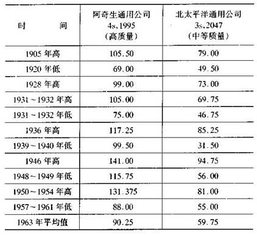
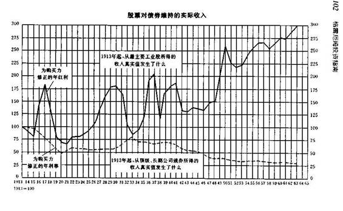

# 通用组合策略：防御型投资者

奇迹能够通过正确的个人选择而出现，即在一个正确的水平上买入．在大幅上涨之后和在不可避免地下跌之前卖出。但普通投资者不可能期望实现这点，就像他不能在树上找到钱一样。要购买的证券类型和想得到的回报率不是取决于投资者的金融实力，而是与知识、经验、气质相联系的金融技能。一个投资方案的基本特点在很大程度上由个体所有者的地位和性格所决定。一方面，我们有储蓄银行、人寿保险公司以及所谓合法的信托基金。直到现在，许多州在法律上仍将投资限于高等级的债券或高等级的优先股。另一方面，我们有富有的和有经验的商人，如果他们认为购买是有吸引力的，那么在他们的证券目录中将会包含任何一种债券和股票。那些不能承受风险的人，应该对他们的投资取得较低的回报感到满意。这是一个古老而正确的原理。从这点出发已经形成了一个概念：投资者所预期的回报率或多或少与他准备承担的风险成正比。我的观点是不同的。更确切地说，投资者所追求的回报率依赖于投资者愿意和能够完成任务的明智的努力程度。被动的投资者只能得到小的回报，因为他既想安全又不想过多地烦心；而机警的和进取的投资者则能得到最大的回报，因为他运用了最大的智力和技巧。在许多情况下，购买一种有可能获得较大收益的廉价证券的风险，比购买收益大约4．5％的常规债券的风险要小得多。

债券：股票分配中的基本问题

前面已经概述了防御型投资者的投资组合策略。投资者应该将他的资金在高等级的债券和高等级的普通股之间进行分配。

我建议将其作为一个基本指导原则：投资者不应将少于25％或多于75％的资金投资于普通股，而应相反将75％-25％的资金投资于债券。这说明在两个主要的投资媒介之间，标准的划分应该是相等的．或50％对50％。根据传统，增加普通股持有比例的正确理由，是在持久的熊市中出现"廉价"水平；相反，当投资者判断市场水平高得危险时，正确的做法应该是将普通股的比例降低到50％以下。

这些习字帖式的格言总是易于阐述清楚而难以遵循，因为它们与引起牛市和熊市的人类本性相违背。一种对普通股持有者固有的策略是：当市场超过一定点位时应清仓，而在点位相应下降后再增持。这些格言与此是相矛盾的。它要求普通人用我们过去取得很大成功和挫折的对立方式进行操作，而且必须如此操作--这点作者相信--我们在将来很可能也会如此。

如果投资与投机之间的区别像从前那样清楚，那么我们或许能够将投资者想像成为精明的、有经验的群体，他们在高价位时将股票卖给轻率的、运气不好的投机者，而在低价位时从投机者手中买回。这种情形在很久以前或许是真的，但从1949年后，就很难将其与金融发展等同起来。没有迹象表明诸如互助基金的专业操作已经受这种方式引导，在证券中，由两种主要基金(负债基金和普通股)所持有的公债券的百分比逐年很少有变化．其销售活动与从较少到较多的允许持有量的努力有紧密联系。

如果股票市场已经与其固有的边界失去接触，而新的边界还没有建立，那么本书就不能向投资者提供任何可信的准则，以便通过这些准则将其普通股持有量减少到25％的最小量，并在以后将它们恢复到75％的最大量。我极力主张一般投资者的公债券持有量不应多于一半，除非他对自己股票位置的正确性深信无疑，并且相信自己能够平静地对待1962年类型的市场下跌。因而，我反对在那时以多于50％的比例投资于普通股。但是，由于互补的原因，劝告人们将数量降低到50％以下几乎同样是困难的，除非投资者对当前的市场水平感到不安．并满足于在未来的上升中将其投资份额限制在总资金的25％。

这样，导致我向大多数读者提出可能是过分简单的50：50公式。在这个公式中，指导原则就是尽可能符合实际地维持债券和股票持有之间的均等划分。当市场水平的变化已经提高了普通股的比例时，例如55％，那么可以通过卖掉1／11的股票并将收益转移到债券而恢复平衡；相反，当普通股比例下降到45％时，则用1／11的债券资金购买另外的股票。

应当指出，耶鲁大学根据1937年后几年的数据得出了几乎相似的结论，但它是围绕35％普通股的"正常持有量"变动的。然而，在50年代早期，耶鲁大学似乎放弃了过去著名的公式，进而于1963年，在证券组合中股票占了61．5％(在那时，65个类似大学的募捐资金，总计接近50亿美元，持有55.
8％的普通股)。耶鲁大学的例子说明，大的市场上涨对曾经流行的投资准则产生了几乎致命的影响。然而，我确信50：50模型对防御型投资者是很有益的。它非常简单，毫无疑问瞄准了正确方向。它给予追随者以下的感觉，相应于市场发展，他至少做出了某些行动；最重要的是，当市场上升到越来越危险的高度时，它将限制他拿出越来越多的钱投入普通股。

更进一步，在上升的市场中，一个真正的防御型投资者将会满足于他的组合投资的一半所显示的收益；而当严重下跌时，他可能从他的境况要比更喜欢冒险的朋友的境况好得多中得到更大的安慰。

债券的组成

债券投资的目标相当简单：选择产生最好回报并有高度安全性的证券。公共机构的投资者关心在短期、中期和长期之间的选择，并利用所持有的一部分，准备在交易中牺牲收益的重要部分，以保证阻止与短期证券相连的价格下跌。在这本书中，我们仅处理单个投资者的组合投资问题。由于这些原因．选择债券时不应受太多复杂因素的干扰。

在过去的许多年中，惟一适合个人购买的证券是美国储蓄债券。它的安全性一直是毫无疑问的，并且能够获得比其

他一等债券投资更高的回报。它提供了退还货币的选择权和其他权利，这些大大增加了它的吸引力。在早期的版本中，我就此写了完整的一章，标题为："美国储蓄债券：投资者的福利"。

正像我曾指出的，美国储蓄债券还具有一个优点：它适合于个人投资者购买。对于资本有限的人而言，例如，投资不超过1万美元，我认为它仍然是最容易的和最好的选择，但拥有大量资本的人可能会发现其他更理想的媒介。

让我列举一些值得投资者考虑的主要类型的债券，并简单地描述它们的安全性、收益、市场价格风险、所得税情况及其他特点。

   
a．美国储蓄债券，系列e．

它们在购买后7年又9个月到期。人们以到期价值的75％购买此债券，利息自然增长，并最终以兑现值的形式支付。如果票面价值是100美元，6个月后支付75．64美元，7年又9个月后支付完整的100美元。

它的安全性毫无问题。美元购买能力的可能损失一般发生在持续的通货膨胀时，而真正的危险在于没有将其与普通投资意义上的"安全性"联系起来。这个危险对所有形式美元的投资以及对银行储蓄等同样都是普遍的。

它到期时将有3．75％的收益，而提前支取则收益更小。例如，如果在购买后3年支取，每年的收益大约为3．3％。这反映了同样质量的短期和长期债券收益的标准关系。

因为此债券能够以不低于成本价在任何时候被持有者赎回，所以从严格意义上讲，它根本没有任何市场风险。提前兑付所得到的低于3．75％的收益，与以固定3，75％的债券销售在原始价值的微小损失上是等同的。

债券的利息服从于联邦所得税而不是州所得税。联邦所得税可以由债券持有者选择以两种方法支付：一是每年按照赎回债券时增加的收入支付，一是延期到债券实际兑现时支付。

持有者有权以公开价格赎回是这一债券的最大特点。1950年后，当其他债券价格急剧下跌时，这一特点证明是很有价值的。如果愿意，持有者还可以通过以3．75％的税率拖延所得税，进一步选择债券的持有时间(老的债券已经享有延长至少10年的选择权，1957年5月后发行的债券的延长期限在1964年早期还没有宣布)。

该债券如丢失、损坏或被偷，可以无成本弥补。

每年，个人拥有者被限制购买到期价值1万美元的债券(系列e，成本是7500美元)，而对共同拥有者的规定使得典型的家庭有可能每年购买更多的数量。当拥有者去世时，债券可付与指定的个人。它们不可以被出卖、转让或像其他债券一样作抵押品。

   
b．美国储蓄债券，系列h．

这些债券按面值发行(100％)，期限10年，每半年付息一次。在最初的18个月，支付2.
57％的平均利息，然后按固定的4％支付；在10年的持有期间，综合利息为3．75％。没有延长期限的规定。其他规定与系列e．相似。

   
c．其他美国债券

这些债券包含了各种息票率和期限。它们就利息的支付和本金而言是非常安全的。它们适用于联邦政府所得税，而不是州所得税。收益主要随期限而变化。在1964年初，超过10年的长期债券可得到平均4．13％的收益，3至5年的中期债券收益为4．05％，短期债券收益为3．76％。

   
d．州和市政债券

它们的主要特点是免收联邦所得税，也免收发行债券的州(而不是其他地方)的所得税。它们或者是州或其分支机构的直接责任证券，或者为"收益债券"，其利息支付依赖于道路、桥梁、建筑物等征税的收益。不是所有的免税债券都受坚强保护，从而证明防御型投资者的购买是正确的。在进行选择时，投资者可能受摩迪和标准·普尔给出的每一种债券等级的影响。三种最高等级aaa、aa或a债券之一，应该构成安全性的指标。这些债券的收益将随着质量和期限而变化．短期债券给出较低的回报。1964年，在标准·普尔市政债券指数中所代表的债券，平均质量等级为aa，20年期限，在1964年早期收益宰为3．41％。当时宾夕法尼亚州建设局债券的代表性收益率是：1965年到期的为2．20％，1975年到期的为3．05％，最长(1989年)期限的为3．90％。

   
e．公司债券

这些债券受联邦和州税收的限制。在1964年初，那些质量最高、期限为25年的债券的收益率是4．4％，中低等长期债券的收益率是4．85％。在每一个等级上，短期债券收益比长期债券要少。

评论：以上概述表明普通投资者在高等级的债券间有几种选择。与应该课税的证券比较，高所得税阶层的人能从良好的免税证券中获得更好的净收益。对其他债券而言，应课税的收益范围似乎是从美国储蓄债券的3. 75％到顶级公司债券的大约4.
5％。这个范围对小规模债券业务量不太重要-

(1)价格变化性

投资者应该知道，即使本金和利息的安全性是没有问题的，但随着利率的变动，长期债券的市场价格也可能会有很大的变化。表14给出了几年来各种类型投资平均收益变化的数据，从中可以看出，在高等级(aaa)债券上的变化是相当惊人的：表15显示了两种代表性债券的价格波动。

表14 
1919~1963年各种类型投资的收益比较(％)

   
a.系列a、e和h；  b..来源于标准·普尔。 
c.来源于摩迪    d．纽约州平均值。

表15 
l905~1963年两种代表性债券的价格波动

   
(以美元为单位)

(2)更高收益的债券投资

通过牺牲质量，一个投资者可从他的债券中得到更高的收入回报。长期的经验已经证明，普通投资者总是很明智地远离高收益的债券。总体而言，当这种债券可以比第一流的债券在整个收益上表现得稍微好一点时，它们就使拥有者面临着太多的不利于发展的个人风险，范围从令人不安的价格下降到真正的不履约(交易机会不会经常出现在低等级的债券中，因此这需要特殊的研究和技巧以成功地开拓)。

 (3)作为债券替代的储蓄

现在，一个投资者可以从商业或储蓄银行得到像他从第一流的债券得到的几乎一样高的利率。银行储蓄账户的利率将来可能降低，但在目前情况下，它们是个人债券投资的合适替代物。

 (4)可转换债券

就形式而言，可转换债券由于提供了安全性和获利机会，从而表现出明显的吸引力。它的索取权排在公司的普通股之前；如果后者价格上升得足够高，转换权就有了价值，债券就可能以高于成本价卖出。然而，这样的优点是要付出代价的。这种债券的价格可以比有相同安全性而没有可转换权的债券高出20％。因此，可转换债券的购买者实际上从两种不同东西的"包裹"中得到了好处：普通债券加对普通股的购买权。可转换债券也有投资决策问题．它贬低了对防御型投资者的适用性。我将在关于进攻型投资者的章节中详细讨论这种类型的证券。

 (5)买入规定

大多数债券在到期之前可以被支付(当然，这里非常例外的是美国储蓄债券，其赎回权给予持有者而不是债务人)。在特殊情况下，债券可在保险后，以适当高于发行价5％的保险费被公平地购买。人们很少注意不满意的情况，其中，买入规定已经将债券持有者作为一个阶层。这意味着，在基本利率波动较大的时期，债券投资者不得不首当其冲地面对不利于己的变化，并且除了参与少量喜欢的债券外，被剥夺了一切。让我们举一个例子来清楚地说明这一点，因为它很重要且广泛被忽视。

   
1928年．美国燃气电力公司以101美元的价格向公众出售了期限为100年、退税5％的凭单债券，收益率为4.
95％。4年后，在极度萧条中，债券以62．5美元的低价售出，收益率为8％。这反映了非常不利的经济和市场条件对高质量投资债券的影响。相反，在后几年中，在有利的情况下，这种债券的利率跌到了3％以下。这意味着这种5％债券的价格上涨超过160美元。但在1946年3月的这个点位，这种债券仅能以106美元的价格被赎回。

典型债券合同中的买入特征是"我得头，你失尾"。在1934年至1946年利息下降的12年中，大多数投资者收兑了他们的长期、高付息债券，并且被迫接受越来越低的回报率。如果没有买入特征，他们的收入就不会减少并且他们债券的本金值会有巨大的增加。在1950年后，利率开始回升，那些在1946年以高价买进低息债券的投资者，他们的本金值实际上减少了。总而言之：当利率下降时，买入特征迫使投资者失去收入；当利率上升时，投资者会失去本金。

这种安排从投资者的角度来看很不合理，因而投资者不应该在不安全的情况下去购买它。

近年来，或许是机构投资者遗留下来的要求，买入规定情况有很大的改善。大多数新债券要么是不可赎回的，要么在发行后许多年才能赎回。

直接的(不可转换债券)优先股

在这里，应该对优先股做某些观察。真正好的优先股能够而且确实存在，尽管它们的投资形式不好，但它们本身是好的。典型的优先股持有者将安全性基于公司支付普通股的能力和愿望上。一旦普通股红利被取消，或甚至更危险，那么其地位就不稳定了。另一方面，典型的优先股除了享受超出固定股息的利率外，不参与公司利润的分配。因此，优先股持有人既没有债券持有者(或债权人)的法定索取权，也没有普通股持有者(或合伙人)享有的获取利润的可能性。

在萧条时，优先股法定地位上的这些弱点便更加明显。所有优先股中，只有一小部分使自己处于牢固的地位，在整个变迁中保持一个毫无问题的投资地位。经验告诉我们，购买优先股的时间，是临时性的逆境使得它们的价格被过分压低时(在这时，它们可能适合于进取的投资者，但不适合于防御型投资者)。

换句话说，它们应该在廉价的基础上被购买，或根本不被购买。我们今后将更加关心可转换债券和有类似权利的债券，因为它产生了某些特殊的获利可能性。

优先股总体地位的另一个特点值得一提：公司购买者比个人投资者有好得多的纳税地位。基于它们普通利息的收入总量，公司仅需支付红利收入15％的所得税。从1965年起，公司税率是48％，这意味着作为优先股红利收入的100美元仅需纳税7．20美元，而作为债券利息收入的100美元则需纳税48美元。另一方面，除了最近有一点减免外，个人投资者在优先股投资上须支付与债券同样多的税收：所以，严格地按逻辑讲，所有投资等级的优先股应该由公司购买，就像所有免税债券应该由支付所得税的投资者购买一样。

股票形式

如同迄今所讨论的，债券形式和优先股形式，是易于理解和相对简单的。债券持有者有权在确定的日期得到固定的利息和返还的本金；优先股所有者取得固定的股息．更重要的是，股息必须在任何普通股红利之前支付，它的本金值在任何指定的日期前不会到期(股息可能是累积的或非累积的，股票持有者可能有也可能没有选举权)。

上面讨论了大多数债券和优先股，以及分配中的基本问题。毫无疑问，仍有数不清的例外，最著名的类型是可转换债券和类似的债券及收入债券。除了这些外，还有许多债券，就它们对本金、利息或红利的索取权、选举权、分解权等等而论，都存在独自的奇异性。

在一个标准的投资组合策略中，混合的或不规则的证券形式被作为防止证券杂质的主要的外观依据。评价这些特殊证券的真正效果或价值经常是很困难的。证券的期限实际上可能有不寻常的吸引力，并且它也可能构成例外的情况。在例外的情况下，不规则证券仅应该被有进取心的投资者购买，那些防御型的投资者不应该去碰它们。

普通股的利弊

在本书的第一版中(1949年)，我发现对所有投资组合中包含大量普通股成分的情况插入一长段说明是必要的。普通股通常被认为具有高投机性，因而是不安全的；它们曾经从1946年的高水平大幅度地下跌，但这并没有吸引投资者，反而削弱了投资者在股票证券交易中的信心。我已经对随后16年中出现的逆境做过评论，股票价格的大幅上升现在已使得它们在所记录的高水平上看来是安全和可获利的投资，但实际上可能伴随着相当大的风险。

我在1949年对普通股的优点所作的论证取决于两个主要观点：第一点是，它们提供了相当程度上的保护，以避免由于通货膨胀使投资者的资金遭受损失，而债券却不能提供任何保护。题为"股票对债券维持的实际收入"的图为这个论证提供了证据。第二点是，多年来，它们给予投资者更高的平均回报。它的产生是由于平均红利收入超过好的债券收益和未分配的利润重新投资的结果。

尽管这两个优点是很重要的，并且在过去长期使普通股比债券有好得多的记录。但是我经常告诫，如果股票购买者为他的股票支付太高的价格，他可能会失去这些利润。市场水平回升到1929年至1932年大幅下跌的边缘花费了25年时间。从1957年起，由于它们的高价格，普通股又一次失去了红利收入高于债券利率收入的传统优点，剩下就要看通货膨胀因素和经济增长因素在将来是否会弥补这个不利的发展。

读者应该清楚，在这个水平上，我们一般不会热心于普通股。根据已经给出的理由，我感觉到，防御型的投资者不可能在他的有价证券中没有一定比例的普通股，即使他必须把它们看作是两种祸害中较小的一个--较大的是全部持有债券所带来的风险。

投资普通股的原则

对防御型投资者的组合策略，普通股的选择是很简单的。下面提出应遵守的四个原则：

①应该有适当的但不是过度的多样化，这也许意味着有最少10种和最多大约30种不同的证券。

②所选择的每一个公司应该是大的、突出的、谨慎投资的。尽管这些修饰语是不确定的，但它们的一般意义是清楚的。关于该点的讨论被放在本章的结尾。

③每个公司应该具有一个长期的连续的红利支付的记录(在道·琼斯工业平均指数中的所有证券满足了这个红利要求)。为了明确这点，我建议连续红利支付的要求至少从1940年开始。该点将简捷地把我们带进现在一般所指的"战前"时期。

①联系到过去7年的平均收益，投资者应该表明他将愿意为一个证券所支付的价格的界限。我建议这个界限设置为平均收益的25倍，并且不多于最近12个月的20倍。这个限制几乎将所有最强的和最流行的公司从组合证券中去掉了。特别是，它实质上取消了在过去很多年中被投机型和机构投资者所喜爱的整个成长股目录。

成长股和防御型投资者

术语"成长股"被用于这样一种股票：其过去每股收益的增长远高于整个普通股的收益率且人们预计今后仍会如此(一些权威人士认为，真正的成长股应该有望在10年至少将其收益翻倍，即它们的复合年收益率增长超过7．1％)。显然，如果支付的价格不过分的话，这种类型的股票具有购买和拥有的吸引力。当然，由于成长股长期以与现在收益相联系的高价出售，并且在过去一段时间以比它们的平均收益高许多的倍数出售，因而是存在问题的。这说明在成长股中已经导入了相当重的投机因素，并在这个领域以远不是简单的方式进行了成功运作。

最主要的成长股长期以来一直是国际商业机器公司股票，它已经为几年前购买它并坚持持有的那些人带来了丰厚的回报，我已经指出，这个"最好的普通股"在1961年至1962年的6个月下跌中，其市场价格实际上已经下跌了50％。其他成长股对不利的发展，表现得更加脆弱；在某些情况下，不仅价格已经跌回，而且收益也是如此，因而给那些拥有它们的人造成了双重损失。适合我们目的的第二个例子是得克萨斯仪器股份有限公司股票，它在6年中价格从5美元上升到256美元，没有支付红利．而它的收益从每股40美分增加到3
.91美元(注意：价格上升是利润的5倍，这是流行的普通股的特点)。但两年后，收益下跌了将近50％，并且价格下跌了4／5，到49美元。

从这些例子，读者将会明白为什么我把成长股总体上作为防御型投资者的一个很不确定和有风险的媒介。当然，奇迹能够通过正确的个人选择而出现，即在一个正确的水平上买入，在大幅上涨之后和在不可避免地下跌之前卖出。但普通投资者不可能期望实现这点，就像他不能在树上找到钱一样。相反，我认为相对不流行的因而可用合理收益几倍价格得到的大公司群的股票，给一般公众提供了一个合理的而非投机的选择区域。

投资公司股票

拥有少于5000美元资金的普通股投资者将得到忠告，应通过投资公司证券的媒介间接地获得他的清单。大多数现在被购买的股份由所谓的开放型公司发行，它们通过分销组织持续地销售它们的证券。索价包括对销售成本的弥补，其倾向于大约占基本资产价值的8％。股份可以在任何时间以当时的资产价值回售给公司。投资者所得的红利等于在基本证券上的支付减去运作费用支付，其平均大约是净资产的0.55％，并且可能是公司收入的15％。

开放型公司被有效地管理着，它们肯定比典型的小投资者犯更少的严重错误。因而，毫无疑问，开放型公司使拥有少量财富的一般的投资者能够充分履行其投资作用，这些投资者希望在相当多的普通股中取得收益。

拥有大量财富的防御型投资者是购买开放型公司的股份还是选择他自己的普通股组合，是一个更易引起争议的问题。在这两个方面有许多争论；投资者可能按照他自己在这个事情上的观点行事。

由于另外一种类型的基金，即被称为封闭型公司基金的存在，投资公司的问题变复杂了。这样的企业不会像开放型公司那样持续地购买和销售它们自己的股份，因而封闭型公司的股份，如同美国钢铁公司的普通股那样，完全由公开市场的买者和卖者所决定。它们中的大多数已经按财产价值的很大折扣有规律地出售。换句话说，当典型的公司资产的市场价值每一股份等于20美元时，那么封闭型公司的股份通常仅用16美元便可买到。

开放型公司和封闭型公司基金作为一个整体，已经说明过去许多年的结果大致等于道·琼斯工业股平均指数和标准·普尔500种股票综合指数的结果(这里，我指的是所有的普通股基金)。

我确信，就经济而言，封闭型基金总体上比开放型基金或互助基金能够提供更好的价值。对不同的公司和不同的年份，投资结果会在很广的范围内变化；但两个群体的整个行为是非常相似的。显然，那些按净资产价值的80％购买封闭型股份的投资净回报更好于按价值的108％购买开放型股份的投资净回报(不一致的原因能够在简单的事实中发现，互助基金股份是通过很多勤奋工作的上门推销商销售的，而封闭型股份的销售则没有类似的努力)。

然而，应该指出，有相当一部分开放型基金为"无负荷"销售，即按净资产值而没有附加的销售费用(也有一些开放型基金仅有1％或2％的附加费用)。他们中的大多数由投资顾问商行和佣金机构操作，并通过收取管理赞用和佣金得以补偿。1963年底，该类型中最大的结算基金是路米斯-塞勒斯互助合作基金，最大的全普通股基金是斯库德、斯蒂文斯和克拉克普通股基金。显然，这个群体已经产生了一个接近于满负荷互助基金和封闭型公司基金的长期记录。因为没有雇佣销售商来销售股份，因而无负荷基金不如较大负荷基金增长得那么快(这里，与储蓄银行人寿保险相当类似，它们更经济但不如销售商销售保险那样流行)。

投资于普通信托基金

投资基金股份的替代就是参与普通信托基金，它通过银行或信托公司来运行。由费城吉拉德信托银行所持有的一种普通信托基金(多样性信托基金a)的特殊规定可作以下概述：

为了参与此基金，吉拉德信托银行作为受托者必须建立一种个人信托，可以有个人作为合作信托者。为了将基金限制在"适度信托"规模，一个单位信托部分的参与基金不超过10万美元。没有管理费或进入基金的费用(负荷费)或收回资金的费用，但信托公司通过充当"信托不动产"的受托者，收取标准费用而得以补偿。进入或收回可以在每季度开始时进行，基金的收入按季计算和分配。

基金被投资于美国政府债券、公司债券、优先股和普通股。以1963年11月的价值为基础，1963年的回报是3．76％(以受托人的费用为条件)。在这一年中．净资产值增加了7．3％。

让我们假设刚才描述的基金是典型的普通信托基金-也许，除了它在优先股中的非常大量的投资(17．6％)。一个投资者为了自己的利润，可以通过建立一个(可撤销的)信托基金，将他平常的资本交给这样的管理机构。这时，他的地位多少类似于所谓的有补偿的基金股份持有者。该基金是一个持有相当数量的高级证券和普通股的投资公司，通常的比例大约分别是35％和65％(吉拉德信托基金在1963年11月拥有普通股55．4％)。

组合策略的变化

为了观测组合投资质量是否能够被改进，提交所有的证券表进行周期性检查现在是一个标准的惯例。当然，这是投资顾问们为顾客提供服务的一个主要部分。几乎所有的佣金机构都准备提出相应的建议，不附带特殊的费用，而是以所包含的佣金作为回报。某些佣金机构以费用为基础维持着投资服务。

当投资者探索什么时候他的资金第一次被交付时，可能投资者应该至少一年一次得到与他的组合投资变化有关的相同类型的忠告。因为他对自己所依赖的东西没有多少专业知识，因而他必须将自己委托于具有最高声誉的商行，否则，他也许很容易落入无能的或无耻的人的手中。在任何时候，在每一个这样的磋商中，投资者都应该使他的顾问清楚，他希望严格遵守本章早些时候给出的普通股选择的四个原则。偶然地，在第一次，如果他的清单已经被合理地选择，那么就没有必要经常和大规模地变化。

美元·成本平均标准

纽约证券交易所已经用了很大的努力来普及它的"月度购买计划"，在该计划中，投资者每月投入相同数量的资金以购买一种或多种普通股。这是一个被称为美元'成本平均标准的一种特殊类型"公式投资"的应用。从1949年起，在突出的上升市场的经验中，从这样一个程序所带来的结果是非常令人满意的，因为它防止了参与者在错误时间集中购买。关于美元·成本平均标准，或许一个更令人信服的事例可以通过研究1949年前的结果而发现，特别是那些包含了1929年后灾难性下跌的年份。

让我们概括以下由桑德森在纽约证券交易所月刊《交易》1947年7月号上发表的一篇文章中所提供的某些数字。尽管所覆盖的期限很遥远，但这些数字可能比1949年至1963年所得的数字更贴近投资者将来的问题；在后一个期间，趋势太过于向上，因而美元·成本平均标准方法不适合于任何有关其正确性的测试。

在这篇文章中，跟踪了从1927年开始到1946年结束，每年投资1000美元于阿奇生和陶佩吉和桑塔.费铁路普通股的结果。每年得到的股份范围从1929年以价格247美元购买的4股到1940年以价格19美元购买的52股，年平均是18．2股，价格55美元。这个结果比取这个期间高、低价的直接平均值所得到的结果要好得多。因而，尽管1947年6月80美元的价位远低于早期购买的价位，但是它显示，在整个持有量上有44％的增值。在此期间，基于成本每年所得的红利平均为6．3％。对以同样方法购买的其他10种著名的普通股也显示了同样的结果。

在路斯利·汤林森公式投资计划的详细研究中，作者根据构成道·琼斯工业指数的一组股票，描述了美元·成本平均标准结果的计算。所做的试验覆盖了23个10年购买期，第一个1929年结束，最后一个1952年结束。每一个试验都证明或者在购买期结束时或者在此后的5年获得利润。在23个购买期结束时，除去红利收入外，所揭示的平均利润是21．5％。不用说．某些时候，市场价值有大幅度临时的下跌。tomlinson小姐用惊人的语句结束了这个异常简单的投资公式："还没有人发现任何其他投资公式，该公式可以充满最终成功的信心，而无论证券价格发生什么变化，就像美元'成本平均标准一样。"

反对意见认为，美元'成本平均标准尽管原理上是正确的，但实际上是很不现实的，因为很少有人处在如此的境地，他们20年每年为普通股投资相同数量的钱。对我而言，这个明显的反对意见在近几年中似乎已经失去了它的大部分力量。普通股正逐渐被接受为合理的储蓄--投资规划中必需的组成部分。因此，系统且均匀地购买普通股也许并不比同样连续支付美国储蓄基金和人寿保险表现出更多的心理和财政上的困难，它们应该是补充。月度数量可能是很小的，但在20年或更多年之后，结果对储蓄者而言是难忘的和重要的。

投资者的个人状况

在本章的开头，我简单地指出了单个组合证券拥有者的地位。根据随后总体策略的讨论，让我回到这个问题。在什么范围内投资者选择的证券类型会随着他的环境而变化呢?作为表示许多不同条件的具体例子，我将列举如下：(1)一个寡妇被留下10万美元以供养她自己和她的孩子；(2)一个职业生涯中成功的医生，有10万美元的储蓄，且每年增加5000美元；(3)一个年轻人，每周收入100美元，一年储蓄500美元，

对于这个寡妇，依靠她的收入生存是个很困难的问题。另一方面．在她的投资中，保守性选择是首要的：将她的资金在美国债券和一等的普通股之间进行大约相等的划分，符合我们对防御型投资者的总体说明。(如果作决策时，她已有思想准备，并确信购买时价格不是太高，那么股票部分可以高达75％：但在1964年早期，情况肯定不是如此：)

不排除这个寡妇可能是一个有进取心的投资者，在这种情况下，她的目标和方法是很不相同的。寡妇不必做的一件事情就是以投机的方式"获得一些额外收入"，这一点，我的意思是指在没有必要的完全可以依赖的获取全面成功的手段下，谋取利润和高收入。为了收支平衡，每年从她的资本中取出1000美元要比用一半资金以贪婪为基础去投机、冒险好得多。

富裕的医生没有寡妇所承受的压力和义务，然而我认为他的选择与她是非常相似的。他愿意在投资业务中获得感兴趣的利息吗，如果他缺乏冲动或本领，那么他最好接受防御型投资者这个容易的角色。他的组合投资的划分将和典型的寡妇的划分没什么不同，并在固定股票大小上有相同的个人选择范围，年度储蓄应与整个基金大约是相同的比例。

富裕的医生或许比普通的寡妇更可能成为一个有进取心的投资者，并且更可能在事业上取得成功。然而，他有一个重要的障碍，他没有多少时间可以用在投资教育和资金的管理上。事实上，从医的人在他们的证券经营中很不成功。造成这种情况的原因是他们通常太过于相信自己的才智，并且强烈渴望取得好的回报，而没有意识到要取得成功，既需要对这种事情的充分注意，也需要某些证券评价的专业方法。

最后，那个每年储蓄500美元并且期望逐渐做得更好的青年，发现自己有着同样的选择，尽管有不同的原因。他的部分储蓄应该自动地投放进系列e债券。平衡是如此适中，以至于他几乎不值得去经受不愉快的教育和本质上的训练，以便充当一个合格的进攻型投资者。因而，防御型投资者简单地采用我的标准程序，将是最容易和最合逻辑的策略。

在这点上，我们不要忽略了人的本质。金融对许多财产有限但聪明的年轻人有着诱惑力。他们可能在储蓄的投放方面既有才智又有进取心，尽管投资收入比他们的薪水收入重要性要小得多。这种态度是好的。年轻的富豪尽早地开始他的金融教育和实践有很大的益处。如果他准备像进攻型投资者那样运作，他肯定会犯一些错误并造成一些损失，尽管年轻人自己能够承受这些挫折和利润。我力劝开始购买证券者，不要浪费他的努力和钱财以试图与市场作对。请他研究证券价值吧，并通过他的判断开始检验与最小可能数量的价值相对的价格。

因而，让我们回到一开始所作的陈述：要购买的证券类型和想得到的回报率不是取决于投资者的金融实力，而是与知识、经验、气质相联系的金融技能。

何谓"风险"

按传统的说法，好债券比好优先股风险小，而后者比好普通股风险小。从这点得出了反对普通股的流行的偏见，因为它们不"安全"，这被1948年联邦储备委员会的调查所证实。应该指出，由于术语"风险"和"安全性"以两种不同的意义用于证券，结果导致了思想混乱。

一个债券，当它不能偿还利息或本金时．可以清楚地证明是不安全的。同样，如果一个优先股或者一个普通股是带者能连续支付红利的期望而被购买的，那么，红利的减少或不支付则意味着它是不安全的。当价格低于成本时，如果存在持有者不得不在这时卖出的可能性，那么投资包含着风险也就是真的。

然而，风险的思想经常被扩充到用于一个证券价格的可能下跌，甚至这个下跌可能是周期性的或暂时的，并且持有者也没有被强迫在这时出售。这些可能性出现在所有证券中，而不是仅在美国储蓄债券中；出现在普通股总体运行中的程度比出现在作为一类的高级证券中的程度更深。但我相信，这里所包含的东西并不是真正的风险。那些持有建筑物抵押的人，如果他被迫在不适宜的时间出售，那么将可能不得不承受巨大的损失。在判断普通不动产抵押的安全性和风险时，并没有考虑那个因素，惟一的标准是按期付款的可靠性。同理，与普通商业业务相联系的风险是用它损失钱的可能性来衡量，而不是用如果拥有者被迫出售时将会发生什么来衡量。

与在第二章的讨论相一致，我将强调，诚实的投资者不会仅仅因为他所持有的证券的市场价格下跌而遭受损失，因而下跌的可能发生并不意味着他正承受损失的真正风险。如果一组经过认真选择的普通股投资，通过几年的衡量，表明有一个令人满意的总回报，那么这组投资证明是"安全"的。在投资期间，市场价值注定要波动，并且很可能在这个购买者的成本之下出售一段时间。如果这个事实使得投资"有风险"，那么它将不得不在同时被称作有风险的和安全的。如果我们将风险的概念仅用于价值的损失，这个损失或者是通过实际出售所造成，或者由公司地位的急剧恶化而引起．或者是与证券内在价值相关联的过分的价格支付的结果，那么这个困惑就可避免。

很多普通股确实包含了恶化的风险，但普通股中合理地进行的一组投资不会引起这种类型的任何实质性风险，因此，不能仅仅因为价格波动的因素，就将它定义为"有风险"。但是，按内在价值标准，当存在着这个价格被证明明显太高时，风险就出现了，即使后来严重的市场下跌在很多年后能够被补偿。

什么是"大的、突出的和财政保守的公司"

标题中所引用的短语用以描述那些限于防御型投资者购买的普通股种类--假设它们在许多年中连续支付红利。基于形容词的标准总是模棱两可的，那么，规模、突出性、财政结构的保守性的分界线在哪里呢?就最后一点，我能够提出一个特殊的标准，尽管武断，但它与被接受的想法相一致。一个工业公司的财政是不保守的，除非普通股(以账面价值)至少代表了包括所有银行债务在内的总资本的一半，对铁路和公用事业公司而言，这个数字至少应该是30％。

这里"大的"和"突出的"，是指相当大的规模以及在工业中占主导地位。这样的公司通常被当作是"主要的"；除了成长型股通常被那些购买它的人放在一个独立的层次外，所有其他的普通股鄙被称作为"次要的"。在这里，为了提供一个具体的要素，我建议，当今天称一个公司是"大的"，那么它应该有5000万美元的资产或5000万美元的业务；当称一个公司是"突出的"，那么它的规模应该位于本工业群体中前1/4或前1/3。

然而，坚持如此武断的标准将是愚蠢的，它们只能作为那些要求指导的人的指南。任何由投资者为自己设定并且不与普通意义上"大的"和"突出的"相冲突的规则应该是可接受的。事实上，必须有一群边际公司，其中一些适合于防御型投资者，而另一些则不适合。观点和行动的多样化是无害的，它在股票市场中产生了有益的效果，因为它允许主要的和次要的股票类别之间有逐渐的区分或转变。
