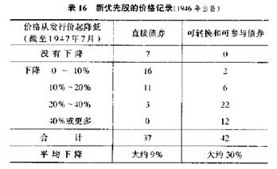
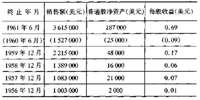
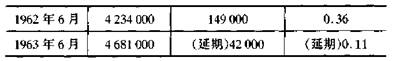
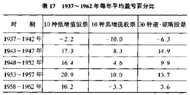
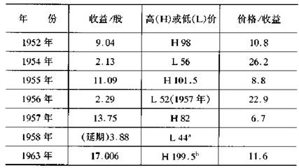
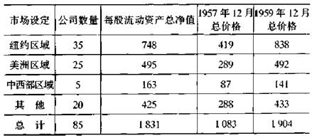

## 进攻型投资者的组合策略：负面方法

仅仅由于收益诱人而去购买缺乏足够安全性的债券或优先股是不明智的

进攻型投资者应从与防御型投资者相同的基础开始，即在高等级债券和以合理价格购买的高等级普通股之间进行资金的分配。

进攻型投资者应从与防御型投资者相同的基础开始，即在高等级债券和以合理价格购买的高等级普通股之间进行资金的分配。他将准备扩充范围，以便投资于其他类型的证券，但在每种场合，他都需要对选择有一个合理的推断。用有条理的方式讨论这个主题存在着困难，这是由于对进攻型操作没有惟一的或理想的模式。选择的领域是很广的；选择不仅依赖于个人的能力和工具，而且可能同样依赖于他的兴趣和偏好。

对进攻型投资者最有用的是采取一种消极的方式。让他将高等级优先股留给合伙购买者，让他避开低等级的债券和优先股，除非能以廉价水平购买它们．这通常意味着以低于账面价值至少30％的价格购买。他将会让其他人购买外国政府债券，即使收益可能是诱人的。他也将注意所有类型的新证券，包括可转换债券和似乎十分诱人的优先股以及最近几年有很好收益的普通股。

对标准债券投资，进攻型投资者将会尽量采用给防御型同行建议的模式，并在可以得到大约4.5％的收益的一等纳税证券和其长期收益高达3.5％的高质量的免税债券之间做出选择。

二等债券与优先股

现在，我们应该讨论投资于二等债券的问题，很容易发现这些债券产生的任何指定的回报率可以达到8％或更高。在一等和二等债券之间的主要不同在于收益与利息相比的倍数。例如，在1964年早期，芝加哥、密尔沃基、圣保罗和太平洋公司回报率为5％的债券，价格68美元，收益率7．35％。但是，1963年铁路税前收益仅是其债券全部利息支出的1．5倍，违背了我们关于有着良好防范的铁路债券其公司收益要高于债券利息5倍的期望。

许多投资者购买这种类型的债券，是因为他们"需要收入"，并且不能在由顶级债券所提供的不多的回报上取得进展。经验清楚地表明，仅仅由于收益诱人而去购买缺乏足够安全性的债券或优先股是不明智的(这里，"仅仅"意指债券没有以大的折扣出售，因而不会提供资本价值巨大的收益机会)。当这样的公债券以全价购买，即比100低不了几点，那么，在将来某一个时候，持有者看到一个低得多的行市的可能总是一个坏的购买、价格为70美元的同样的证券可能更有意义，如果你有耐心，你将可能在那个水平上购买它、

二等债券和优先股拥有两个相矛盾的性质，明智的投资者必须清楚地已在心里，在坏的市场，几乎所有的证券都经受着一段时间的严重下跌；另一方面，当好的条件重现时，大量的征券又重新回到它们的价位。当股市不利时，优先股已经几年没有支付股息了，这是真实的情况。作为30年代持续萧条的结果，40年代初有大量的此种股票。在1945年至1947年战后繁荣时期，这些大的累积优先股中的许多或者以现金或者以新的证券支付，并且本金也经常被偿还。结果，大量利润被那些在几年前购买这些证券的人所获得，而当时这些证券无人理睬并被低价出售。

在整个账目中，二等高级债券可得到的高收益将证明已经弥补了不可挽回的本金损失，这一点可能是真的：换句话说，一个以它们的开价购买所有这种证券的投资者，最终可能过得很好，就像将自己限于一流质量证券的投资者一样，甚至稍微更好一点。①

要是没有实际目的，问题就很不切题。无论结果如何，当二等债券的价格突然下跌时，以全价购买它们的购买者将会焦虑和烦恼。更进一步，他不可能购买足够的证券以保证一个平均结果，他也不能够留出大量收入的一部分以弥补或"分期偿还"那些已被证明是永久的资本损失。最后，如果长期经验证明在下一个弱市可能以70美元或更少的价格买到股票，

①在国家经济研究局指导下所进行的精心统计和研究表明．情况确实如此

那么就一般意义上讲，应该禁止以100美元左右的价格购买。

外国政府债券

即使只有很少经验的投资者都知道，总体而言．外国债券从1914年以来一直有一个不好的投资记录。由于两次世界大战和一次前所未有的世界性危机，这是不可避免的。然而，没有几年，市场条件非常适合以账面价格销售某些新的外国证券。这个现象为我们提供了许多有关普通投资者心理活动的轨迹，并且不仅仅在债券领域。

几乎所有外国政府债券都比一流的国内债券收益更大。在1964年初，高利率的债券．例如澳大利亚或丹麦的债券，利润率大约是5％。这些债券在这里发现了现成的市场--息票率通常比在他们自己国家更低--因为美国人相信它们是很安全的，并被每年0．5％左右的额外收益所吸引。美国债券投资者只具有相当短暂的记忆和很有限的想像力，他们几乎不会回想起在上一个时代几乎影响了所有外国债券的经济和政治变迁，他们也不可能设想在将来发生相同变迁的可能性，包括类似的大幅度价格下跌。

我没有具体理由关心澳大利亚和丹麦债券的价格水平，但我的确知道，当麻烦到来时，外国证券的拥有者没有法律或其他方式实施他的索赔。那些在1953年以117美元的高价购买古巴共和国4．5美元债券的人眼睁睁看着利息未被付与．然后在1963年以20美分的低价出售了它们。当年，纽约证券交易所债券表中包括了比利时、刚果5．25美元债券，价格36美元；希腊7美元债券，价格30美元；以及各种波兰债券，价格低到7美元。自从它们在1922年以价格96．5美元供给这个国家以来，有多少读者考虑过重复捷克斯洛伐克8％债券的变迁?它们在1928年上升到112美元，1932年下跌到67.75美元，1936年回升到106美元，1939年暴跌到6美元，1947年(不可思议地)回升到117美元，1948年迅速下跌到35美元，并在1963年以19.125美元的低价出售。

几年以前，存在着一个关于购买外国债券种类的争论，这个争论是基于类似于我们一样富有的债权国所具有的对外国的道德责任。时间，它带来如此多的报复。现在我们正在处理一个自己难以处理的平衡支付问题，部分问题可以归结于寻找小额收益的美国投资者对外国债券的大规模购买。过去的几年中，我们从购买者的立场对这种投资的内在吸引力提出了质疑；或许我们现在应该加上一点，如果投资者拒绝了这些机会，将会给他的国家和他本人带来益处。

新证券

我的一个建议是，所有的投资者都应该留意新的证券，简单地说，这意味着在购买它们之前应该仔细地调查和非常严格地测试。

对这双重限制，有两个原因。第一个原因是，在新证券之后隐含着特别的推销术，因而这被称作一定程度的销售阻力；第二个原因是，大多数新证券在"有利的市场条件"下销售，这意味着有利于销售者而结果对购买者不利。

随着我们从最高等级债券到二等优先股到最低级普通股的等级逐步下降，这些考虑就变得越来越重要了。在过去进行的大量的筹资，包括以买入价支付现存的证券和由具有更低息票的新证券作为替代，其中的大多数属于高等级债券和优先股的范畴。购买者主要是金融机构，足以保护自己的利益。因而这些证券被精心地定价以适应可比较证券的现行利率，并且高能力的推销术对结果也没有什么影响。当利率越来越低时，购买者最终为这些证券付出了太高的价格，并且它们中的许多后来在市场上明显下跌。这就是当条件对发行者有利时，销售各种新证券的总体趋势中的一个方面;但一流证券的情况对购买者的负面影响可能只是不愉快的而不是严重的。

当我们研究1945年至1946年和1960年至1961年出售的低等级债券和优先股时，情形稍有不同。由于这些证券的大部分售给了个人和业余投资者，因此，销售努力的效果更明显。这些证券的特点是，当根据适当年数的公司业绩进行判断时，它们不会作出适当的展示。如果能够假设现在的收益将会继续而没有严重的倒退，那么它们中的大多数看起来的确是很安全的。发行这些证券的投资银行家可能接受这个假设，并且他们的销售商在说服他们自己和他们的顾客接受相同的效果时没有任何困难。然而，它是一种不好的投资方法，并且可能证明代价是很高的。

牛市周期通常以大量私人拥有的企业转成挂牌股份公司为特征。这是在1945年至1946年和从1960年开始又出现的情况，后一过程到达相当的程度直到引起1962年灾难性的关闭。一个相当普遍的过程就是将优先股出售给公众，经常是增加货币以满足企业膨胀的需求，为了老的拥有者的利益，也出售大约25%的普通股。因而，后者将保持大约75%的普通股并在诱人的时期将剩余部分变成现金。在大多数情况下，优先股将以比普通股的开价稍高的价格转换成为普通股。

这种方法，现在是共同投资的标准，在这里值得考虑。为方便起.见，我们将不仅处理可转换债券中的新证券，而且也处理一般的形式:许多投资者毫无疑问已经被证券销售商引入到可转换债券，而这些销售商已经有新的证券要销售。

可转换债券

这种债券被断言对投资者和发行公司都特别有利。投资者得到一个债券或优先股的较多的保护，加上分享普通股价值任何大幅上升的机会;发行者能够以适当的利息和优先股股息的成本来增加资本，并且如果所期望的繁荣得以实现，发行者就可以将其转换成为普通股而免去优先股责任。因而，讨价的双方将会相处得很好;

显然，前面的章节有点夸大了情形，因为你不可能靠一个机智的计划得出一个对双方都更好的交易。在转换权的交易中，投资者通常放弃质量或收益，或对两方面都重要的某些东西:相反，如果由于可转换性，公司以更低的成本得到它的货币，那么它就正在减少普通股持有者对未来增长所要求的回报部分。在这个主题上.产生了一系列赞成与反对的狡辩。得到的最安全的结论是，可转换债券与任何其他形式的债券一样，以自身的形式，保证其既不诱人也非不诱人。问题将完全依赖于围绕着单独证券的事实。

然而，我们确实知道，在1945年至1946年流通的典型的可转换债券已被证明是不诱人的。事实上，整个该组的市场行为已被证明比那些不具备可转换特征的优先股更令人失

望。表场将刻画出这种情景。

表16新优先股的价格记录(1946年出售)

从这些数据得出的结论并不是说，可转换债券本身比非转换债券和直接债券更不诱人，其他的方面是相同的，而对立是真实的。但我们也清楚地看到，其他的方面在实际中并不

相同，并且附加的可转换权利经常-或许一般地-暴露出这种证券缺乏真正的投资质量。

当然，真实的情况是，可转换优先股比同一公司的普通股更安全，即它最终损失本金的风险更小，因此，那些购买了新的可转换证券以取代相应的普通股的人，其行为在某种程度

上是符合逻辑的。在大多数情况下，普通股并不是以一个规定的价格开始，因此这时购买是不明智的，且可转换优先股所作的替代并不能充分改善这种情形。更进一步，大量的可转

换债券是被那些对普通股没有特别兴趣和信心的投资者所购买，他们从来没有想过在当时购买普通股，但他们被似乎是优先权加上接近市场的可转换权的理想组合所诱惑。在许多情

况下，这个组合运行良好，但统计似乎表明它更可能是一个陷阱。

与可转换债券相联系，存在着一个大多数投资者难以认识的特别问题，即当利润出现时，它也同时带来一个进退两难的困境。持有者是否应该在稍微上升一点就卖出?他是否应

该继续持有以等待更大的上升?如果债券被收兑-当普通股已经有相当大的上升时，这种情况经常发生-他是否应该卖出或转换成为普通股并且保留它呢?

让我们通过具体的费用来进行讨论。你以100美元的价格购买3.5%的债券，转换成价格为25美元的股票，即按每1000美元债券40股的比率。股票上升到30美元时，这使得

债券至少值120美元，所以它以125美元出售。你或者出售或者持有。如果你持有，希望有一个更高的价格，你几乎处在与普通股持有者相同的位置;如果股票下跌，你的债券也会下

跌，你的收入回报可能比普通股少得多。一个保守的人可能说，超出125美元，他的位置已经变得太投机了，所以他应该出售并得到令人满意的25%的利润。

到目前为止，一切顺利。但我们还要进一步追踪这件事。当持有者以125美元卖掉债券后，在许多情形中，普通股将继续上升，并带有可转换性，投资者会痛苦地看到他过快地出售了很多股份。下一次，他决定持有它到150美元或200美元。当证券上升到140美元时，他没有出售。然后，市场崩溃，他的债券下跌到80美元。他又一次做错了事。

除了产生这些坏的猜想带来的精神痛苦外-它们似乎是不可避免的-在可转换债券的操作中还存在着真正的数字上的缺陷。或许可以假设一个按25%或30%利润出售的严格和统一的策略，当许多持有者应用这一策略时，将能够成功地进行运作。但是，如果就像真的出现一样这些债券缺乏足够的基本的安全并且趋向于在牛市的后阶段发行和购买，那么它们的大多数就不会升到125美元，当市场下跌时，也不会不崩溃。因而，可转换债券的投机机会在实际中被证明只是虚幻的。

由于如今的牛市异常的长，可转换债券作为一个总体15年来已经干得很好了，但这仅意味着大多数普通股已经享受了大多数可转换债券能够分享的大上涨。投资于可转换债券

的好处只能通过市场下跌时它们的表现来检验。

下述埃费夏普可转换债券在1945年至1948年期间的表现是有趣的，它有助于加强我们的论题。大多数可转换债券代表着一个机会和风险的特别组合，它对于投资者可能是撩人的同时又是令人失望的。

在1945年，埃费夏普以103美元出售两种4.5美元收入企业债券，每种300万美元，以每股40美元转换成为普通股。股票迅速上升到65.5美元，然后(在2股分成3股之后)上升到88美元。后一个价格使得这个可转换债券的价值至少为200美元。在这个期间，两种债券以很小的溢价发行，因而它们实际上被全部转换为普通股，该普通股被许多财政债券的原始投资基金购买者所保留。价格很快开始了剧烈的下跌，在1948年3月，股票价格跌到7.375美元。这表示企业债券的价值仅为27美元，或者原始价值损失了75
%，而不是100%以上的利润。

我对新的可转换债券的一般态度是怀疑。在这里，我的意思是指，像其他类似的观察一样，投资者在购买它们之前至少应观察两次以上。在怀有敌意的细察之后，他可能发现某些有利于拒绝的例外情况。当然，理想的组合是一个非常安全的可转换债券，它可以转换成诱人的普通股，并且价格仅稍高于现行的市场价。不时地出现一些新的证券满足这些要

求。然而，根据证券市场的本质，你更可能在某些已经发展到了有利位置的老证券中发现这样的机会(如果一个新证券确实很坚挺，它就不可能有一个好的转换权)。

在标准型可转换债券中，在给予什么和不给予什么之间的良好平衡，可由美国电话电报公司在融资中广泛使用这种类型的债券来很好地说明。1913年至1957年，该公司至少销售了9种不同的可转换债券，它们中的大多数将预约权给予了股票持有者。可转换债券对公司有很大的好处，它带来了比股票出售广泛得多的购买者，这是由于该种债券流行于许多拥有大量资金的金融机构，这些机构中的一部分便不允许购买股票。债券的利息收入通常少于相应的股息收入的一半。这是个抵消债券持有者优先权的因素。由于公司维持它的9美元股息率已经有40年了(从1919年至1959年的股票分割)，实际上将所有的可转换债券最终转换成了普通股。因而，这些可转换债券的购买者在几年中日子过得很顺利，尽管并非像他们在一级市场购买了资本股那样好。是这个例子而不是可转换债券的内在吸引力，为美国电话电报公司赢得了声誉。为了在实际中证明它们的正确性，我还应有一些例子，在这些例子中，即使普通股的表现令人失望，可转换债券也会良好运转。可是这样的例子不容易找到。

新发行股的炒作

下面内容是从1959年版本上未加改变地复制下来的，并加上评论。

普通股融资采取两种不同的形式。在公司已经上市的情况下，增加的股份按比例地提供给现有的股票持有者。预定价格定在当前市价之下，并且预定的"权力"含有一个原始货币价值。新股份的销售几乎总是由一个或更多的投资银行包销，但一般希望和期望所有的新股份将通过行使预约权而购买。然而，上市公司增加的普通股销售通常不需要分销机构方面的积极销售努力。

第二种类型是用以前私人拥有的企业普通股进行公开的配置。这种股票的大多数出售是为了控制利息以使它们能在有利的市场兑现，并改变企业的财政(当新的货币用于经营时，它经常通过优先股的销售而实现)。这个活动遵循着一个良好的模式，然而依证券市场的性质，其必然会给公众带来许多损失和失望。危险来自被供给资金的企业的特点和使得筹措资金成为可能的市场条件。

在本世纪早期，我们最主要的公司的大部分被引入公共贸易。随着时间的流逝，仍然紧紧持有证券的一流公司的数目在逐渐减少，因而原始普通股的创建已经趋向于越来越集中在相当小的企业。作为一个不幸的关联，在同一时期，股票购买者已经形成了对大公司的根深蒂固的偏好和对小公司的相同的偏见。这个偏见，像许多其他的偏见一样，随着牛市的逐步建立而趋向于减弱;普通股带来的大且迅速的利润足以钝化公众的批评。而且，在这期间，可以发现相当多的私人企业取得了辉煌的成就。

当这些因素被放在一起时，出现了下面的结果:在牛市中期的某个时候，第一个普通股的筹资出现了。这种股票的定价毫无吸引力，但是被早期证券的购买者创造了较大的利润。随着市场的继续上升，这种融资方式便经常产生;公司的质量不断地变差，要价近于过分。牛市接近底部的非常可靠的信号是:小且难以归类的公司的新普通股，以稍高于许多具有长期市场历史的中等公司股票的价格发行(应该补充的是，这种普通股融资很少是由具有最佳规模和声誉的银行来实施的)。

公众的阻力和销售组织情愿出售任何可能有利可图的商品，只能有一个原因:价格崩溃。在许多情况下，新证券将损失它们发行价的75%或更多。以前的事实更坏，这个事实是，在牛市的底部，公众对那些随意购买的每一种类型的小证券都非常厌恶。这些证券的大多数都下跌到低于它们的实际价值，其程度与以前出售时所高出的程度相对称。

对聪明的投资者的一个基本要求，就是要有能力来抵抗那些在牛市期间出售新普通股的证券销售商的哄诱。即使通过严格的测试能够辨明一两种股票的质量和价值，但是搅和在这种业务中仍可能是一个坏的策略。当然，销售商将会指出这种证券有相当好的市场前景，包括某些证券在出售当天就诱人地上升，但所有这些只是投机气氛的一部分。此时，花钱很容易。对于你按这种方式运作的每一美元，如果结束时仅亏损两美元，你将是幸运的。

几年以后，当没人需要这些证券，即它们只能按实际价值的很小比例出售时，购买它们才是正确的。

然而，从1949年起，更广泛的股市行为并未有助于使他们的分析以长期经验为基础，新普通股筹资的继续完全与老的规定相一致。现在值得怀疑的是，我们在过去是否曾经以那样低的质量发行过如此多的新证券，并且遭受了那样剧烈的价格崩溃，如同我们在1960年至1962年所经历的那样。股票市场总体所具有的迅速从灾难中解脱的能力的确是一个不寻常的现象，它将人们带回到已被长期埋葬的记忆中，即在1925年佛罗里达不动产大崩溃中，它所显示的类似的避难能力。

在目前的牛市最后结束之前，新股票发行的疯狂性一定会有回报吗?谁知道呢!但我的确知道一个聪明的投资者将不会忘记在1962年发生了什么，它使其他投资者在这个区域迅速得到后续的利润，随后经历痛苦的亏损。

一个可怕的案例

如果在这里更详细地引用一个"痛苦的例子"，我认为这也许能使读者对新普通股发行的未来态度产生有益的影响。这个例子取自标准·普尔《股票指南》的第一页，它用极端的方式说明了1960年至1962年股票筹资的显著弱点，由于在市场上给予它们太高的定价，结果造成崩溃。

在1961年11月，15.4万股埃特纳·缅因特纳斯公司普通股以9美元价格出售给公众，并且很快升到15美元。在融资前，每股净资产大约为1.20美元，但收到新股份的货币后，每股净资产上升到略高于3美元。

在融资前的销售和收益是:

a.代表6个月。

在融资后的销售和收益是:

1962年，该股价格下跌到2.375美元，在1964年以0. 875美元的低价出售。在此期间没有支付红利。

进攻型投资者的组合策略:正面方法

一句传统的华尔街格言说:"决不买进一场诉讼。"它正确地告诉投机者们，对于所持股票要迅速寻求市场。

进攻型投资者的活动特征可以被概括为以下四点:

(l)低价购买，高价出售;

(2)谨慎选择成长股;

(3)廉价购买各类衍生证券;

(4)购买"特别地位"。

一般市场策略方案的时效

在第2章，我们简略地讨论了进入萧条市场策略和退出暴涨市场策略的可能性和量限性。在过去许多年中，这种闪光的有价值的思想显得既简单又易行。最初的市场调查图包

含了它的周期波动。我们已经遗憾地看到在过去15年中，市场作用本身未提供操作的严密根据。已经发生的波动，在范围上是不可取的，这要求读者有一种特别的才能或"感觉"，以利用它们从事交易活动。这是与读者所想像的智能相当不同的东西，因此我们必须排除只根据参考条件的这种技术操作。

我在第5章中提供给防御型投资者的50：50的方法，是我能够介绍给处于1964年形势之下的所有投资者的最明确或最自动的公式。对于普通股，我保留了25 %- 75%宽阔的

余地。我认为，它对于在既具有风险又具有吸引力的一般市场水平上的投资者来说，有着较强的说服力。大约10年前，非常详细地用一些明确的公式讨论变更所持普通股的百分比公式是可能的，可以相信这些方法具有实际的效用。①这个时期似乎过去得并不遥远，几乎没有必要采用1949年以来买卖的市场模型新标准，因为时期太短而不能对将来提供可靠的指导经验。②对成长股的讨论

每一个投资者都愿意选择一年中平均业绩更好的公司股票。一个成长股可以被定义为这样的股票，它在过去已经做了这个，在将来被期望做那个。③因此，它似乎仅在逻辑上是聪明的投资者全神贯注的选择。实际上，当我们试图就此进行说明时，事情更复杂。

过去，如何判定超过平均业绩的公司仅仅是统计上的琐事，投资者可以从经纪人那里获得50家或100家这样的企业目录。在目录中，他将不仅获得15个或20个最有希望的公司，而且他还有了保证股票成功的策略。

这个简单的思想有两重含义:第一，有良好业绩和前景看好的普通股应在合适的高价卖出。投资者也许对股票前景的判断是正确的，但未有好的收获，这只是因为他为所期望的繁荣已先期倾囊付出。第二，他对未来的判断也许是错误的，迅速成长的股票通常不能持续长久。

当一个公司已经有了辉煌扩展的业绩，其规模越大，重温以往的辉煌就越困难，达到某个点以后，增长曲线将趋缓变平，许多情况下它将转而向下。

在第12章，我将给出一些例子，说明投资成长股所面临的风险的两面性。显然，人们很容易局限于自己为数不多的例证，他们找到有关例子，来论证在成长股领域财富速得瞬失。这里，人们怎样才能正确地判定全部结果呢?我认为完全可以通过对成长股的专项投资结果的研究来大致推断。纽约证券交易所成员亚瑟·威森克格公司每年出版一册的《投资公司》，在这方面的研究是很权威的，书中计算了大约20家这种成长股资金一年以上的走势。

第10章表24概述了1962年至1963年和1954年至1963年间的结果，表明所有成长股和为数众多的500种非标准的股票一样。

1954年至1963年①的10年间,23种被划为"成长"的股票平均总获利为270%;普通股获利占44%，价格增加226%。预测认为再投资还会有同样的股利。这就是它本身的出色表现，但是，它令人难忘的印象被同期为数众多的非标准股票总计增长278%和其中75%来自定期股利的表现冲淡了。如果我们认为这种股利在10年中有45%以上用于再投资，那么非标准股票的增益将增长318%。实际上10年里23种成长股中只有5种比起非标准股票可比较的部分表现更出色。这预示着对成长型公司各项投资的回报与通常的普通股比较并不突出。

根本没有理由认为，一般的聪明的投资者只要付出更多的努力，就能够获得比专门的投资公司更好的结果。的确，在操作时，这些组织比你有更多的头脑，更好的研究手段。在此，我劝告进攻型投资者不要投资于一般的成长股，尽管这类股票公认有良好的前景，有高于20%的市盈率(对于防御型投资者，我建议购买价上限为过去7年平均收益的25倍。在大多数情况下，两者规范大致是相等的)。

成长股作为一个等级的显著特点，是它们市场价格宽范围的波动性。这适用于最大的和最悠久的公司，例如通用电气和国际商业机器公司，甚至包括多数较新的和较小的成功的公司。它们说明了我们的命运，即1949年以来股票市场的主要特征已在绝大多数取得辉煌成绩的公司股票中加进了投机的因素。这些公司有高的投资率(它们的长期信用最佳，支

付低的借款利率)，其投资规模在数年内可以不变;其股票的风险性依赖于股票市场所发生的情况，公众对它产生的热情越高，与它的收益相比它上涨得越快，作为一种投资对象它的风险就越大。

然而它是不确切的。读者会问，真正来自普通股的大的财富，是那些对公司未来抱有信心而在早年进行了实质性投资的人获得的吗?当它们的价值增长了l00倍或更多时，他们还应坚定地持有这些原始股票吗?回答是肯定的。但是来自单个公司的因投资而获得的大的财富几乎都是和这种公司有密切关系的人实现的，如员工、家庭成员等等，他们有充分的理由，通过一种媒介安置一部分资源，在所有变动中持有它们，并置高价时卖光它们的大多数的诱惑于不顾。一个没有这种密切的个人关系的投资者时常被迫面对这样的问题:他的一部分资金投在这个媒介中是否太大。每次价格下跌，尽管是暂时的，都将再一次强调这个问题。内外的压力多半迫使他捕捉似乎是可观的利润，而实际所得远比应得的要少。①

进攻型投资:三个推荐领域

在长期活动中，要想获得比平均水平更好的投资结果，需要持有一种选择双倍价值的操作策略:(1)它必须经过客观的或有理性的公正分析;(2)它必须不同于被大多数投资者或投机者追随的策略。我的经验和研究导出了三种符合上述要求的投资途径。它们之间区别相当大，每一种都需要不同类型的知识，以及就分析它们的那些人而言不同的气质。

如果我们承认由于普通股显示了优良的成长性和一些其他原因构成的迷人之处，过高估价普通股是市场习惯，那么逻辑上过低估价就是预料之中的-至少比较而言-因为一

时发展活力不令人满意。公司将会失宠。这也许是股票市场存在的一条基本规律，它提示了一种可以证明是最保守和最有希望的投资途径。

关键的要求是进玫型投资者要全神贯注于正经历不引人注意时期的大公司。当小公司也许因为类似的原因被过低估价，并且在许多情况下。也许过后它们的收益和股价增长时，它们便承担着盈利能力最后丧失的危险以及不管是否有更好的收益而被市场长期忽略的危险。大公司比较之下有双重的优势:第一，它们有资本资源和智力资源帮助它们渡过不幸，恢复到令人满意的收益基值;第二，市场对它们任何改善的表现多半有适度敏感的反应。

该结论是在对道·琼斯工业平均指数冷门证券价格行为的研究中发现的。这些研究是假定以每年按现在或以往年收益的最低售价购入道·琼斯的6种或10种证券为前提的。在目录上，这些可以被称作"最便宜"的股票。它们的便宜是对投资者或交易者相对不热心的明显的反应。据认为购买者持有1一5年后将会卖出，这些投资结果与道·琼斯工业平均指数作为一个整体以及最高增值(即最热门)板块所显示的结果形成比较关系。

我们已经有效地占有了每年购买结果的详细资料，追踪了过去45年每年的情况。早期，1917年至1933年，这些资料显示无利润，但自1933年始，资料显示了非常成功的结果。在由drexel&compary一年支持一次(1936年至t962年)的26项调查分析中，便宜的股票只是在1种情况下比道.琼斯工业平均指数差，在8种情况下是相同的;在其中的18年里便宜的股票明显胜过平均情况。和道.琼斯股票以及10种高价股票比较，表17显示了连续5年时间的平均结果，表明了低价股有一致的更好的表现。

drexel的计算进一步表明，在1936年将1万美元原始投资放在低价股票上，按以上比率变动，到1962年将增长到11.92万美元。在高价股票期投入同样的钱，只获得1.08万美元;道·琼斯30种原始股票投资将增长到3.
5万美元或6.1万美元。①

类同的以及相同的一般结果的比较，见于1966年6,7月出版的《财政分析》杂志。作者s.法兰西斯·尼科尔森。常使用他的'"全球100种"可信赖的投资质量股票。1939年至1959年期间，每5年改变一次选择，结果显示20种最低价股的投资者胜过20种最高价股投资者1一3倍。

我不能说这种简单的股票选择方法在将来是否还会有参考意义，然而我能自信地推荐这个一般的途径，因为它完全是有道理的，既含有当代投机热情，又以过去给人强烈印象的成就记录为依据。

廉价证券的购买

我对廉价证券的定义为:它是一种建立在事实分析的基础上，表现出持有比出售更有价值的证券。它包括债券和以相当低价出售的优先股以及普通股。哪一种股票会符合这个定义而不存在大的矛盾呢?廉价股怎样上市才好呢?投资者是如何从中获利的呢?

发现廉价的普通股有两种方法:一是通过我提供的评价方法。这种方法我将在第10章详加论述。值得注意的是，这种方法依赖于大量的有关未来收益和增值的统计，这些都要通过特别发表的可用数据来实现。如果价值完全超过市场价格，并且投资者有利用技术的自信，那么他可以把这种股票看作是廉价的。第二种方法是对一个私人企业价值进行测验。这种价值常常首先取决于所期望的未来收益，其结果也许完全和第一种方法相同。第二种方法把更多的注意力放在实际的资产价值上，特别强调净流动资产或流动资本。

通过这些标准来衡量，当市场处于低价位时，大比例的普通股便是廉价股(一个典型的例子是通用汽车股票，当1941年它以低于30美元出售时，仅相当于1964年的5美元。获益一直超过4美元，并支付3.
5美元或更多的红利)。的确，现行的收益和近期的前景也许都差，但对未来平均情况的稳健的评价却预示着其价值远超过现行支配价格。因此，有勇气的明智的人在萧条的市场上不仅用经验来证明自己，而且采用合理的价值分析方法去辨识真伪。

因股票循环出现廉价所产生的市场，说明几乎完全相同的市场水准中有许多独特的廉价股的存在。市场喜欢将山头平成鼷鼠丘，将普通的起伏夸张成较大的盛衰，甚至仅仅因为缺乏兴趣或热情也会迫使价格降到荒谬的低水平。因此，我们观察股票价值是否低估有两个主要的来源:(1)确切的令人失望的结果;(2)长期被忽视、误解或受冷落。

但是，如果考虑到个股的独特性，这两点都不能被依赖为成功的普通股的投资指南。是否能确定现行令人失望的结果只是暂时的?当然，我能够提供所发生的突出的例子。钢铁股票通常在循环涨落上是有名的，灵敏的投资者，在低价时能吸纳它们，在有良好利润的繁荣期出售它们。一个更近的和值得一看的例子是由克莱斯勒公司提供的(见表18)

如果这是股票收益变动的标准行为，那么在股票市场上赚取利润将是一件容易的事。不幸的是，我们能够引证许多在收益和价格上衰退的例子。一个例子是anaconda wire和cable,到1956年它有大的收益，有85美元的高价，然后收益异常地衰弱了6年;1962年价格落到23.
5美元;随后在33美元时被它的母公司(anaconda
orporat inn )接替。

表18 
1952-1963年克莱斯勒普通股收益和价格

                 
(以美元为单位)

a. 1962年低到37.5。b.考虑股票分割金额较小。

类似的许多经验告诉投资者，在作购买决策时，仅仅根据收益和价格减少的信息是不够的。较低收益值不总是出现在利润的退步上，大公司股票的购买对于我们似乎是一台测深机的操作。这在克莱斯勒无疑将排除大多数赚钱的机会，因为在糟糕的年头，收益比价格落得更多，所以市盈率(d/e)增长了(见表18)。但是我对读者保证-无疑是一再重申-在"后视利润"和"实际货币利润"之间存在完全不同的区别。我确实怀疑像克莱斯勒一类颠簸的航船对于进攻型投资者的操作是否是合适的例子。

前几页我们提到"长期被忽视、误解或受冷落"是价格落到不寻常低水平的第二个原因。一个好的例子是北太平洋公司的股票，它在1946年至1947年间从36美元降到13.5美元。在第l2章，将表明北太平洋公司1947年每股盈利10美元。它的股价大部分是被它的1美元的红利抑制了，它的被忽视还因为它大部分收益为铁路特殊的记账方法隐蔽了。

这类能够非常容易鉴定的廉价股，是一种出售价比其所代表的公司净流动资本少的普通股，在扣除所有重要债务之后，它意味着购买者根本不用为建筑、机器等固定资产或任何也许存在的高商誉进行支付。几乎没有公司能证明哪种做法比运用较少资本进行管理更有价值，虽然也许能发现零散的例子。令人惊异的是，那么多的企业具有在市场上被评价为廉价的根据。1957年发表的材料表明，当时市场平均价格水平不低，例如普通股在150美元。表19概述了1957年12月购买的结果，表上85家公司的每种股票都来自"标准·普尔每月股票指导"，持有2年。

表19 
1957~1959年低估价值股票的利润(以美元为单位)

巧合的是，两年中每组在每股流动资产总净值上都提高了。这一期间全部持有的证券有75%赚钱，相反标准·普尔的425种工业股赚钱的是50%。更值得注意的是，没有一种股票发生重大损失，7种大约持平，78种有相当多的收益。

这类建立在各种基准上的投资选择，在1957年以前许多年都是被看好的。或许能断言它构成了一种可信赖的测定盈利和低价时获利的方法。不幸的是，从1964年开始，这个比例受到极大限制。此时，仍在其流动资本价值以下卖出的某些股票一直被报告亏损，尽管还存在普遍的繁荣(例如publicker工业股)。投资者通常不买进这种具有负面收益形象的股票，甚至认为它还会高速地下跌，除非有某种特别好的理由，预期未来形势逆转，或被另一家公司接管。在后一种情况下，他应能完全确信至少能获取与股价相等的流通资产净值。

现在来讨论一下中等公司廉价股模型。我对中等公司的定义为:它是一个比较重要的工业部门但不是领头的公司。

例如，它通常在有关的领域是较小的公司，但也许在不重要的行业中与领头的公司起一样的作用。除此之外，任何拥有成长股的公司通常都不被考虑为"中等"。

1920年大牛市中，一些几乎无名气但有相当规模的股票在工业领头股和其他行业股票中脱颖而出。公众感觉到一个中等规模的公司有足够的力量来应付暴风雨天气，并且比大规模的公司更有机会获取惊人的扩展。但是在1931年至1933年的萧条中，在规模上或天生具有稳定性方面排在前列的公司受到了特别严重的打击。作为经验的总结，投资者在工业领导股和大多数时间里不被关心的普通中等公司之间作出了断然的选择。这意味着投资者通常在后者价格相对低于其收益和资产时卖出，也意味着在将来许多情况下，该股价格的下降将使它进人廉价股的行列。

当投资者舍弃中等公司股票时，就使它们的卖价达到相当低的程度。他们压低了一种信用，害怕这样的公司将面对暗淡的前景。事实上，至少在潜意识上，他们预计到，任何价值对于它们都显得太高了，因为它们将趋于消亡，就像1929年"蓝色切片"理论指南所说，它们不应有太高的价格，它们的将来是不可预测的。这些观点被张扬并且产生了严重的投资错误。实际上，典型的中等规模公司是比一般私人企业大的公司。说不出这样的公司在遭遇了经济周期的影响后，全部收益尚不足投入的资本而能继续运作的理由。

这种简单的批评说明，对于中等公司股票市场情况的反映是不切实际的，并因此造成多数时间里低估其价值的无数例子。战时和战后的繁荣对较小的公司比较大的公司更有益，因为这时卖方的竞争暂时停止，较小的公司扩大销售，可实现更多的利润。如到1946年，与战前比较，市场形势完全被颠倒过来。道.琼斯工业平均指数中的领头股从1938年末到1946年仅提高40
%,标准·普尔指数中的低价股同期迅速上升不少于280 %。投机者和许多有个性的投资者(在股市有名的短期炒作的人)渴望买进夸张价格下不重要公司的新旧股票。钟摆明显摆动到对面的位置。先前最大部分的中等公司的股票，现在恰好成为最大量过热的和高估价格的例子。

1962年，这个现象从不同的方面被重现-重点投资在比中等公司少的小公司新提供的股票上。

如果中等公司股票的一般趋势是低估，投资者通过这种趋势怎样才有希望获利呢?对这个问题的回答有些复杂。购买廉价的中等公司股票，其利润因各种方法产生:(1)收到的股利率。(2)相对购买价格并最终影响价格的再投资的可观收益，在5~7年中，在良好的上等股票中，这些利益能积累得相当大。(3)牛市对廉价股通常是最慷慨的，它将把典型的廉价股至少提高到一个合适的价格水平。(4)即使在相对平凡的市场中，持续的价格调整过程仍在进行，此时，中等公司的被低估的股价也许至少升到它们典型的一般的安全水平。

 (5)许多情况下，由于令人失望的收益记录所造成的特别因素，可能因新状态的出现，或因采取新的政策，或因一个管理的机会而被修改。

廉价证券包括债券和相对于它们内在价值低价出售的优先股。说每一个低价证券都是廉价的，这完全不真实。无疑，业余的投资者应接受劝告完全避开这些不真实的廉价股，因为它们容易转换成原本的价格。在这个领域，一种潜在的市场萧条的趋势被夸张了;因此，这一类证券作为一个整体，对于人们进行认真的有勇气的分析，提供了一个特别有益的刺激。在这一领域，在1948年结束后的10年里，10亿元未按期兑现的铁路债券呈现出许多惊人的机会，这样的机会自那时起已经很少了。

特别情况的处理

近些年，典型的"特别情况"产生于较小公司被较大公司兼并的增长数量，它作为结果多样化的福音已经被愈来愈多的管理者听龋对于一个企业来说，与其从头开始一场新的冒险，倒不如在这个领域兼并既存的公司。为了造成这种兼并的可能性，并获得小公司大多数股东的同意，它必须提供一种明显高于现行水平的价格。因此，法人组织的建议会在这个领域里给人们一直提供创造利润机会的兴趣，并以它足够的经验指导人们如何获得较丰厚的利润。

要给出以上观察的更多方法，得让我概述一下由福特公司获得的美国纤维胶公司大部分资产的一种特别情况。

    1962年10月，美国纤维胶公司同意出售它持有的资产给斯陶弗化学公司，但受到美国司法部反对，计划被搁置了。1963年，由福特公司作出一个新方案，将价格提高一些，这

样，美国纤维胶股票卖到约60美元;1962年支付2美元此时就可获利2 .
95美元。如果第二个方案做成，这个公司被购并-显然根据计划-可以预先计算到，股东会得到一笔上涨了80%的以现金计算的股票并外加由纤维胶公司持有的蒙桑托化学公司股票。在这种股价下，预示着有30%的利润，存在着长期滞付和计划不完全的可能性。

    1963年5月，这个售价被股东认可，然而司法部重申反托拉斯的立场。该股票的价格在先前被提高之后，回落到它的低点。7月，美国地方法院支持这次出售，高等法院接着在8月拒绝采取反对的行动，这个计划最终得以实现。11月，美国纤维胶公司出售股票的现价(用现金购买)和蒙桑托股票联合价值约8美元，年底时非上市股票卖到88.75美元。

因此，对于那些在1月买进并在12月卖出的人来说，这种"套利"产生了40%的利润。它不是凭借"开和关"的操作;如果是的，预示着利润将会减少。提供思考的关键是，这种经营决策在资产实际价值方面要实现股东利益，这些资产价值比长期占优势的市场价格要高。这种情况是由所报告的收益、股利率和不引人注目的增长记录建立起来的。最初斯陶弗公司收购之所以失败，是因为被收购公司能找到出价更高的买者。这些事实有力地说明，对于销售或清算来说，低于75%价格的股票的购买几乎没有真正的风险，即使福特公司的操作被反托拉斯行动所阻止，第三个买者出现也是可能的。在这个大公司寻求多样化经营的时期，大公司和纤维胶公司将完全是非竞争关系，可以使第三种方案免受司法的攻击。

聪明的投资者，通过对破产的铁路债券的购买，得到了大量货币，并不是许多年前的事情，他们知道当铁路债券最终被承认时，其价值比购买成本高得多。在改造计划宣布之后，为一种新证券"定时发行"的市场出现了，这些股票因而几乎不会比能交易的老证券卖价高。尽管存在着计划不完全或未预料的耽搁危险，然而总体上证明这种''套利操作"有高利润。

依据1935年的法律，相似的机会产生在公用事业控股公司的终止上。几乎所有这些企业从控股公司转成分立的公司，其股票价值都有增长。

这里第一位的因素是低估价值证券的市场安全性的变动问题。这类证券涉及各种复杂的法律程序。一句传统的华尔街格言说:"决不买进一场诉讼。"它正确地告诉投机者们，对于所持股票要迅速寻求市场。受此影响，一般公众必定会采取创造证券廉价机会的行动，因为对它们的偏见，会使它们的价格被压得过低。

特别情况的开发是一种专门的投资技术，这种技术需要一些非同寻常的知识和设施，或许只有一小部分进攻型投资者可能掌握它。这本书不对它复杂的内容详加介绍。

投资规则的广泛应用

这里已经被发展的投资策略，首先依赖于投资者对防御或进攻角色的选择。进攻型投资者必须有相当多的证券价格的知识，以足够保证如同商业企业一样看待他的证券买卖。这里不会有中间的立场或给在防御与进攻之间徘徊的人以空间。许多情况下，大多数投资者置自己于中间立场。按照我的意见，这种折衷最可能产生失望而不是成功。

作为投资者，你不可能完全变成"半个商人"，但你的资金可以预期获得商业平均利润率的一半。

它来自这样的原则:绝大部分证券拥有者会持防御策略，他们没有时间、决心或思想准备，像类似的商业活动一样从事投资。因此，他们将有理由满意由于过去所持防御型证券所获得的相当的收益，并且他们会坚决地抵抗周期诱惑去增加他们的收益。

进攻型投资者完全可以从事任何证券操作，他具有足够的训练和知识，并且这种操作完全可以满足所建立的商业标准规范。

在我对这类投资者的介绍和忠告中，不得不试图应用这样的商业标准。对于那些防御型投资者，我已经从安全、选择便利和满意结果的合约三方面，不仅从心理学，而且从算术上，作了大量的介绍。这种标准的使用将导致我把推荐投资的许多证券排除出这个领域，而各类投资者一般认为这类证券是适于投资的。

让我们来考虑一下比以前的这些排除所包含的更多的情况。我认为"足价"购买证券有三个重要范畴:(l)外国债券;〔2)普通的优先股;(3)次级的普通股，当然包括原始发行的证券。所谓"足价"，意指其价格接近债券或优先股的标准价格，以普通股情况，它表现出企业合理的商业价值。大量的防御型投资者不管价格如何而使这些范畴失败;进攻型投资者仅在廉价时购买它们，我定义它不高于这种证券所代表的资产价值1 /3的价格。

如果所有投资者在这些事情上接受本书的指导将会发生什么呢?第6章已讨论了这个问题，我没有什么要补充的。在投资等级上，优先股将完全被公司所购买，例如保险公司，它将从所持有的优先股的特别所得税中获利。

我们的策略排除的最麻烦的影响是在次级普通股领域。如果大多数投资者持防御的策略，根本不买这些证券，这个领域可能的买者就受到严重的限制。更进一步，如果进攻型投资者仅在廉价水平购买它们，那么这些证券卖价将注定低于其真实的价值，除非它们被不理智地购买。

这也许是严酷的，甚至是不太道德的，可作为事实，我们仅仅承认这个领域在过去35年的大部分时间里所发生的事情。大部分次级证券，波动于中心略低于它们真实价值的价格。时常它们达到甚至超过其价值，但这发生在牛市上，此时，实际经验教训会告诉人们支付给普通股流行的价格。

所以，我只是建议进攻型投资者要认识到这个生活中的事实，进取性投资是靠次级证券过活的，它们接受市场中心价格水平，这种价格通常是指导他们购买证券的价格。

但是，这里存在着似是而非的问题，一般优选的次级公司也许完全与一般的工业领头公司一样有希望。由于较小的公司缺乏固有的稳定性，它也许就会创造出领先增长的可能性。因此，对许多读者来说，它可以不合逻辑地形成对充满"'企业价值"的次级证券的所谓"非理性"购买。我认为最有力的逻辑是经验，历史最终清楚地表明，投资者可以凭经验预期满意的结果。一般地说，作为次级普通股，私人所有者只购买价格低于其价值的。价格低于其价值，这就是廉价的标准。

最后对普通的"外界"投资者说几句。能控制次级公司的人，或拥有部分控制力的人，按同样的策略购买股票完全是理所当然的，有如他投资一家"封闭公司"或其他私人企业一样，地位之间和相关联的投资策略之间的差异、内部人和外部人之间的差异变得更重要，而企业本身的差异变得不太重要了。

一个独立公司的股票在一般价值上与控股集团的股票一样大，这是一流的或领头公司的一个基本特征。次级公司分立股票的一般市场价值实质上低于控股集团的股票。因为在这方面，股东与管理者的关系问题以及内部股东与外部股东之间的关系问题，次级公司比起一流公司来变得更重要，争论也更多。这方面内容将构成后面的章节。

在第5章末尾，本书介绍了造成在一流公司与次级公司之间不容变通的差异的困难，许多普通股在这个范围内可以完全呈现出中间价格行为。一个以相对它潜在的或评估的价值少有折扣的价格买入的证券，不是不合逻辑的，理论上它离一流公司仅有很小的距离，并且在不太远的将来，它可以获得无限制的等级。

因此，一流公司与次级公司证券之间的差异不需要分得太清晰，否则，质量上一点小的差别就会在价格确定上带来大的不同。据此，我认可在普通股等级上持中间立场，虽然我在投资者策略选择上反对持中间立场。对于这种显而易见的矛盾，我的理由如下:对于一类证券的不确定的观点不会带来大的损失，因为这种情况是例外的，并且在紧急关头并无大量的交易。投资者对防御还是进攻的策略选择主要取决于自己。

在进行这种基本决策时，错乱和拆衷是不被允许的。

