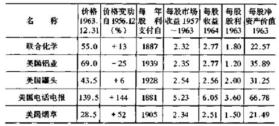
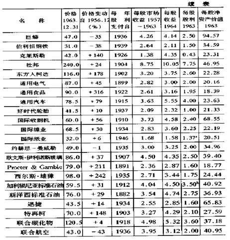
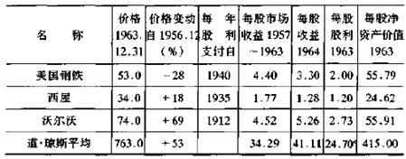
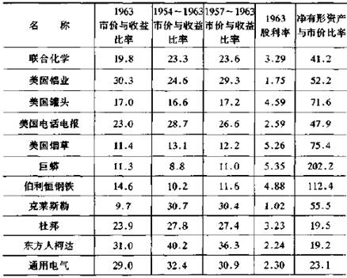
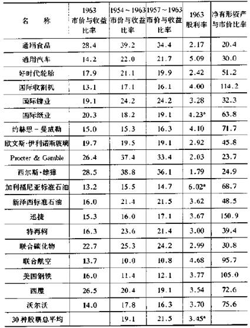
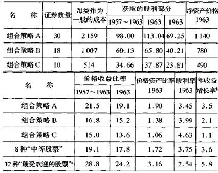
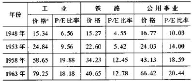

# 防御型投资者的证券选择

如果人们能准确无误地选择最好的股票，人们就会丧失多样化。在对防御型投资者建议的普通股选择的四个因素的界限内，有相当充分的自由选择的空间。从坏处想，放纵这种自由选择应该是无害的;此外，它可以使结果更有价值。

现在转向证券分析技术的一些新的应用。对于如何把投资者按投资策略划分为两个类别，我已经在一般术语中作了描述。对于我来说，现在的逻辑顺序应是讨论为了实现这些策略证券分析该如何进行。例如，按我所说的防御型投资者，将仅购买高等级的债券和各种一流的普通股，他要确定所要购买的后者价格不是太高。

在确立购买品种时，他有三个选择方向。

第一个选择，他应获得一种正确的一流证券的抽样数据，它应既包括幸运的成长型公司(该公司股票卖价特别高)，也包括缺乏增长以及股价较低的公司。这样做起来，也许最简单的是通过购买相同数量的道·琼斯所有30种工业股票。每一种买s股，在890美元的平均水平上，将总计花费11600美元。①在过去记录的基础上，他可以期望通过购买几种典型投资基金股份得到大体相同的结果。

①译者注二原文似有误。

在后面，我将显示满足我们基本标准的有相当规模和长期分配股利记录的道·琼斯工业股票的各种资料。

第二个选择，是排除那些卖价相对它们现在和过去平均收益太高的证券。原因是公司具有投资品质时，高价使其证券注入了太大的投机性因素。我建议一种可能的排除指标是:价格超过7年平均收益25倍或最近l2个月收益的20倍。

第三个选择，是全神贯注于那些一流的证券，由于它们相对不流行，因此卖价处在重要公司市场价以下。我在有关进攻型投资者组合策略的一章中讨论了这一途径。它以开发为目标，即它在股票市场价值低估情况下具有获取利润的可能性。由于在形成的模式中，它是一种自动的操作，因此不需要除接受并运用这一思想之外的其他个别判定。它或许主张一个防御型投资者在执行这个策略时应是自由的，如果他求助于它的话。他能够应用它，像〔hexed公司研究中所做的那样，选择年终卖价相对于那年收益最低倍数的10种道·琼斯工业股票。

现在让我来说明如果防御型投资者在1964年初应用以下三个办法到道·琼斯工业股票上，其组合策略应如何使用。表21和表}2给出了覆盖30种道·琼斯工业股票的重要资料，包括1963年12月31日各种市场价格的比率(那个资料对最近的预测将是有利的，即使它们实际上不在手边)。在组合策略a,b,c中，我将说明如何就道·琼斯工业股票相对于市盈率、股利报酬、过去增长率和资产价值，进行正确的选择。

组合策略c(10种最便宜的证券〕，构成如下:美国烟草公司、巨蟒公司、伯利恒钢铁公司、通用汽车公司、国际收割机公司、约赫思一曼威勒公司、加利福尼亚标准石油公司、迅捷公司、联合航空公司、沃尔沃公司。

组合策略b，由以上公司加以下公司构成:联合化学公司、美国罐头公司、好时代轮胎公司、国际镍业公司、欧文斯·伊利诺斯玻璃公司、新泽西标准石油公司、特再柯公司、美国钢铁公司。

组合策略a，由30种道·琼斯工业股票并加上以下证券构成:美国铝业公司、美国电话电报公司、克莱斯勒公司、东方人柯达公司、通用电气公司、通用食品公司、杜邦公司、国际纸业公司.procter&gamble、西尔斯·雄獐公司、联合碳化物公司、西屋公司。

表2)道·琼斯30种工业股票的基本资料(以美元为单位)

a.平均价的一半含有2%的股利。b.平均价的一半含有5%的股利;c.以上包括股利。

表22  1963年底道·琼斯工业股票市场价格比率(%〕

a.包括平均价格50%的股利。

表22 -1三个组合策略的重要比率(以美元为单位)

a).最高价股加到了组合策略a,b

b).根据相对于1951一1953年和1961一1963年的每股平均数

根据组合策略c的选择方法，每一美元花费将提供比全部道·琼斯股票更多的当前收益、股利、过去平均收益和净资产。相反，便宜证券10年中增长率不高-这就是它们在现行收益期为什么便宜的原因。高价股与高增长率之间对应的关系在表上被反映出来，它出现在组合策略c①的10种股票、5项比率中，还出现在加到组合策略b的8种证券上，以及加到组合策略a的10种证券上，它们都完全属于道·琼斯股票。

①译者注:原文为a,似有误。

各种流行和不流行普通股之间的特征-包括道·琼斯工业一流股票-通过对组合策略c(10种最低价或便宜证券)与8种最高价或高价证券的比率进行比较表现出来。1963年，每美元花费，便宜证券比高价股带给卖者多1.75倍的收益、1.8倍的股利。在其他方面，后者显示出更大的内在收益率，因为在同样的投资下，它们赚取的是便宜证券的1.8倍，它们还显示了在过去10年里，每股收益约增长3,2倍。

这些适度的收益率和增长率从根本上说是定性的因素，并且清楚地表明高价股公司作为一个整体比其他公司更为成功。如何能够确定一个能补偿相对于美元目前收益和股利的更高的增长率呢?对此，我不能作出肯定的回答。但我知道与道·琼斯过去30年不太流行(并且通常不太成功)的公司比较，市场为高价证券支付得太多了。正是这个原因，我推荐在绝大多数公司中购买低价证券。但我不能保证这个选择策略会使将来的收益率与过去的一样。

铁路、公用事业、金融公司领域

公用事业公司比其他公司天生更有稳定性，也具有利于普遍增长的因素。但是公司之间增长率变动相当大，地方基础差别也相当大，因为国家某些部分比其他部分发展得更加迅速。这些不同的情况在公司间造成了完全不同的市盈率(p/e)，虽然远不及我们在工业领域发现的差异那么大。①在别处，最高的市盈率反映了收益持续增长率将比平均增长率更高的可能性。②

①由c .m .
loeb-rhoades公司1963年，7月覆盖了95家公司的统计显示，当时相对于1962年的收益，最低市盈率为17倍。最高为33倍。

②过去5年市场的实际收益增长率，最高的4家公司平均是7.7%,最低的4家是4.05%。

过去许多年有很多人认为公用事业股表现非常出色，惟一的问题是它的价格似乎升得过高。这也是其他组别的投资者和成长型公司所面临的相同的问题。因此，防御型投资者在他标准的组合策略中适当地持有公用事业股的比例，完全是合宜的。

就收益增长和稳定性以及它们的市场价格行为来说，铁路从整体上看是个有些萎缩的群体。标准·普尔价格指数对它们的市场表现提供了一个概括的快速反映，因为所有这些指数与1941年至1943年的10个平均数中的1个有关。1963年以来铁路股平均价在40.
7美元，同时公用事业股在66.4美元，工业股在79.3美元。运输业各股之间的差别比公用事业各股之间差别更大。差别产生在经营效率、金融力量和收益增长上。防御型投资者也许会将较强的一类股票包括在他的名册上，这既因为其形式上的多样化，也因为他看好它们的前景。

金融证券包括五个小群:银行;人寿保险公司;火灾、意外险担保公司;金融(借贷)公司;储蓄与贷款协会以及它们控股的公司。这些企业因征税太繁杂而不能有一般的利润。几乎所有这些企业在它们普通股净值前都有大量债务，而它们资产的性质使这种结构没有过分危险的可能。我认为没有特别理由把这一组股票放在投资者的单子上，至少较强的公司与其他公司相同的方面是适合这个结论的。

读者也许对表23感兴趣，它追溯了三组主要标准·普尔证券的价格和市盈率的变化。

表23不同的标准·普尔平均数中价格和市盈率(p/e)的变化:

                 
1948~1963（价格单位为美元)

a.接近年末。

三组自1948年以来的市盈率增长都是值得注意的。这表明投资者信心比公司利润增长得更快(比较温和的衰退率的变动修正了这个比较，但不改变它们之间的密切联系)。1959年我曾补充说:"公用事业股的变动是最稳健的，但在1959年它对于防御型的投资者的确提出了一个问题。"当时，公用事业股作为一个整体在三个投资组中，显得最稳定，利润最大。在接下来的5年中公用事业股的指数提高了50%以上，工业股提高了35%，铁路股提高了18%。防御型投资者的选择性

投资者都喜欢自己的证券比平均的情况更好更有出息。因此读者将问，如果他有一个胜任的顾问或证券分析者，他是否能指望不出现超过价值的投资。他可以说:"毕竟，你描述的规则非常简单易行。一个训练有素的分析者应该能够使用他所有的技术，充分地改进同道·琼斯股票一样明显的某种东西。如果不是、他所有的统计表、计算和神圣判断又有什么用呢?"

作为一种根据实际作出的推定，我们限制了对1963年以来购买的道·琼斯"最好的"5种股票的选择的探究。我可以肯定，如果有100个从事证券分析的人被分配做这一项工作，那么很少会发生相同的选择，许多人相互之间有完全不同的意见。

起初它的发生是不奇怪的，基本的理由是，每一种突出的股票现价几乎都反映了人们对它财务记录上的突出特征和对它将来前景的一般看法。因此，任何关于一种股票比其余股票更值得购买的分析者的意见，都必须从他个人的偏好和期待的局限扩展到更大的范围。如果所有的投资者都同意一种特别的股票比其余的股票更好，那么，这种股票会迅速提价到这样一种程度，即抵消掉所有它先前的利益。

有关现行价格既反映了目前所了解的事实，又反映了将来期望的阐述，是要强调市场评价的双重根据。具有这两种价值因素，对于证券分析有两种根本不同的途径。的确，每个胜利的分析者与其说是回顾过去，不如说是期待未来;他明白，他工作好坏的证明，根据的是未来发生的事，而不是已经发生的事。未来能用两种方法达到，一个可称为预言(或设计)，一个可称为保护。

强调预言的那些人，将尽力使其预料正好符合未来年头公司所要完成的，特别是收益是否显著，是否有持续的增长。这些结论可能以对公司供求状况进行非常认真的研究为根据，或以对规模、价格和成本的研究为根据;它们也可能来自对过去的增长延续到将来的相当天真的设想。如果这些权威和专家确信，相当长时期的前景是异常有利的，他们几乎总是推荐这种股票，对于其正在出售的价格，则不作太多的考虑。例如，许多年中对于航空运输股前景的一般态度就是如此，尽管这种悲惨的态度出现于1946年，但持续了许多年。在前面两个部分中，我已介绍了高价股表现和这个行业相对使人失望的收益记录的差别。

形成对照的是，强调保护的那些人总是特别关心证券价格。他们的主要努力，是确保自己计算的现在价值超过市价的实际余额，这种余额能吸收将来不利的变化。因此，一般地说，当有理由确信公司将会发展，因而过于热衷公司长期的情况，对于他们是不必要的。

预言的方法也可称作定性的方法，因为它强调前景，即管理和其他不可测量的但又非常重要的企业品质方面的因素。保护的方法也可称作定量或统计的方法，因为它强调测量卖价和收益资产、股利等等的相互关系。顺便说一下，定量的方法确实是证券分析观点的一个延伸-进入普通股领域，这种分析充分体现在债券和优先股的选择中。

基于我们自己的态度和专家的工作，我们总是使用定量的方法。就第一个方法来说，我们要确定在具体的可论证的时期，我们的货币可以获得多大的价值。因手头缺少足够的现金，我们不愿意接受未来的前景和契约作为补偿。这决不是投资专家们标准的观点;事实上，大多数人可能赞成这个观点，前景、管理质量、其他无形的东西和"人为因素"远比过去研究记录所提供的东西更重要。

因此，如何选择"最好的"股票，实际上就成了一个激烈争论的问题。我劝告防御型投资者不要过于纠缠这个问题，比之单个的选择，应更强调多样化。附带地说，普遍接受多样化的观点，至少部分地否定了雄心勃勃的自负的选择。如果人们能准确无误地选择最好的股票，人们就会丧失多样化。在对防御型投资者建议的普通股选择的四个因素的界限内，有相当充分的自由选择的空间。从坏处想，放纵这种自由选择应该是无害的;此外，它可以使结果更有价值。随着长期技术发展的影响日益增大，投资者不能不在预算中考虑它们。这里，像在别处一样，他必须在忽略和强调之间寻求一种平衡。

随后，我打算更进一步发展一种定性与定量相结合的普通股选择的途径。这是进攻型投资者研究的课题，我们现在就转向对它的论述。
