# 进攻型投资者的证券选择:评估方法

聪明的投资者能够成功地在次等普通股中运作，他只在廉价时买进;;这意味着当它们的短期前景看好也就是普通的购买者可能对它们很感兴趣的时候，聪明的投资者几乎不会买进它们。

前一章讨论了在上市证券中如何选择普通股。经过选择，防御型投资者可不受限制地依据自己或者顾问的意愿掌握手中股票的去留，以此达到股票投资最大的多样化。选择的重点主要在于排除。我建议:一方面排除上市股票中明显的拙劣股，另一方面排除那些价格很高却容易卷人投机性冒险的最优股。在这一章中，对进攻型投资者，我要考虑那些超过总体平均收益的个人决策的可能性和手段。

成功的前景是什么呢?坦率地说，我在最初表达时，不得不对这点作重大的保留。乍一看，成功选择的出现是不言而喻的。为了获得平均结果，例如，等于道·琼斯工业平均指数的统计结果，我们并不需要一些特殊的能力，所需要的只是与那些30种优等上市股票相同或相似证券。当然，依靠适当的训练，根据研究、经验和天生的能力，获得比道·琼斯工.业平均指数更好的结果是完全可能的;

即使那些操作者资格是最高的，仍然有许多给人印象深刻的证据表明要达到理想的效果是很难的。这些证据存在于那些运作多年的投资公司(或投资资金)的记录中，这些资金的大部分比较庞大，足以值得最好的金融或证券分析家与研究机构的其他人员在这个领域一起为之工作。当扩展这些资金时，他们运作的费用平均每年大约0.5%或者更少些。这些费用本身并不是微不足道的，但与1951年至1960年(1954年至1963年也是)10年间普通股每年15%的总收益相比，这个数字并不算大。只要具备一些较好的选择能力就很容易克服费用的限制，并能为股东带来较高的净收益。

然而，总体看来，完全投资于普通股的基金，在很多年里没有能获得如同标准·普尔500种股票平均值所显示的那样好的收益。在表24中，我总结了各种普通股基金表现的情况，这些资料被编在威森伯格很有权威的著作《投资公司手册》(1964年版)中。我这里的数据包括了1962年、1963年、1962年至1963年(综合)以及1954年至1963年的统计。与标准·普尔综合指数相比较，这一结果决不令人佩服。但就金融机构来说，这个事实也不会使投资基金的用途失效，因为金融机构的运作是使参加投资基金的所有成员都有可能获得普通股的大致平均的收益。由于各种原因，大部分投资者根据自己的选择将钱投入到普通股中，却并没有做好。而对于客观的观察者来说，优于大盘业绩的投资基金的失败是一个相当明确的信号，那就是这种业绩的取得不是轻而易举的而是相当困难的。

表24普通股投资基金的平均收益(%)

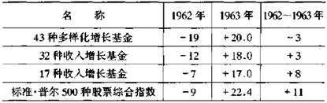

10年:1954 ~
1963(以美元为单位)

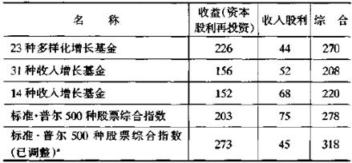

a.假设在此期间内45%以上的分红以及平均收益用于再投资。

为什么会这样呢?我认为有两种不同的解释，尽管这两种解释都不完全说明问题。

第一种可能的解释是，在现行市价影响下的证券市场，不但反映了企业过去和现在经营收益的各种重要事实，而且无论如何预示着对未来的期望能够有合理的形式。频繁发生变化的-常常是极端的-多样性市场的运动是新的发展的结果，并且是不可预见的。这使得价格的变化总是偶然的和随机的。本质上讲，由于试图去预见根本不可预见的东西，因此无论证券分析家多么聪明，考虑得多么周密，他们的工作总是没有效果的。

证券分析家人数的增加很大程度上会导致这种结果。随着成百甚至成千的专家从事研究重要普通股后面的价值因素，人们期望它的市价会完全地灵敏地反映它的价值是自然而然的。由于个人的偏爱和无所谓对错的乐观，那些喜欢证券价值而不喜欢证券本身的人也会这么做。

我常常研究华尔街上优秀的证券分析家的工作和桥牌比赛中王牌选手的表演之间的相似之处。前者总是试图找出最可能成功的股票，而后者总是想让每手牌都得分最高。只有极少的人才能实现他们的目标。从一定程度上说，所有的桥牌选手的专业技巧在同一水平上，而胜利者很可能是取决于各种叫停，而不是更高的技巧。在华尔街，证券协商会参与了分析过程。在这个协会中，思想和见解相当自由地分散在多数证券上。在类似的桥牌比赛中，玩每一手牌时各个高手总是注意观察其他每个对手，并且努力赢取每手牌。

另一种可能的解释与第一种有很大的不同。许多股票分析家常常被股票选择基本方法的不足所困扰。他们寻找有最好的发展前途、有优秀的管理和好的效益的工业企业进行投资。这表明即使价格较高，他们也要用市价买进这样一些工业企业的股票;相反地，尽管股票价格很低，他们还是不向那些销路不好的工业企业投资。如果一些好公司的收益确实在未来一段时间里快速增长，由于理论上它们的股票的价值是无限的，因此，这种方法是惟一正确的。如果效益差的企业被引向消亡，又得不到救助，分析家们将有理由认为它们的股票没有任何吸引力。

各家企业投机的事实都差不多。很少有公司能在很长的一段时间内保持不间断的高增长率。值得注意的是，也很少有大企业最终轻易地走向消亡。大部分企业，它们总是兴衰并存，沉浮共在，处于一种相对稳定的发展变化中。由衰变强,由强转衰的变化是一个重复的周期(以前作为一个标准适用于钢铁工业)。那些大的变化，与企业管理的好坏有关系。

前面的研究，到底怎样才能适用于想让自己的选择得到更高收益的投资者呢?我要特别强调的是，他从事了一项困难而又不太切合实际的工作。本书的读者，不论他多聪明，也不论他知道多少，几乎不会希望自己能够作出比全国最优秀的分析家更好的股票选择。如果在作标准的分析选择时，经常小看或完全忽视了相当大的股票市场，那么，聪明的投资者可能只能从过低的估价中获利。

评估方法

在本书的开始部分，作为合理的有效的普通股的选择途径，我对"评估方法"作了阐述。在这一过程中，分析家试图对上市股票设定一个合理的可靠的价值或者价值范围，以便对所建议的以相对"基本价值"的最低价出售的股票作出选择，我们称之为"区别于传统方法的普通股投资方法"。随着时间的推移，这种方法在华尔街占有越来越重要的地位。在以前，这种方法仅被成功地应用于公用事业股票。(有人认为)这就是可能受影响但本质上充分稳定的收益计划，也就是允许根据期望收益作出的可信的估价。近几年来，估价程序主要应用于工业类的"增长股"。这看起来需要找出一些数学公式，以求出预期收益超过当前收益的倍数。

标准评估方法包括估算未来7～10年内每股平均收益以及需要一个反映上市股票品质的倍数。这种品质确实能反映更长时间的期望收益，这个期望收益的期限超过了原来可靠估计的期限。的确，这种品质反映了过去收益的稳定性、股利的持久性，尤其是企业管理的信誉等情况。这些因素，在一定程度上，对今后的收益和预期股利的影响起着较大的作用。如果期望公司执行一般的红利支付政策，那么通常不必将预期股利看作一个独立的价值因素。正如我在第15章将要阐述的，股利在决定股票价格和价值方面的作用正经历着大的调整期，因此作为评估的一个因素，尝试选择恰当的比例作为预期的红利支付是比较困难的。

这种方法经常会出现两方面的误差:一是出现在为将来的正常年度或3年期估算收益方面;二是出现在将选择的倍数用于生成所谓的"长期普通价"或者"潜在价格"方面。预期股息可以记作独立核算或决定倍数的因素之一;而评估是根据数学公式的计算得出的，或者是根据过去单股价格和价值因素的等价关系作出的。

在前面，我给出了两家权威的咨询机构根据上述方法对30种道。琼斯股票作出的评价。总体上，它们预测了未来4年的收益和股息，并应用收益倍数或复杂的公式来决定每种股票的"长期普通价"或"潜在价格"。后者可能会被认为就是评价或估价，也可能暗示着上市股是否对目前市价有影响。

在表25和表26中，列出了1959年所作的评价。这是基于1963年或1962年至1964年的情况作出的，并且还列出了1963年的实际结果。在第3章，我们曾经讨论了这些预测中的收益和分红的比例，表明它们在总价中的比例过高;相反，价值或价格的预测与1963年的实际平均价格相比有下降的趋势，并且在1963年和1964年低于最高水平。

在以前的版本中，通过比较估价(参照}1963年和1958年12月的价格，我在两个表中给出了一些数据，所列的5种"最便宜"和5种"最贵"的股票也许能说明些什么。我通过1963年的平均价格所显示的结果，研究了这些选择。在总价中，10种"最便宜"的股票是按预测或评价价目卖出的;相对于道·琼斯22%的预付款，按1958年12月的费用，它们会获得超过32%的利润。这是很令人满意的。然而，两个表中所列的10种"最贵"的股票总价在5年里上升了40％。单就以上情况来说，这些好的结果还很难长久地保持。

表25  1959年"普通价"预测与实际结果比较(以美元力单位)

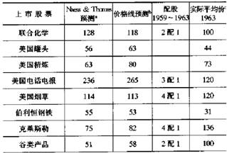

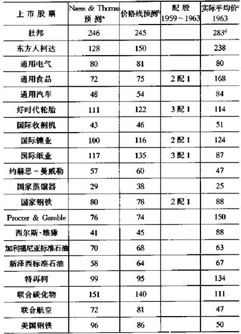

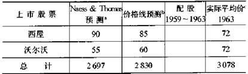

a.以1963年为基数的长期普通价。b.
1962一1964年的潜在价。

c.已调整d.包括了通用汽车所有的一半股份;

表26  1959年收益和分红预测与实际结果比较(以美元为单位)

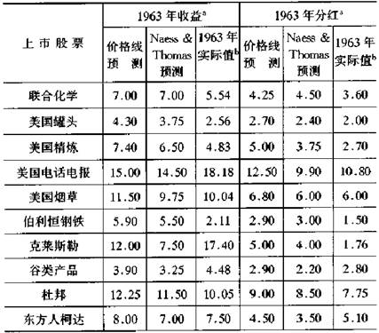

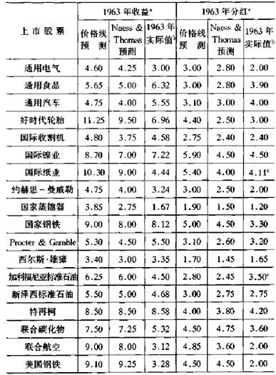

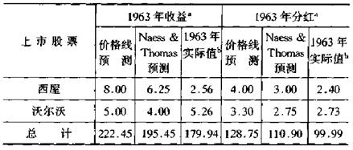

a.或者是1962~
1964年的平均值。b.参照1959年的基数c.包括在一半平均价时的分红。

1964年评估

刚刚讨论过的1959年预测，naess&thomas和价格线能给我们提供19年中期的相应估价和头几年的预期值。这些数值反映在后面的表27和表28中。正如前面所做的，让我们通过评价给每组列出5种"最便宜"和5种"最贵"的股票。

根据1967年至1969年价值线的"潜在价"

   
5种最便宜的股票是:联合化学、巨蟒、伯利恒钢铁、联合碳化物、西屋。

"潜在价"397美元与1964年6月价293美元相比，涨35
%。

   
5种最贵的股票是:东方人柯达、通用电气、国际收割机、西尔斯·雄璋、新泽西标准石油。

"潜在价"385美元与1964年6月价505美元相比，跌24%。

根据naess&thomas
"1969年一长期普通价"

   
5种最便宜的股票是:联合化学、alcoa、克莱斯勒、通用电气、好时代轮胎。

"普通价"376美元与1964年6月价298美元相比涨26%。

   
5种最贵的股票是:美国罐头、国际收割机、新泽西标准石油、迅捷、沃尔沃。

"普通价"296美元与1964年6月价300美元相比，跌1％。

表27基于1959年的道·琼斯工业平均值和naess&thomas评价(以美元为单位)

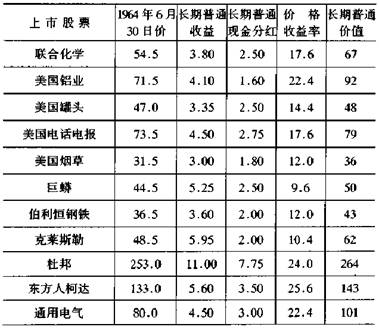

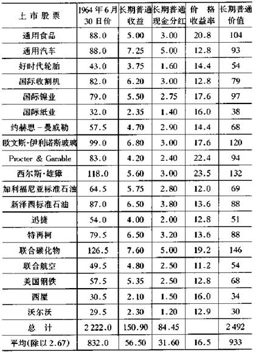

表28道·琼斯工业平均值:1 967~
1969年价值线预测

         
(1964年6月30日作，以美元为单位)

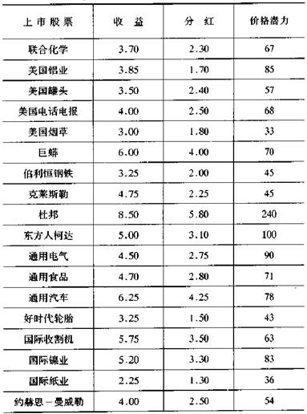

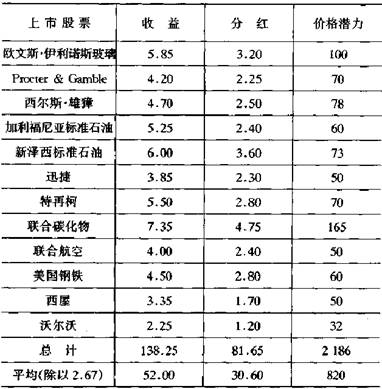

影响资产价值的因素

普通股的资产价值由以下因素决定:所有的有形资产(一般根据它们的账面价值)，扣除普通股之前的所有负债和债权，按未偿还股的数量平分余额。如果存在资产价值，它的重要性是什么?几十年前，人们认为它是最重要的，正如资产负债表中所显示的，净有形价值是投资估价和投资决定的起点，就是今天它也是私人企业或封闭式公司评价的出发点。但在股票市场上，股票的价格完全按其他方式变化。价格是由当前或预期的收益、品质或"一般预测"和股息率决定的。对典型普通股来说，要找到可用于资产面值的对市价的具体影响力是比较困难的。

这样我们发现，虽然1963年纽约中央铁路股票背后有141美元的资产，却以15美元的低价卖出;另一方面施乐普通股在$7美元卖出，而回调时仍低于有形投资每股3美元的价。表22表明，在道，琼斯工业股票中，巨蟒公司以自身有形资产价的一半卖出，而东方人柯达却以超过5倍这个价卖出。

在我们的想法里，决不愿意完全按资产价目交换。困难在于帮助聪明的投资者形成这种印象。对这一点认真研究了几年之后，我不再轻易地建议将低于价格的资产价值的巨大亏损看作证券估价的"负面因素"。

如果资产价值超过了收益率价值，投资者对此几乎不会感兴趣，因为缺少相当收益率的固定资产占有了不合适的比重。然而，应该注意那些流动资产净额或者流动资本远远超过收益率价值或市场价格的例外情况。这不会发生在一些领先的和成功的公司，但在次等的公司中这种现象经常会发生。在这些公司中，我们经常看到，普通股只是在低于公司的流动资产价值而不少于其商誉价值时，销售才好一些。

在这一点上，股市评价与私人企业评价之间的区别比其他一些企业更明显。在私人企业中，如只有少量权益时，其价值会被评为最低水平，这是由于其手头的现金少于总负债。华尔街却并不是这样。如果企业作为一个整体不再能引起人们的兴趣时，人们常常会不顾企业所有其他财产，而明显地以低于现金资产价值很多的价格卖光他们的股票。这种情况只是不适用于第二等级企业。读者可以回忆一下1938年a&p普通股卖出时少于流动资金的情况，甚至一家更大的企业迅捷公司继续按战前的基价卖出时，也没人注意到这个事实。在1947年至1949年，甚至从1940年开始，就有大量的同类股票上市，它们获得的收益给人留下了很深的印象。

在1957年至1958年，当普通市场处于高水平时，售价低于流动资金的公司仍大量地存在，而且数量之多令人惊异。在其他章节，我曾列出了一些属于大类的廉价证券。

在评价和选择普通股时，我建议把过量的流动资产价值作为一个明确的"增长因素"。如果能发现流动资产价值具有令人满意的收益能力，它就提供了有力的购买理由。对那些坚持将此放入公式的人，我建议在评价时，将流动资产价值超过收益能力价值量的一半加入到收益能力价值中去。

在以前，用现在或最近的一些例子论述这个规律比较容易。在1964年初，能用的例子不多，如果用了，也只具有一些可疑的独特性。不过，正如我所写的，我将会用一些当前的示范性例子来阐述这个问题。

   
1964年3月，burton-dixie公司(床垫、枕头等制造商)以每股20美元卖出。在这以前的5年里，它的收益相对比较少，每股账面价值50美元，平均收益1.50美元。在1963年，每股平均收益1.03美元，独立的流动资金大约每股30美元，而现金资产每股16美元。保守的评价者估计每股长期收益1.50美元，并给18美元的收益能力价值提供12的倍数。但如果接受我的建议，他会再加上18美元和30美元的流动资金价值之间差值的一半，也就是说，相对比较合适的估价是每股24美元。

我不能自信地预测购买单一上市的股票，像1964年3月burton- dixie的价格那样还能获利。但如果能找到一些这样的组合，那么几乎一定能获得令人满意的结果。

成长股的评估

我以前讲过，证券分析家的大部分正式评价都与成长股的评价有关。我通过研究各种方法为读者提出了一个简单的公式用于成长股的评价。这个公式得出的价值数据相当接近于那些用更精密的数学方法计算出的结果。我的公式是:价值=当前(普通)收益x(8.5加上预期年增长率的2倍)

这个增长数应该是对下一个7至10年的预测。

读者可能会对表29感兴趣。它把用我的公式得出的当前收益的倍数和别的权威机构的结果作了比较。根据公式很容易看出哪个增长率是固有的，哪个明显是根据当前市场价预测的。表中给出了这种计算的一些例子。施乐公司预期的33.8%的年增长率与通用汽车公司绝对适当的2.8%的年增长率之间的差别的确是惊人的。在某种程度上，用股票市场的预感也能解释。通用汽车公司1963年的盈利-一些公司历史上的最高值-为何能艰难地保持住并且能适当地超出一点。另一方面，施乐公司的价格收益率代表了有很大业绩的大公司的投机热情，并且还可能会给它们带来更多的契约。

道·琼斯工业股票隐藏的或预期的5.1%的年增长率与1951年至1953年和1961年至1963年之间3.4%的实际年增长率(综合的)形成了比较。

表29收益倍数、增长率、所选股票的价格:1963

      ca.基于预期增长率的收益倍数

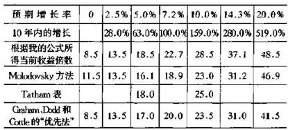

b.1953年12月隐蔽或预期的增长率:所选股票的价格(美元)

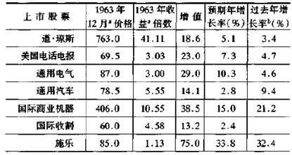

a.适应1964年6月分红。b.
1961~1963年平均数对1951~1953年平均数。

头等和次等普通股

防御型投资者和进攻型投资者之间实际的主要的区别在于:前者要限制自己向大的和领先的公司投资;反之，如果后者的判断力和技巧告诉他这些公司有足够吸引力，那么他可能购买它们的股票。我认为，防御型投资者在对主要的股票作选择时，不必受我的评价方法或类似方法的影响，否则会给他带来比预想的更多的麻烦。如果他采用多种投资方法，或者采用如第9章里策路b和策略c论述的更简单的选择标准，那就足够了。

另一方面，如果进攻型投资者买进领头的或一流公司的股票，他就会大胆地通过在众多股票中选择"最好的"来证明自己的独立判断。他会为这个目的而选择我的评价方法，或者采用对他和他的顾问有更强吸引力的其他选择方法。无论采用什么方法，我认为使人放心的情况应该是，他驹买的股票价格所表示的企业总的市场价值，不要过于高出实际记录和谨慎的前景预测的价格。

就那些已知有广阔前景并因此而表现得最热门和有最高价值的公司来说，很明显不能这样做。想想施乐公司，在1964年后期以132美元卖出，这个投机成功的公司因此在市场上拥有27亿美元的价值。这个数字依次是1963年销售额的10倍、利润的117倍、每股不足3美元的净有形资产的约50倍。我的主要论点是，作为真正的投资，不能买那种价格的普通股和同一水平的其他股，除非投资和投机混合在一起，投机占了统治地位，或对自己真正的购买动机含混不清。

很难精确地划清次等股的范围。它包括大约2 000种上市股票和好几千种未列出的股票，它们一般未被认作为有很大的市场发展前景的主力，从而进入"贵族阶层"。很明显，无论何时，在意见相异处都会有大量的相同部分。但在一般情况下，投资者应知道他目前所考虑的上市证券是属于头等级别还是次等级别。

聪明的投资者能够成功地在次等普通股中运作，他只在廉价时买进。这意味着当它们的短期前景看好也就是普通的购买者可能对它们很感兴趣的时候，聪明的投资者几乎不会买进它们。在这种时候，市场价格持续上升，并可能接近甚至超过预期的长期价值。明显地，这是一个有利的卖出而不是买进机会。

在这些次等公司不景气甚至有些无望的时候，价格水平其实更适合进攻型投资者。在这种时候对一种证券作出大的选择并不难，那就是，证券内在价值是其卖出价的2倍。这个评价方法经常被使用，很有利于确定预期公平价值。如果投资者确信他没有为这个价值中的每美元支付多于67美分甚至更少的钱，那么，他有充分的理由期望在来年有令人满意的收获。

为了说明在有吸引力的水平上的次等普通股的选择，我们将回到1957年的年末。在表30中，列出了在那时满足以下4条投资价值标准的5种股票。

①基本规模:有超过1000万美元的流动资本。

②主要"廉价"标准:以低于净流动资产2/3的价格卖出普通股。

③低市盈率:价格不超过1957年收益的8倍。

④良好的分红历史:至少在以前10年分过红利。

这5种股票在后来的两年里都获得了令人满意的进步，1959年12月的总价值略微超过前两年的净流动资产价值。

表30  1957年末的5种交易股票(以美元为单位)

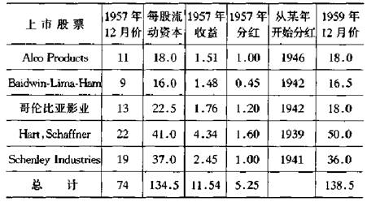

评估普通股的规则

以下11条建议为投资者或证券分析家提供了一组规则。这些建议试图给他们的评价工作以明确的帮助。

①评估价值取决于对收益能力的预测，因此要选用合适的倍数，如果必要还要通过调整资产价值来决定。

②收益能力一般代表对未来7年平均收益的预测。

③上面的预测应该是在对美元数量和利润率统计分析的基础上得出的，起点就是过去一些时期的真实情况，尤其是过去7至10年内的那些情况。

④当把早些年的价格用到计算中时，应该作出适当的调整，以反映后来资本额所导致的变动。

⑤倍数应该反映未来收益更长期的变化。倍数选12对股票的中立预测比较适当，"中立预测"也就是每股收益年预期增长不超过2%。这个数字的增加或减少依赖于评估者的判断和偏爱。除了异常情况外，最大的倍数应是20，最小的倍数应是8。倍数的范围应该符合一定规律，并随基本利率的变化而相反地改变。当然，能否在实际中这样做还值得怀疑，这是因为在市场中，心理因素-很大程度上决定了倍数-能使较高的利率更高，使较低的利率更低。

⑥如果有形资产价值少于收益能力价值(收益能力倍数)，后者会由于反映了这种缺陷的一些恣意的因素而减少。我建议的因素是:将收益能力价值超过资产价值2倍的量减少1 /4(这里允许不扣除超过有形资产100%的额外部分)。

⑦如果净流动资产价值超过了收益能力价值，可以让后者增大到超过最后估定价值的50%

⑧有些因素是不能控制的，例如战争收益，或战争的约束，或临时使用权，或租赁条件，或由于过去损失而获得的收入税的有限的减免。在不考虑反常条件的情况下，可能的收益总数或每股的损失应该是能估计到的，并且应该在评估价值时加入或从中扣除。

⑨在资本化结构有很大投机性的地方，也就是在那些企业优先股总量较大而不够均衡的地方，企业的总价值应首先被确定，如果企业只拥有普通股的话。这个价值应该以企业承认的主要债权经营价值为根据，然后在优先股和普通股之间进行分配(注意这个处理方法和基于优先股分解权的评估之间的区别)。如果根据前面第8条中所指反常条件来说需要调整，这种调整应该对企业总价值进行而不是对每股的基价进行。

⑩只有在评估价至少超过市场价1/3时，它们对指导当前购买才具有明显的价值。在其他情况下，它们作为补充的事实可以用在分析和投资决定中，如果现价高出评估价较多，它们也可用在卖出的决定中。

⑧无论在什么情况下，普通股的投机性越强，符合鉴定价值的实际根据就越少，特别是成长型公司，在它们的总价值中很可能有真正的投机性成分，对此无法作出任何可靠的计算。

投资与价值的投机成分

就成长股来说，它应该有利于建立价值的投资构成，这个价值要大致地与20倍于当前收益的最大建议值相一致。市场价的平衡可以说是代表了投资者对企业投机可能性的估计。这种可能性不仅是真正重要的价值因素，而且在大多数前景看好的情况下，它们可以比投资成分增加得更快。不过，我们会区分它们并称之为投机。由于很大程度上依赖于未来的发展，包括股市的发展，所以它们不可能设计得让人十分信服。

让我用两家重要公司的资料来说明我的意思，这两家公司是国际商业机器公司(ibm)和国际收割机公司，它们碰巧在纽约证券交易所中竞争了多年。在1961年的高价中，ibm以607美元卖出，当时收益9.10美元(包括海外收益);国际收割机公司以55.25美元出售，1971年收益2.41美元。如果我们把20倍于1963年收益的"最大投资价值"用于ibm,这使它仅能在182美元卖出，或者低于市场价的1/3。考虑购买ibm的投资者的问题在于如何对这个企业的前景作出判断，即120亿美元的市场评价代表了一个公平的价值，还是一个保守的价值。很明显，投资者在这时不可能得出可靠的结论;如果他能得出，那他可能已经找到了每股1000美元的价格甚至更多的理由。我坚持认为不能因为有合适的条件，就认为i 961年购买ibm是一种投资行为，甚至还允许为销路好的公司的投机性支付较多的但并不非常多的额外费用。

对于国际收割机公司，如果认真考虑其账面价值为68美元，而5年平均收益为3.20美元，以及这个公司在最重要的工业领域的领导地位，我们就能很好地得出这样的结论:它的股票投资价值超过了1963年收益的(或者说48美元)20倍，在高价55美元的投机性仅仅是每股7美元。这样，在真正的购买中，投资者总能带着比富有魅力的ibm更强的信任去购买它的股票。

根据与19f61年水平的比较，国际收割机股票在1962年比ibm降得更厉害，而在19034年升得比ibm高得多，这个结果碰巧对国际收割机股票特别有利。对一次投资操作的内在质量的说明还不足以对经营结果产生太多的信任。另一对选自不同时间的例子可能会产生不同的结果。不过，我确信一个真正的投资者购买国际收割机类股票的选择比他们根据财务要求和心理态度作出的选择要合适得多。

选择"中级"股的一个方法

承蒙查尔斯·麦高瑞克先生(《财务状况分析》的合著者)①提供了完美的成功的次级普通股投资方法，这个方法就是根据过去6年的平均收益来确定买点的。这些收益按照一个乘数比率转化为资本，正如一种有代表性的等级评定-例如价值线-所决定的，比率随着上市股票的品质而变化。由于较低的比率意味着企业自身的投机因素(与市场价格因素相区别)，因此投资者将只考虑普通股的4个最高等级。

①harper&row,1964

麦高瑞克先生为4个最高等级"购买乘数"的建议

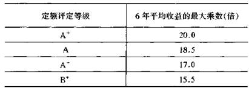

近些年来，有3种最高等级的普通股不能采用最大乘数，但在b+类(中间级)中大约有12种股票的价格在所需的价格范围内。大部分情况证明了从购买日期起的两年或不足两年时间内，卖出且获得25%的收益是可能的。由于投资者通常能用其他符合自己购买标准的股票取代已卖掉的，因此，麦高瑞克先生建议投资者采用这个方法作为他的卖出原则。
