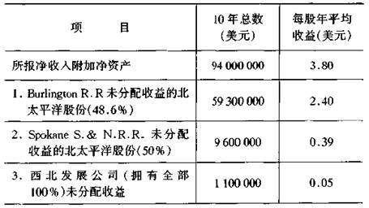
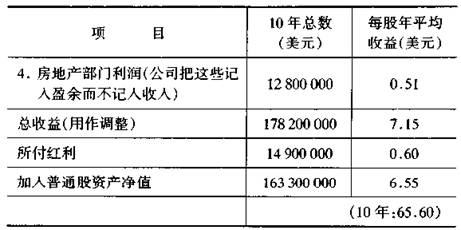
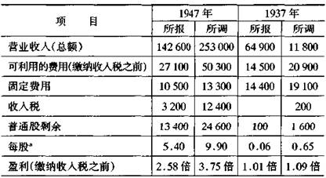
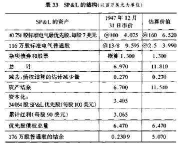
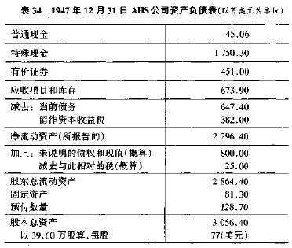
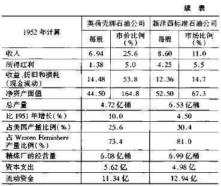
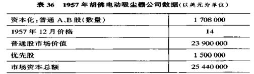
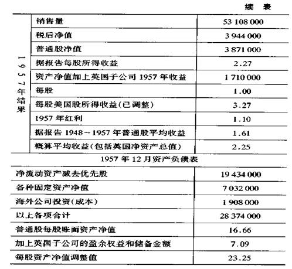
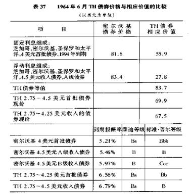

# 应用股票分析技术发现贬值的题材:六个案例

股票市场上绝大部分理论收益并不是那些处于连续繁荣的公司所创造的，而是那些经历大起大落的公司所创造的，是通过在股票低价时购进、高价时出售创造出来的。

对进攻型投资者有吸引力的购买机会产生于各种各样的原因。普遍的和经常性的原因是整个市场的低迷及公众对个人股票的极端厌恶。有些时候，当然这种情况很少，市场对公司经营的重大改进和它的股票价值的变动没有反应。一般情况下这发生在管理趋于改善的地方(在第8章已讨论了克莱斯勒的情况;另一个案例是crown cork
and seal,1956年产生了新的管理体制，但其收益和市场价大幅升高的结果到1959年才显现出来)。我们经常发现价格和价值之间的差异，这是由于人们没有认识到公司的真实情况，这依次归因于会计核算的或公司关系的一些复杂因素。

有效的股票分析就是解决这些复杂因素并且弄清真实情况和真实价值。在本章中，我将给出这种分析作业的6个案例，它们取自铁路、公用事业和工业领域。其中3个案例在原先版本的第13章用过。那时，我这样写道:"另一方面，选择现行的例证，并由此思考与我们推论所喻示的不同的市场，将是十分轻率的。而我们恰巧认为分析不具有例证的价值，哪怕是一个相当属实的例证，除非它充分反映了能适用于不确定的时间，换句话说，除非它甘冒不可避免地犯错误的风险。"

1954年的版本中加入了一个新的案例，1959年的版本中加入了另一个案例。读者应该很有兴趣地去找出这些建议的结果。我现在提供6个不同案例。

案例ⅰ(选自1949年版)

北太平洋铁路普通股，1947年12月31日价:20美元;

1948年12月31日价:16.75美元。

综述

第一次世界大战前的很多年里，北太平洋公司是较强的铁路企业之一。在1901年至1930年间，它每年所付红利不低于每股5美元。30年代公司遭受了经济大萧条的沉重打击。它避开了财务清算，在第二次世界大战前的1936年至1940年间，收益极少，没有丝毫的分红。然而，从1940年起，它又获得了大量的收益，并且大大改善了自己的地位。在一定程度上说，这些收益1947年底并没有反映在价格上，它还处在1937年平均水平以下。这种迟缓现象的出现主要有两个原因;第一，从1942年起，未能偿付超过每股1美元的红利-似乎控制着股票的平均价格;第二，北太平洋公司报告中对股票真实收益计算不足，这是由于一定数量的重要收益条款未列人收人账目。

北太平洋公司额外收益能力中有4个要素超过了所说的每股收益。它们的种类和结果列在表31中，还带有注释。

表31证明，北太平洋公司在1938年至1947年间，仅以3倍于其真正的平均年收益的价格卖出其股票，并且在这段时间内，每股有68美元(不足1 /3)通过保留的盈利加人了普通股的净资产。我在计算中最重要的调整是burlington(c.b.&q)净资产的增加。北太平洋公司和the
greatinorthern拥有成功的运输业的近一半。根据技术统计规则，北太平洋公司未分配收益的burlington股份不必向公司的股东们报告，但在最后的分析中，它们和公司的自身收益一样真实可靠。实际上，对北太平洋公司的股东们来说，burlington的业务总收益和净收益与公司直接运作所得的一样多。

表31北太平洋铁路股1938一1947年收益"

a。作为报告，用于反映附加资产净值所作的调整。

在这种条件下，证券分析家的工作就是提供比公司自己的报表有更多信息的图表。表32提供的简明收入统计表为北太平洋公司的股东们反映了两个方面的统计结果:(l)提供给州商业委员会和其证券持有者们的例行报表;(2)合并收益，包括它每股总收益、burlington和(s.p.&s).的净收益和地产部门转化为收入的利润。

这些综合数据不但大幅度超过所报每股收益，而且还反映了这个事实，即北太平洋公司的营业状况和信贷地位已经变得十分良好，最重要的是1937年以来，总固定费用削减了30%。

形成北太平洋公司地位的另一个因素，应该是分析家提出的它所拥有的广泛的设备，公司可以通过其他运输者定期所付租费获得大量的收入(1947年，公路业获得了各种各样的净租金521.6万美元)。在战争期间，公路业花费了不少于4
000万美元用于添置新设备，这是由于根据战时统计所允许的特殊的折旧费或折旧提成，设备也会贬值趋向零。在10年中，北太平洋公司自己用于折旧的支出总数是9800万美元，相当于以每股40美元计。这就意味着公司有大量的新有形资产以很小的净价记在资产负债表中。

表32北太平洋铁路公司的分析结果(以千美元为单位)

结论

北太平洋公司的案例论证了机苦的投资者感兴趣的两个观点;第一，受传统统计方法的影响股价将在一个相当大的范围内变动，而在有些情况下不可能描绘出普通股真实的经营情况和结果。第二，如果长期保持与收益相关的低股息率，会导致越来越多的交易，这是由于低股息压低股价，同时它又允许不断增长的资产净值以未分配的收益形式积累。

1947年末，北太平洋公司的普通股毫无疑问地受到这两个因素的影响。这两个因素共同作用会造成一些似乎很清楚的估价过低的情况。除非以后铁路行业的运转比预期的总体市场不利得多，否则，在20美元时购买北太平洋股票的人，只能期望对其股价和经营结果之间的悬殊差异作重大校正。尽管随后的价格降至14美元，股息升至每股1.50美元，作出这种预测也还显得很冲动，但我愿意坚持这一点。

结果(1953年增加)

后来的发展是惊人的。1952年北太平洋股以94美元卖出，差不多是1948年底的6倍。这次大幅度地提高是由于出现了我在1949年分析中没有预见到的事件，那就是在williston盆地发现了一个重要的油田，那里的一大片地产属子北太平洋公司。这种从天而降的运气使它变成了公众投机的目标。

公司的全面收益保持在我的分析中所反映的平均率水平，并且红利提高到每股基点3美元，按季度支付。在研究者中的一般观点是，作为铁路股北太平洋值得定在50美元的价位。如果在williston盆地没有重大发现，我的建议可能会非常合理，但这个运气不可否认地证明了它是北太平洋案例中的重要因素。

案例ⅱ(选自1949年版)

标准动力与照明(sp&l)优先股，每股7美元(红利累计至1947年末，每股90美元),1947年12月31日价:l06美元。

综述

这个案例分析比其他证券分析更为复杂。我选择它是为了给读者以公司事务错综复杂的印象。那些不受投资中技术方面因素干扰的读者可能会略过这一部分。为了简明起见.我将扼要地进行分析。

sp&l是公用事业控股公司系统中一家最好的公司,此系统由于1935年制订的《控股公司条例》而被解散。sp&l的主要资产是标准电气公司的最优先股和普通股。后者在许多公司拥有股份,其中最重要的是费城公司。这也是一家控制着位于匹兹堡的著名的duquesnelight公用事业的控股公司。把sp&l系统复杂的组织精简或解散的计划被长期耽搁了,主要原因是由于标准电气优先股股东和普通股股东们的利益冲突。1948年初,证券交易委员会施加了一些压力,以加快这个工作的速度。sp&l公司的一些显著要素概括在表33中。该表的关键部分是估算价值的数据。这些数据选自一个有经验的公用事业股分析家的研究报告,该报告由纽约证券交易所①于1948年2月出版。它们由标准电气公司系统的预计收益能力所推出,并按保守的比率资本化。所有标准电气股票总价值的70%分配给最优先股,25%分配给次级优先般,5%分配给普通股。这个分配顺序.反映了证券分析家们

①josephthal&company

关于上市优先股的优先权在执行实际计划过程中是怎样减少的观点。

sp&l优先股所示价值

根据上述资产评价，sp&l有足够的资金可以支付优先股每股190美元的全部本金并返回股利。如果运用这种方法，在每股190美元时购买优先股会非常有利可图，但有经验的投资者将考虑到优先股不会被完全付清的可能性。正因为如此，除了证券盘子较小或有利可图，有经验的投资者不愿意接受按计划购买证券的理论。和106美元的价格相比的损失会达到25%，但是sp&l优先股仍留有每股143美元的补偿价值(1947年12月起优先股加7美元股利)。

如果研究一下这些活动的历史，我们会发现sp& l优先股价值的另一种情况。在1945年s.e.c.通过的重组计划中，其每股可送资本重组后的14.5股普通股，而标准电气公司的7美元优先股可获得10.5股。这为这两种上市股票确定了14.5:10.5的价值比。虽然新计划与旧的完全不同，但假定这些最优先股的相关价值不会有明显的变化，也是公平的。以1947年12月31日为基点，标准电气优先股每股7美元的市价将会保证和sp&l上市股133美元的价格相对应。事实表明，后一种股票在市场上被相对忽略了，大概主要是由于它不像标准电气公司那样出名。

结论

过去的经验表明，当过程延续时，标准电气7美元的优先股最终的计算会比其卖价高得多。因此，作为结论，我认为p&l优先股最终有较好结果是合理的。

会对这个结论产生不利影响的危险和障碍是什么呢?

首先，是时间问题。没有人能说出在这种情况下要多久才能得出结果，是需要两年呢还是更长时间。虽然这足以使投机者望而却步，但对真正的投资者来说，这绝不是什么大问题;如果价值在所显示的价格附近变化，即使这个操作从1947年12月起用了3年时间，投资者也会对年收益非常满意。

其次，是存在这样的可能性，即当工作还在进行中时，经济形势就恶化了，所属公司股票价值急剧地下跌。危险是现实的，但在一定程度上，就公用事业普通股的一般性投资来说，其危险性与之相比没有什么不同。由于购买的sp&l优先股潜在价值大大地超过了它的目前价格，从而带来了大量的边际安全，所以公用事业因为发展不顺利所导致的最终破产的可能性相对减少了。

依据对复杂情况的详尽分析，这种廉价购买在绝大部分情况下会产生有利的结果。

结果(1953年增加)

标准电气公司和p&
l重组计划的耽搁比预期的要长。然而在这期间，公司潜在的地位提高了，并且1949年sp& l公司优先股价格在7美元时，红利重新开始支付。在1947年12月之后的3年里，股票以165美元卖出。1953年公司按股东的选择(或者是新股或者是现金)，以面值支付了全部欠债，加上10美元的偿债滋付，再加上红利，总计每股214.65美元。

案例ⅲ(选自1949年版)

美国夏威夷轮船公司(ahs)。

在这个案例中，分析不依赖于未决定的收益能力，这是两次前期讨论的关键因素，但依赖于特别的资产负债运行。

财务上出现的情况

    1947年底，ahs股票以每股39.5美元卖出。在那年的公司报告上，每股收益3.85美元，付红利3美元。在1940年至1947年间，报告上的每股平均收益4.25美元，分红3.30美元。在战前9年里几乎没有利润。一家大型投资服务机构算出它的每股净资产价值或资产净值大约是62美元。

这些数据说明ahs的股票没有大的吸引力。大多数二等企业从市场价赚取了比公用事业企业多得多的利润。公司的报告表明，美国商业船队前途未卜甚至没什么前途。

证券分析家调整的数据

资产负债情况报告显示，该公司有额外资产，数量相当于库存现金，但没有反映在资产负债表中，只是大部分表示在脚注中。这包括:

①补偿费(租金和船的征用费)。以前由政府提供给公司的但由于数量不足而被拒收，公司重新申请了更多的补偿，并且可能至少追回以前提供的那部分。

②债权。接管船只和别人还未偿还的，或者是部分未偿还的债务。

③所拥有的超过成本的股票增长的市场价值。

④税务部门承认多付但最终未能退的税款。

这些项目表示的额外现金价值，交税前大约为800万美元，税后大约为550万美元，平均到普通股的39.60万股上-只是未偿还的股票-每股约i4美元。

比可用资产总量更有意义的是它们的结构。净资产大约3000万美元的总量，包括资产负债表中未列出的项目，其中大约2800万美元是流动的，并且这些资金中绝大部分是等价现金，这就意味着市场价的每1美元都对应着近2美元的流动资金。它还表示1947年的绝大部分收益源自少量运输业资金的运用，反之，美国大量的债券和类似的现金资产在缴纳后只能产生大约每股l%的利润。1947年底的资产负债经过修正后概括在表34中。

经过修订的历史记录1939年底，公司每股含有10美元周转资金及12.50美元的固定资产，总计每股22.50美元。那年股票收盘在28
.50美元。8年后，各种各样的固定资产降至约每股5美元，而净流动资产经过如上的调整升至不低于每股72美元。在那期间，公司每股付出了26.50美元的红利及增加了62美元的流动资产。

很清楚，自1939年起股东的地位改善了。在一定程度上说，这绝不会反映在前面引述的财务报告数据中。能产生大量现金价值的主要原因是以很高的比率将船舶的吨位转换成现钱。公司让它的在册船舶按每吨1美元或2美元的折合成本运营，因为公司能认识到，在战争情况下，通过保险和收取征用费，交税后，每吨相当于50美元的价值。这些收益并没有表现在其收益数据中，而它能进一步地被理解，是因为公司报告说只获得了政府当作租金所付补偿费的75%(公司对只收到75%的现金而剩余部分由法律支配提出了抗议)。

分析家的结论如果可能，那么很难不作出这样的结论，此时ahs股票比1947年底每股40美元有价值得多。作为战争环境下的结果，企业不仅积累了很多的现金资产，而且从管理的角度它也不会决定将现金用于购买船只，除非买价和表现出的交易条件从股东们的立场看来很有吸引力。考虑到几乎所有的资本都在流动和这种收益的最小值，1947年的经营结果和分红都很令人满意。

当然，有这种可能性，就是这些现金资产投资没有利润而且连本金都被浪费了。每次投资都会有不利的可能，但追求利润的投资又不得不根据可能性作出决定。按照这个标准判断，对保存股东们所拥有的资产的管理能力就有了可信的根据。ahs公司在历史上走下坡路可以追溯到1899年。它从1902年起开始连续分红，除了1926年至1928年的繁盛期，这一点很奇怪。在第一次世界大战期间该公司支付的红利相当多。

1947年底，当该公司握有与现金资产等量的2900万美元的净值以及约3100万美元的总净资产时，其股票以仅仅1570万美元的企业市场总价值计价显然是低廉的。

结果

在1947年至1953年间，ahs保持了3美元的红利并使股价从40美元上升到60美元，显示出一个令人满意的综合结果。随后，更多的投机事件发生了，它们包括，股东们努力引起的一次政策改变，后来的控制转让，新型货船临时计划的宣布-后被搁置-以及用公司大部分股本重新采购。投机的热情使价格在1957年升到了142.5美元，不知何故，到1958年底又退回到91.5美元。1959年初，公司提出以105美元购买那些多数股东未持有的股票。那些少量的股票有一半以这个价格成交了。

案例ⅳ(选自1954年版)

荷兰王牌石油公司(rdp}，美国股，1953年6月价:27美元。

综述

   
rdp占有rds集团(英荷壳牌石油公司)60%的股份。集团总是作为整体经营，是世界第二大石油企业。直到近几年集团的财务和经营报表仍不健全。由于它不作全面分析，因此不能与其他石油公司作比较。这些不足在1951年的报告特别是1952年的报告中作出了补救。

对1952年经营情况的研究表明，英荷壳牌石油公司是一家非常活跃和成功的企业，根据它的预示收益力，公司的股票例外地在市场上以低价卖出。通过与同一领域的一家更大的

竞争者新泽西标准石油公司的简单比较，这些事实会最有效地反映出来。更重要的数据反映在表35中。

作为大型石油企业，英荷壳牌石油公司和新泽西标准石油公司的所有相似之处都显示在相比较的数据中，但基本区别在于某些价格。英荷壳牌公司的预示市场价值(根据纽约证券交易所的场外市场中英荷壳牌股票27美元的卖价)只是新泽西公司的29%，但它的销售量却是新泽西公司的90%，在折旧和损耗前，它们的净收益几乎相等。作为一个结果，购买英荷壳牌股票的投资者会获得3倍于新泽西股票投资者的现金收益及2.5倍于新泽西股票的最终收益。rdp的1953年6月价与其他大型美国石油公司所作的比较，表明获利是相类似的。

结果(1959年增加)

无论是绝对的还是与新泽西标准石油公司完美的市场经营相比较而言，rdp的经营都是相当好的。前者股票1股已经分成3股，1957年价格达206美元，获利163% ;
rdp以

20%的股利率分红后，升到120美元，提高了340
%

案例v(选自1959年版)

胡佛公司，a级股，1957年12月价:14美元。

综述

胡佛电动吸尘器公司是一家众所周知的美国真空吸尘器制造商。除了国内的商业经营外，它还控制着三家外国子公司，其中最重要的是它占有53%股权的英格兰胡佛电动吸尘器有限公司。这家英国子公司未分配的收益中有大量的资产净值。由于这些资产净值没有直接反映在收入统计表和资产负债表中，因此，母公司的收益和资产价值的计算都是不充分的。这方面的情况类似于北太平洋公司的案例，但没那么复杂。

在1957年底，胡佛电动吸尘器美国股定价偏低，这是因为卖出价只是当年总收益的4.3倍，少于10年平均收益7倍的值(见表36)。如果加入英国价格的53%，那么市场价只能由流动资金独立弥补。美国股只以它们有形资产净值的60%卖出，而英国股1957年的卖出价高于它们的资产价值。1957年的股利率接近8%。

考虑到公司十分坚挺的地位和成功经营的长远历史，其股票显然估价过低，尤其与伦敦市场英国股票更自由的估价形成了鲜明对照。

结果这些股票在1957年以后，表现很好。1963年底，a级股(1股分成2股)的价格相当于67美元，而在6年前只是14美元。

案例ⅵ(1964年6月的数据)

芝加哥特勒·郝特和东南铁路公司(th )，第一批债券，1994年到期，发行价2.75~4.25美元，此时交易价70美元;收入债券，1994年到期，发行价2.75~4.5美元，此时交易价67.5美元。

综述

在这个案例中，主要说明有时由于特殊的原因，在相关的价格和价值之间出现的差异。th债券在低于其他债券一般价格时，卖得很好。

这些上市证券都是密尔沃基铁路的债券，例如芝加哥，密尔沃基，圣保罗和太平洋。它们获得了2.75%的固定利息，在这一点上与也在1994年到期的密尔沃基第一批面值4美元的债券相同。它们还采用了1.5%的浮动利率(根据收益的情况)，这一点和密尔沃基面值4.5美元的a级收入债券相同(至于它们一定运费的留置权，th的第一批债券领先于th的收入债券，而作为同一大公司的债券在其他方面情况相同)。可以想像，实质上th每美元利息收入和具有同样利息支付要求权的密尔沃基一样多。这样，th的价值等于密尔沃基面值4美元的第一批债券的275
/400或11/16，加上a级收入债券面值4.5美元的1/3。

   
1964年6月，各个价格和相应价值的关系列在表37中。

在这个表中，惊人之处是th债券实际收益比mia债券

高，虽然th有大部分优先债权和利率平价债权。th支付的大部分利息是固定的铁路债券，相反4.5美元a级债券支付的全部是多少与收益挂钩的利息。尽管在可比较的领域情况相反，但在摩迪等级中，th与密尔沃基4美元首批债券一样被评为"一级"，这种评价比4。5美元的收人债券更好。也许，更令人惊异的是th债券甚至比密尔沃基b级收入债券获益更多的事实，因为后者就利息的偿付权来说完全是低等级的债券。

各种证券价格矛盾的讨论已经持续了许多年，这里不是没有它不可思议的方面。就我的观点来说，它主要是由于th债券不适当的证券形式引起的，而这种形式又是由于th债券兼有固定和非固定利息的规定造成的。但是，作为证券分析者，证券实际的价值低估对于警告债券投资者提供了一个有效的根据，债券投资者可以在议价基础上通过将普通品质的债券出售而获益。
