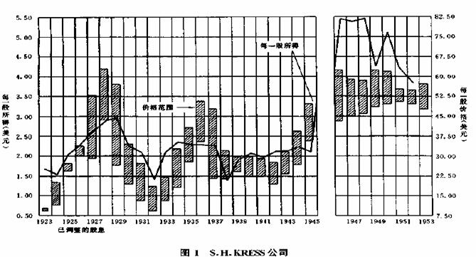
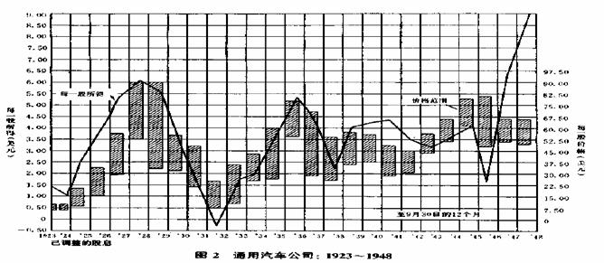
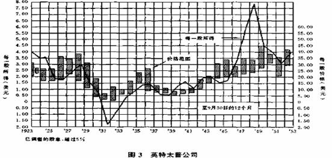
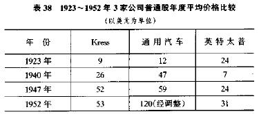
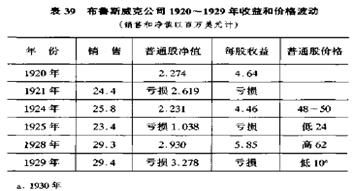
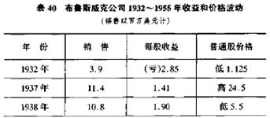
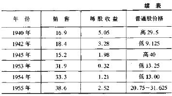
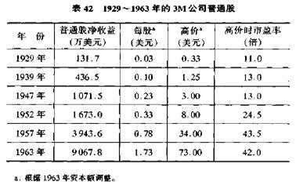
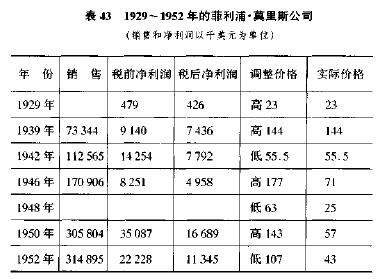
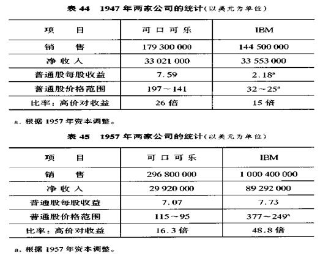

# 股票收益和价格的变动模式

现代股市的变动是一种大量技巧运用在狭窄领域的表现。

股市行为必然是一个令人困惑的行为，否则稍懂一点知识的人就能盈利。投资者必须着眼于价格水平与潜在或核心价值的相互关系，而不是市场上正做什么或将要做什么的变化。

普通股的投资价值取决于反映该股票盈利能力的一定系数。盈利能力是指未来预期的平均收益。盈利能力概念应考虑到股票在不同年代好的和差的收益的数值。因此至少在理论上，普通股的价值或内在价值既不会因经济萧条时收益下降而下降，也不会因经济繁荣时收益提高而提高。价值变化只是与未来长期的发展相联系，或者与那些无关于原始评价的因素相联系(这种说法忽视了收益再投资能导致股票价值年复一年地增长，事实上，一个成长股这样的年度增长也许是相当重要的，但是，这种增长在价格行为上很少以规则方式来表现)。股票价格同价值的偏离是相当明显的。股票价格对影响定期或近期收益的细微变化都会作出强烈的反应，股市变化似乎显示这样一个公理:股票价格在市场形势有利时比不利时高。所谓有利与不利均是长期情况的一部分，两者均应无偏见地被接受，然而这并不是股市哲学的部分。后者似乎根源于这样的感觉，没有任何事是真正永久的，那么在逻辑上就可将短暂视作长久，尽管我们知道不是这样。

股市行为必然是一个令人困惑的行为，否则稍懂一点知识的人就能盈利。我们从一个小的情况就可看到股市的令人困惑之处，即有时股市价格反映市场正发生的事，有时则反映

将可能发生的事。因此它类似我们熟悉的"贝壳"游戏。下期股市价格像豌豆一样随偶然因素灵活跳动，它不是跳到受今年市场影响的贝壳就是跳到受下一年市场影响的贝壳，甚至

更下一年的贝壳，因此股民们常把他们的钱投到一个错误的地方。

正如读者们现在所知，投资者不能仅靠思考赢得股市贝壳游戏的胜利。这并不是由于我们缺乏智力或探索市场的能力，事实上正相反，这是由于有很多聪明而又经验丰富的人同时在市场中竞争并企图取得胜利，结果他们所有的技术和智力相互中和或抵消，事实上的经验、信息充分的结论反而显得无用，甚至不如抛硬币来决定。

现代股市的变动是一种大量技巧运用在狭窄领域的表现。聪明人之间相互竞争，一部分人盈利，另一部分人则亏损。价格变动量实在是令人捉摸不透的，你对它了解愈少，其变化似乎愈有规则，因此也就可获利;当你在轻易获得利润的基础上试图去了解市场变动的准确规律时，你就会发现它并不是那么有规律，市场上充满了欺骗与灾难。

因此我得出这样的结论，当人们对市场变动较少注意时，却往往获得利润，这与人们的一般常识是相反的。投资者必须着眼于价格水平与潜在或核心价值的相互关系，而不是市场上正做什么或将要做什么的变化。

让我们用感性而非理性的方式来研究股市大范围小波动的一些特征。如果一个投资者准备购买并持有普通股，他至少应对该股过去几年中价格变动模式有所了解。如果他掌握

了这些信息，过去35年的价格变动就会对他的购买与出售计划产生影响。

通过研究1924年至1959年的价格变动记录，我们看到没有人能预知股市价格变动的范围，但我们可以假定未来价格很有可能也像1924年至1959年一样变动，而不是偏离这一模式。所以，即使投资者不能或不愿意用这些典型价格变动知识去获利，但将其作为未来变化的心理准备是必要的。

众所周知，1949年至1964年市场变动模式与以前同样长期的变动模式是很不相同的，在不同的例子之间价格变动差别很大。谁能预测1965年至1979年的变动情况同过去的15年相似。或同1935年至1949年和1919年至1934年相似呢?

模式1:普通股价格变动与高度稳定的收益

图1是一个非常有名的连锁店s. h.
k。公司1924年至1945年的盈利和分红记录，同时反映了那段时间较极端的价格变动。

每股年收益的稳定性是特别引人注目的，在图左的22年中有16年股价仅在1.93一2.32美元之间变动，在图右的6年中高峰期为2.88美元，低谷期为1.38美元。图上没有一点给出公司萧条和繁荣时的变化价格。变动完全起因于心理变化。该图利用相当精确的测量方法描述了市场价格的变动范围。

在一定的环境下，价格变动的范围值得仔细考虑。例如从12美元升到62美元，然后降至9美元，又升到48美元，再降至20美元，再升至49美元。在1933年至1937年每股收益仅在2. 11 ~2.
31美元之间，但价格范围为13 .5~47 . 5美元。在1939年至1945年的6年里，收益在1 .93~2 .
25美元，而价格范围为19 . 5~ 49 . 25美元。(在最后几年里

s.h.kress公司的收益突然跃上2倍于战前的台阶，例如1950年每股收益为5.12美元，价格随收益相应升到62 .
5美元，1952年价格在50 .5~ 54 .
5美元之间波动，后来它的盈利能力几乎丧失。这说明在不同历史时期企业业务有巨大变动的倾向。)

一个类似的情况出现于哥伦比亚碳公司，在1922年至1945年间有15年，收益在5
~7美元间变动，然而其价格依次从36美元升至135美元，降至65美元，升至136.5美元，

再降至54美元(在1929年盈利是8,
4美元，而价格上升至344美元;在1932年收益是1.
77美元，而价格降至13.5美元)。

我们暂且撇开1928年至1933年间因股票市场的动荡而产生的价格变化不谈，上图说明了工业股的一般情况(其内部价值并无多大变化)，牛市价往往是熊市价的2~3倍。每一位购买普通股的股民都应知道证券市场的内在特征。

模式2:普通股价格起伏与收益的显著变动

典型公司例子:通用汽车公司

通用汽车公司在年销售额上无疑是全美乃至整个世界最大的公司。图2的数据说明了它盛衰荣枯的整个过程。尽管其平均收益能力和平均价值具有内在稳定性(主要原因是其在工业产业中的需求地位及管理政策的灵活性)，通用汽车公司每年盈利仍有很大变动，市场价格变动更大。将图2分为1923年至1948年及1949年至1963年两部分①，这两部分的特征是整个工业股票的基本特征，概括了标准.普尔425种股票特征。

①译者注:原文如此。

   
1923年至1948年的盈利、红利及市场价值变动数据已在第4章给出，这些数据并未能预示出1950年1股分成2股及1955年1股分成3股的情况。

令人感兴趣的是，1947年通用汽车股票的价格与20年前大致相同，尽管在中期它的销售额曾翻了两番，资产价值翻了一番，但低的边际收益及高的所得税及每股净盈利仅上升20%。

通用汽车普通股的市场价值变动使我们对其在产业中的重要性及质量表示怀疑。它从1925年的13美元上升到1929年的92美元，1932年降至7.5美元，1936年重新升至77美元，193年再次下跌到25
.5美元，在194年它升至80.5美元，同年跌至48美元。由图2的1948年末数据可知，在2年内其中心价在50
~60美元，当然高于此价格的购买并不明智，而低于此价则显得有利可图。

投资者能相信或完全相信将来的价格将遵循这一模式发展吗?如果回答是肯定的，普通股投资的主要问题便得以解决，投资者能充满信心地等待机会的出现，从40美元买进，80美元卖出。不幸的是，过去的数据并不能对未来发展提供保证，只是建议罢了。在许多情况下，应警告投资者不能由过去的价格数据来预测未来的价格，也不能由它来保证未来的价格变化。

另外，过去记录对于那些只在市场价格显示出低于内部真实价格时才购进，其他情况拒购任何股票(无论是一手股还是二手股)的头脑顽固的人来说，提供了相当的鼓舞力量。我重申，我对普通股投资者能有足够的理由等待在40美元购进80美元卖出表示怀疑。在价位合适时购进或在有利可图时购进，与其说是投资者精明，不如说有合适和合理的时机，而这两种决策的选择应由投资者本人来决定。

以上对于投资者遵循过去模式的警告性的叙述，在实际中得以证实。1949年通用汽车股平均价为62美元〔大致在我那时建议的中心价位)，尽管它的盈利是14.64美元。盈利呈不规则上升趋势，到1963年已经是33.3美元。价格从未滑到从前的低价位，实际上1963年上升至550美元(1股分成6股)。更令人感兴趣的是，即使在价格大幅上升后，与其他绩优股相比，它仍以较小的市盈率售出。

作为通用汽车股票价格的附例，我简述一个领先铁路股-atchison topeka & sarta fe(a.t. &s
.)公司的情况。它从1900年18美元升至1909年的125美元，1917年和1921年降至75美元，1929年猛升至299美元，1932年降至18美元，1937年重升至95美元，1940年降至13美元的最低点，1946年爬升至121美元，1947年降至66美元，1948年又升至120美元。1900年至1909年和1940年至1946年有惊人的相似性，40年后历史重演(1951年和1956年股票1股分成10股后，1956年升至334美元，1957年跌至168美元，1964年重新回到370美元的价位)。

典型小规模上市公司:英特太普

英特太普是一个排字机及相关设备的专业厂家，其产品出售给印刷和出版行业。公司成立于1916年，1923年股票上市，1947年销售额为774.5万美元，税后净利润为70.3万美元，自有资本大约为650万美元。图3显示了这一公司在1923年至1953年的盈利变化情况，不包括已被报导的1923年以前的最好盈利情况。这一点显然表明它是一个衰退行业，而且根据成长股理论，从它上市起就不会有投资需求。

实际上公司建立后运行良好，多年来普通股都能得到分红，并且公司抛出原始股，扩大其流动资金。

从安全角度分析，大部分时间公司股票风险很大。在这期间它为投资者带来较高的收益。尽管股票现行价格大约20美元，市盈率为10%，但在1938年至1942年里，市场价格围绕9美元在波动。

正如图3所示，英特太普公司的历史教训是很明显的，但又很少被注意到。购买那种收益已很高、短期前景差、价格低于几年前价格的股票是不明智的，而购买中性市场上的那些相对被忽视，价格比其实际价值低得多的股票则是明智的选择。

刚刚讨论过的3家公司的相对价格数据或许能引发出有趣的结论。表38给出了1923年至1952年4个不同年份的平均价格。

结果表明，到1947年底最好的长期价格属于kress，它反映了多年的稳定收益，被列入成长股的级别。但下一个5年kress停止了增长，而通用汽车公司每股盈利与平均价格增长了2倍。但通过对数据的比较，最好的投资机会应是购买英特太普公司1940年的股票。由于在此之前英特太普的盈利业绩不高，这就导致了一个具有特别投资价值的低价。

这些结论与传统的投资理论很难吻合，其暗示开放的思想和独立的思考将会在华尔街取得好的红利。

模式3:极端的兴衰

下面列举的几个公司就其代表的证券市场持久的易被发现的部分来说，并不能称为典型的例子。极端的例子虽不常见，但却向投资者们展示了企业的发展变化是多么不同寻常。

大多数人认为这些变化是由企业的成功与失败决定的，所以我们看到福特公司的每美元原始投资价值大幅增长。相反，有一个大家非常熟悉的例子:45年前许多人认为newhavevs铁路股是一个具有高投资价值的股票，而随着公司的最终破产，成百万的投人化为乌有。

投资者从一些极端的成功与失败的企业例子中，可以进一步了解到影响美国企业发展和对其进行投资的因素。下面的例子表明不同类型的企业变迁及与之有关的风险价值。对每一个例子我将附上一些评语，以便作一般的应用。

布.斯威克公司

让我们回到1964年来看下面的例子。

布鲁斯威克公司于1845年开业，1907年被合并，其普通股于1924年公开发行。该公司是办公桌、厨房设备的市场领导者。尽管它处于市场领导地位，但如表39所示，其经营业绩波动相当大，甚至出现巨大亏损。

在1936年至1955年间，该公司的盈利几乎在不停地上下波动，1950年达到这期间股价最高点，每股5.08美元，3年以后又跌到最低点，每股0.32美元。如表40所示，股市价格比股票的实际价值低且被认为是垃圾股。现在每股的净值为24328美元，市场价为42美元，盈利为1.21美元，每股分红12
.5美分，另有5%的配股。但在1954年每股售价为13.75美元;在1964年公司销售额为3330万美元，净收入为69.30万美元，有47.30万流通股。

很明显，在这段时间里布鲁斯威克公司均不能为投资者和投机者带来很高的利润。公司不久前进入学校办公设备领域，进行适度多元化经营。1956年一个生产自动私人侦探设备的合伙公司盈利高达50%, 1958年布鲁斯威克公司取得了这个公司的所有权。在与美国机器铸造公司竞争中，公司同时生产旧式与新式厨房设备，并在这个利润较高的市场中迅速扩大了份额。另外它还进入许多毫无关联的行业中，如医疗设备、体育用品、游船等。

   
1961年该公司销售额达4.27亿美元，净利润达4500万美元，在1957年至1961年间股票劈股4次，现在16张新股票等于1张老股票。1961年，股票价格上涨到一个惊人的高度，约75美元，相当于1张老股票涨到1200美元，而7年前老股票的价格在14美元以下;收益则是其29倍，每股45美分的红利还不到收益的1%，扣除股票交易的费用，普通股市值达12亿美元。

一个谨慎的安全分析家在这惊人的成功故事里应发现一些可疑的问题。第一，该公司面临巨大的扩大市场销售的压力，而扩大销售只有依靠降低价格来吸引老客户，过快的发展最终必然使行业进入狭窄的空间。第二，该公司在销售商品时借了大量的外债(它的短期及长期外债估计为7亿美元)。第三，它所报告的巨大利润放在分期付款账户上，实际上还没有支付所得税。如果分析人员对1920年以来的记录进行研究，一定会为该公司的巨大应收款的前景感到担忧。

   
1961年高峰期过后灾难就紧随其后，如考虑到应收款的损失，1963年该公司盈利情况发生巨大逆转，从年盈利4500万美元降到年亏损100万美元，股价为10美元，比其最高价下降了87%，公司因此延迟支付1963年下半年的红利。

布鲁斯威克的故事说明了极为风行的美国公司的生动特征。拿破仑说，不愿意当元帅的士兵不是好士兵，而几乎所有试图飞到理想高空的企业都以沉重地摔回地上为代价。

圣-易斯西南铁路("棉花带")公司

拉扎勒斯的故事被圣-路易斯西南铁路公司重演。到1947年6月，公司的优先股与普通股被最高权威机构的美国最高法院宣布为没有生命力和价值的股票。但一个月以后，股票价格复苏，使公司完全摆脱财政困境。公司冲出破产的阴霾，所有债务被付清。股民们像什么事也没有发生似的，重新抢购该股票。在随后的一年里，普通股得到其37年来首次分红。在公司濒临破产时期，其股票被纽约证券交易所作为可能没有价值的股票而停止上市，并且柜台以外交易也微乎其微。现在股票恢复了交易，股价比1951年上升了320美元，成为纽约交易所里股价最高的铁路股。

这些急剧的变化是怎样发生的呢?1929年之前，该公司营不够稳定，"棉花带"已是一条经济效益低下的铁路。1930年至1941年公司连续亏损，在不可积累的优先股股息支付后，普通股每股损失达130美元。在1935年公司破产的托置人已被任命。1941年州际商业委员会已经认可了一个大规模削减债务、全部出售优先股与普通股的重组计划。这个计划也被美国地方法院批准，并得到上级法院的同意。股民们上访法院请求重新审议，结果被拒绝。股民们作出最后努力，上诉最高法院，在1947年6月再次被拒绝。如果各项法律程序结束，该股票就要消失了。

但在各种复杂的法律程序操作时，"棉花带"的财务状况却由于战争与战后运输量的增加而发生了根本性的变化。1941年至1947年，该公司开始盈余，普通股价格达到200美元以上，平均每股年盈利达34美元。从净利润与毛利润比率来看，该公司已成为运行最有效的公司。

所以尽管"棉花带"的股民们在法律上诉方面失败了，但他们最终是胜利者。大量现金提高了公司的信用，基层法院劝说最高法院取消了公司破产程序。就像老式情节剧一样，英雄人物带着义钱在关键时候出现，企业被解救了。

我很难为如何购买像"棉花带"这样具有复兴活力的股票提出建议，因为大多数濒临破产的股票是消失而不是复兴。但这里存在一种道理，如果一个公司处于绝境而能重现活力，必须有使它从困境中复兴并不再出现经济拮据的良机。

银行家证券公司普通股

这个公司不仅在证券市场上的兴衰方面，而且在投资者态度的改变方面都值得研究。在财务较好的1928年，银行家证券公司被认为是比较可行的投资对象。那时候的投资者和投机者比现在的人更加轻信财政政策，期望通过形成新的投资或调整旧的投资能够创造经济奇迹。然而经济奇迹被证明是海市屋楼。愿望的幻灭对投资者的心理造成极大的打击，直到后来很长时间，投资者对利用别国资金的财政政策仍持怀疑态度。

银行家证券公司普通股的代表价值与市场价值在1928年至1952年的变动情况如表41。

在24年中普通股的资产价值大幅波动，最高价是最低价的2倍，然后达到比其繁荣时期还要高的价格。市场价格的变动也是巨大的，在1928年的清算价格是市场价格的30%
,24年以后，清算价格为市场价格的140%。

银行家证券公司具有一些不同于普通投资合伙公司的特征，其优先股有参与的特权。通过这种特权，它转走了资产上涨的60%。如果优先股没有这些特权，普通股价格在1952年底将上涨到每股893美元。公司主要集中投资在百货商店、房地产，另外投资于大规模的箱包业。在早期公司借入大量资金，相对增强了普通股的杠杆作用。

当1932年该股票以7美分出售时，显而易见其价值不少于55美元。没有自我保护的购买者应仔细分析一下在1941年出现的同样情况，两者均存在巨大利润与损失的可能性。

纺织品精加工机械公司

这是一个自相矛盾的极端例子，但又合乎逻辑。该公司的产品在市场上已认输但股票价值与价格却大幅上升。从表面上看该公司的表现并不奇怪。当一个公司经营不成功、被告知没有收益不能进行分红时，股票价格会狂跌，几乎没有人注意公司资产的转换价值。但在这个公司决定清算时，资产价值就变成可控因素。公司如存在大量债务，就会变得没有支付能力，股票持有者几乎得不到什么东西。但在大部分情况下，在公司清算关闭时仍有大量可出售资产，债权者可得到支付，股民们大体能收回其原来的投资。

在纺织品精加工机械公司丧失盈利能力时，已很少受到人们的青睐。1940年其优先股报价为3美元，普通股约为1美元。1943年股东决定解散清算公司。在1944年至1945年的清算过程中，优先股总计每股收到110美元，在稍后几年中每股又收到80美元。所以在清算过程中每股价格从3美元上涨到190美元。有趣的是普通股没有参与这一涨价过程。优先股每股累计有91美元的红利没有被支付，另外每股的资本合计为100美元，这就足够吸引了解情况的资金。

由于情况相似，一些细心的读者也许希望比较一下周期发生的美国装修公司优先股。该股1940年10月1股卖1美元。经过1930年至1940年的连续亏损后，战争使经营状况转好，大量利润得以实现，1947年优先股市场价值升到202美元。在这两个事例中，发生了几乎同样惊人的获利，前者通过公司退出行业来实现，而后者则通过公司拒绝退出行业来实现。

两个简单的例子

这里简要总结一下reo汽车公司自1920年合并以来的兴衰情况。1920年至1929年企业连连盈利，总计达3800万美元;1930年至1940年企业连续亏损，亏损额达2200万美元，并且公司被暂时接管。1941年至1947年公司又恢复盈利，盈利额达1500万美元。1949年股价下跌4美元，1952年又上升4美元。

资本金和公积金从1919年的1400万美元上升到1928年的3200万美元，1940年下降到200万美元，到1947年又上升到1600万美元。股票市场价格从1920年的1100万美元上升到1928年的7 000万美元，1961年下跌至100万美元，1964年回升到1700万美元，1949年又下降到300万美元，1953年回升到1400万美元。

最后来看一下纽约证券交易所上市的clinchfield煤炭公司。在1928年至1939年间，除1934年公司略有盈余外，其他年份均亏损。1940年每股盈利1美分，平均股债下降2点。到1948年平均每股盈利27美元，1950年股票价格达200美元。

无疑，股票市场上绝大部分理论收益并不是那些处于连续繁荣的公司所创造的，而是那些经历大起大落的公司所创造的，是通过在股票低价时购进、高价时出售创造出来的。如此大幅变动的利润只有通过事后计算才知道，但这些例子对聪明的投资者却有特别重要的意义。投资者应明白，股市价格的大幅变动是对不同影响因素的强烈反应。对股市反应用"强烈"一词表明，股市可为有智慧与勇气的投资者创造许多相当好的机会。

模式4:成长股的行为

最后部分有别于先前，是因为它说明了股市行为的不同部分。一个成长股的确定，不仅是因为其有一个特别好的历史，而且要求这种情况将继续下去。大部分公司股票的这种内在增长最终将会逐步或完全停止，所以，股票市场对其走向如果具有洞察力，许多成长股在其盈利能力出现减弱之前就丧失了高价位。

我们还不能对成长股市场发展变化趋势进行先见之明的判断。令股民们大吃一惊的是，当一个公司的实际收益已明显下降时，股价仍会保持很高。然后股民们对股市前景深感失望，而且这种失望的心态在股价较高的情况下表现更加强烈。

有时由于股民的固执心理，或长期前景看好的原因，一些恶化的成长股价格就会表现得比其应显示的价格高，1947年至1948年的航空股表现就是如此。

持续增长的3m公司在叙述之前我们来看一下表42

从表上我们得到一个很深的印象:3m公司有非常令人满意的历史，市场价值显示了股民的信心，认为公司在未来的几年里将会继续繁荣。该公司公布了市盈率后，公司的股票交易比1929年更活跃。值得注意的是，1929年整个公司的资产被评估高达1400万美元，到1958年其普通股的市价总额达17.50亿美元。因公司连续盈利，为企业带来了高位市场价亦为企业带来了灾难。

3m公司的股价在1957年从101美元的高位降到次年的70美元，1961年又从87.5美元高位降至1962年的41美元低位。如此波动无疑是投资商的热情被公司不同寻常的增长所引发的必然结果。无论如何，股市这种波动与公司的真实盈利变化没有多少联系。

    i
bm公司有与3m公司几乎同样的经历。ibm公司的净收益包括国外收益，年利润从1929年的670万美元增长到1963年的3.03亿美元，股票价格从1929年的50美元上升到1964年初的192美元。但是如我在前面所指出的，在1961年12月到1962年5月不到6个月的时间里，股票价格下跌了50%以上。

利润下降的同时投资增长:菲利浦。莫里斯公司

在1929年至1939年间，当几乎所有公司利润下降的同时，菲利浦公司的税前利润增长了20倍。这是企业的巨大成功。7年以后，公司净利润明显下降，但市场上投资热情依然高涨。1946年股市价格高达企业前年盈利的27倍，是当年盈利的3.5倍。从那个水平起到1948年初，股价下跌了2/3,比其他市场领导股下跌幅度大得多。这明显是投机者对公司变化反应滞后的表现。随后公司的销售额和利润均有大幅增加，但有意义的是，1950年至1953年的牛市高价并没有超过1938年至1946年的最高点。

公司1953年的每股盈利为4.13美元，1957年每股盈利为4.50美元，但1957年的平均价格低于1953年的平均价格。

00

企业的运行结果并不代表投资者的热情

   
twa公司的发展变化就像航空运输业的一个缩影，它有一个充满希望与失望的过程，许多年后投资者又恢复了信心。经过多年的发展，到1937年公司进入一个快速成长期。公司的收入迅速提高,1937年为500万美元，1944年为2500万美元，1947年为7900万美元，1952年为1.61亿美元，到了1963年达3.75亿美元。从交通流量来看，航空运输业的每一家公司都是充满希望的。

但twa公司的净收入却是另外一种情况。公司从1937年96万美元的亏损发生意想不到的转变，1944年达到275.30万美元的净收入。随着1946年至1947年毛收入的巨大增长，公司竟出现极不成比例的亏损。在这两年中亏损额达到2304万美元，而在1945年公司的账面净资产为1800万美元，因此巨大的亏损将股东的资产一扫而光，使这个领头的成长股公司实际上变得无力偿债。在随后几年里，公司又恢复盈利。1950年至1952年，年平均盈利为900万美元，每股盈利为2.7美元，公司财务状况随公司发行新股得到改善。但1956年至1957年公司又出现了赤字。

正如读者可能预料的一样，twa公司股票价格波动是极大的。在1937年从27.625美元下降到4美元。在1945年又上升到79美元，这个数据是市盈率的27倍以上，反映出投资者对未来有更大的信心。接着在1947年价格回落到13
.5美元。

同一般股票的价格变动行为相反，twa公司股票价格的下落幅度比收益和公司财务状况的下滑幅度小得多。1948年价格恢复到22美元，这表明公司股票总价值为2200万美元。但这对这个债务比资产多得多的公司来讲是一个微不足道的数，所以即使是这个紧缩的价格仍反应出投资者对公司未来充满乐观的一种固执。在1948年我写道:

通过比较twa公司与北太平洋公司在1938年至1947年的财务状况与价格行为的不同之处，是很有指导意义的。在一个例子中，巨大的利润增长并没有导致股票价格上涨;而在另一个例子中，巨大的亏损并没有导致价格下跌。在风险分析家看来，那些注意安全的股民的偏见在这自相矛盾的例子中表现得多么的固执与缺乏理性。当然这也有可能表示那些能看到10年或15年变化趋势的股民具有特殊才能，但以往的经验并不能支持这种"伟大的远见"。

对航空业充满自信的股民们认为公司的净收益在i948年以后将会增加，但1952年股价却低于1948年，股民们的预期又一次超过了现实。1957年twa股价为9.5美元，到1962年为7.5美元，这同公司这两年的财务亏损是相一致的。

   
1963年公司的财产与股价发生了戏剧性的变化。该年每股盈利2.99美元，到1964年股价超过50美元，创造了一个新记录，所以股民们又重新进入一个对twa与航空业充满信心的阶段。我相信那种过去发生过的股价与盈利相分离的情况又将重新发生。

1947年两个活跃的成长股的比较

在1947年，被投资者认为是成长股的股票中，可口可乐与ibm倍受青睐。这两家公司在过去的30多年中均取得了迅速的发展。如果参看表44中所列的两家公司的有关数据，我们会发现投资者对可口可乐公司更加看好。1947年，可口可乐股票售价为每股盈利的26倍，而同期ibm股价仅为每股盈利的15倍不到。这说明可口可乐公司的股民认为，该公司的市盈率将比其他公司增长得快。事实如表45。

两家公司后来的表现同股民们预期的相反。ibm公司以一种特别快的速度继续增长，1957年的股价是1947年的12倍，1958年达到17倍;市盈率1957年是1947年48倍(这还不包括海外的辅助收入)。与此相反，可口可乐公司却带给1947年的追随者极大的失望。当其销售额继续增长时，净收入却在下降，每股的收益也在下降;1957年的股价还不到1947年的一半，标准·普尔平均市场指数不到1/3，最后市盈率从1957年的26倍下降到16.3倍。

在两个不同年份的高价股投资中，1947年对可口可乐的1000美元投资，到1957年仅值620美元，而1947年对i b1v}的1000美元投资，到1957年值11800美元，两者达到1:19。

这些数据比较说明，在不知道最佳收益的情况下，选择最好的成长股是不易实现的。股民错误选择股票的危险已在一些专门投资成长股的资金中体现，这种危险表现为价格的意外变化与整体股价相对比较的结果。

总结

最后4个例子表明，投资成长股有一些现实的意想不到的风险。我相信大部分投资者往往在不恰当的时候对这种公司抱以极大希望。在下一章我将从另一角度讨论这个问题，并证明公司过去的发展并不能作为决策投资的充分条件。
