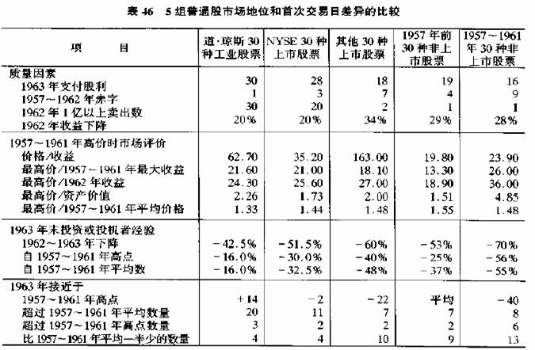
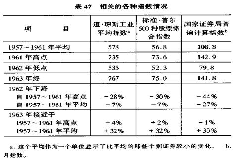
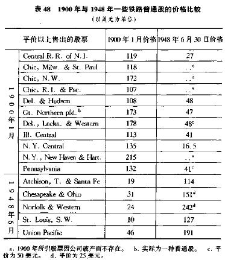
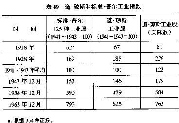
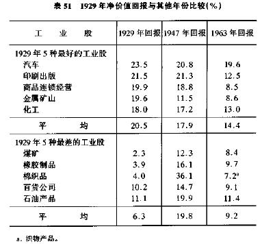

# 收益和价格变化的组合分析

许多现在衰落的将会复兴，许多现在荣耀的将会衰落。

投资者或许会问，关于债券应该如何更聪明地进行操作呢?对于这个问题没有现成的答案，因为相关的研究还没有进行。我有可能告诉投资者的是，在过去的年份里，不同的债券在实践中是如何操作的。可以用两种便利的方式来收集这些信息:(1)通过研究一个特别种类的债券被大量投资的实际结果;(2}通过记录大量市场行为的案例，从这些行为中可以统计出假定的投资结果。

投资研究很少被公开，以展示在实际中被实实在在地认识到的结果，这个结果后面附带着一个公开的和定义了的理论，或者技术，或者跨越了相当长一个时期的选择计划。我确实有一堆未加工的资料，反映了大约200个投资基金政策的数据和运作状况。通过这些资料，这一类研究可以得到实施。这项工作已在进行着。其间，在投资分析档案中，并没有东西与大量客观的观察和经验的数据相一致，而观察和经验很有助于科学的进步。

假设研究与实际经验和系统记录相分离，并在债券的全局行为和普通股的行为之间有着良好的比较，那么债券的研究成果就会更丰富，例如，那些远在1924年由e.
l.史密斯编辑的跨越长长的1871年至1937年期间的cowles委员会的资料。关于不同等级的公司债券的可比较成绩的复杂调查(在国家经济研究局的领导下)结果最近已发表。有一系列的研究-然而并未很好地集中在一起-与投资者关于优先股的经验相联系。毫无疑问，这种类型的更多更好的数据将会逐渐地出现在商业财政学院研究生院的研究活动中。然而，对爱寻根问底的投资者来说，这与他有权了解一般证券的重要性相比，供他使用的归纳性研究资料太少了。

在查尔斯·e·莫日尔基金的资助下，近年来，芝加哥大学对1926年以来纽约证券交易所上市的所有股票的表现进行了精心研究，从这个研究中得出的有趣数据已在1963年发表。

在我自己关于证券的工作中，亦有机会实施或指导了一系列对投资策略关系问题的研究。在本章我将提供它们中的部分结果，并评价它们对证券购买者的重要性。

四组随机案例和道。琼斯工业股票

第一项研究的目的，是为了测量所列地位和周期-例如，很多年中市场上一直交易的纯粹的事实-影响多组证券的价格表现。我特别感兴趣于对比那些在1957年至1961年出现的、与其他组群容易区别的新普通股所表现出的质量和价格。我通过建立四组随机案例来实施，每个案例包括30种工业股票。第一组限于纽约证券交易所的股票，第二组为其他交易所的股票，第三组为1957年以前发行的未上市股票，第四组为1957年至1961年第一次发行的股票。在每组案例中，我使用了在1963年12月《标准·普尔月度股票指南》上首先出现的30种证券。

作为第五组案例，我采用了道·琼斯工业平均指数中的30种股票。然而这些并非随机挑选，也并非短期行为，它们可以说是最大和最强公司的不同方案的代表。

与每个组群中的投资者和投机者的经验极其相似，我假定所有股票按1957年和1961年最低和最高价的中间值购买，然后我把每个方案的市场价格变成1962年的低价，并统计了到1963年底的结果。

我为这些股票的最高市盈率增加了相关信息-用1957年至1961年的最高价格除以最高收益-以及其他方面的收益股利和资产价值图表。材料被概括在表46中。

考虑到前述1962年衰退期间新普通股的社会购买者的经验，我认为所表现出的结果确实是可怕的(实际上真正结果或许比我所发现的更坏，因为标准·普尔将那样的证券选择在它的股票指南里，它或许假定这些选择比那些被省略的更好)。读者最好花费一些时间检查在股票市场所经历的交叉选择，它提供了可能是最有力的证据:小企业出售新普通股构成了最没有吸引力的"投资"(这个词完全是适用的)形式和最危险的投机中介。

与在较老的未上市股票中选出我们的30种样品股一样，我发现较小交易所的股票与纽约证券交易所的股票同样在公司质量和市场效果方面取得了积极的进步。最后，非随机的道·琼斯工业平均指数中的30种股票被发现给出了整组的最好结果。这些对比支持了我的观点:防御型投资者应该将他的普通股方案局限在大的和强的公司证券中。

在表47中我增加了资料，以比较标准·普尔公司的500种股票综合指数与按月提供的以35种未上市股票为基础的国家证券局工业平均指数所反映的市场价格变化。我们将注意到标准·普尔股票比道·琼斯30种工业股票运行得好，并且第三市场指数也运行得好。在1951年至1960年，开始时以100美元购买超过1
000种纽约证券交易所的股票并持有它一直到期末的结果，与购买道，琼斯工业股票的指数相类似(这个事实被芝加哥大学的研究所证实)。这些数字似乎与我的随机案例的指示相矛盾，该指示认为单体组合的质量越高，所期待的结果就越好。

对所使用的平均指数的近期研究至少将部分地回答这里的明显矛盾。标准·普尔指数实际上是由公司规模权衡的，因为较大的和领导性的企业承担了价格变化的绝大部分，本质上它极不同于道·琼斯30种股票中的大企业。国家证券局指数的构成有点和道·琼斯类似，这个指数通过在最大和最强的未上市股票中选择35种来实现。所有的处于纽约证券交易所的股票组合指数在1951年至1960年运行相对好的原因，或许是低质量股票并没有特殊的销售努力，并且或多或少地有以它们的相对价值出售的倾向。很清楚，由于对低等级证券大吹大擂的促销因素，诱使公众在它们的市盈率大于真正强大的公司时才出手，而可笑的价值高估并没那么有害。

一个公司群的长期变动

将本世纪初纽约证券交易所的铁路股票清单和1948年的相同清单进行比较是有益的。尽管一些公司已经通过合并或其他一些形式而消失，但几乎所有比较重要的股票都能容易地被跟踪到1948年的情况。突出的事实是，每一种以高出1900年平均值出售的股票已经丧失了它的大部分价值;相反地，所有以高出1948年平均值出售的铁路股在1900年的估价相当的低。表48给出了列于纽约证券交易所的普通股的可比较价格。

由这些价格记录所揭示的铁路股强弱地位的完全转变，是工业股票在过去年份中改变其投资质量的内在趋势的极端事例。按《圣经》的话:它或许是说得太多了，最后将变成第一，第一将变成最后。但我们或许用得着贺拉斯写于他那个时代的一句诗(我己经使用它作为《证券分析》一书的题词):

许多现在衰落的将会复兴，

许多现在荣耀的将会衰落。

这种地位上的剧烈改变为投资者警觉地摆脱偏见和偏好提供了独特的价值。当然，还存在着更多的问题，而且并非仅仅是区分那些前进和倒退了的公司。另外，人们还确信，这些有关前景的变化并没有导致它们与市场价格的变化完全一致。在下一部分，某些阐述可以说明这个问题。

提高质量的策略变化之结果

道·琼斯工业平均指数的历史为策略变更问题的有趣研究提供了材料。在平均指数被计算的60年里，它的成分经常处于剧烈的变化之中。①这些变化的公开目的，是使其指数反映工业的变化和交易所中有代表性的重要证券的活动。然而，个人研究机构的研究揭示了一个更进一步的目的，即降低那些已相对不成功和不流行的成分，用更好的流行的成分来取代，从而提高指数的质量(用这种方式来处理不影响变更平均指数的美元价值)。

①1896年5月最初所列的12种股票，仅有美国烟草公司和通用电气公司2种得以保留;1916年12月增加的i2种股票，有7种保留;1928年10月调整好的30种股票，有16种保留。

在这方面，道·琼斯工业平均指数的制定和运作很像典型的防御型投资者，这些投资者焦虑于维持和改善他选择的证券质量，因而周期性地对所了解的证券重新进行选择。这样的选择效益如何呢?一个简单的测试可以用来比较包括替代效果在内的平均价格和没有作出改变时它将会拥有的价值。我们也可以比较道·琼斯价值的进展和其他的经过很多年仍稳定持有的价值。后者指标准·普尔354种(后来为425种)工业股票，这些股票从1918年起开始统计。结果如表49所示。

从1918年至1928年，道·琼斯比较大的指数表现稍好，但在其他的每一个比较期，标准·普尔等指数表现得更好。没有什么给人印象深刻的区别，它们所证明的大多是模棱两可的东西。它们表明，仅购买流行股和以新的领导股取代缺乏活力的股票而不考虑相对价格就作出选择，并不能得到什么。

显然一个人如果不作分析或判断，每种股票购买一些，也可以获得至少同样的结果。我们已经对从道·琼斯指数中挑选出来的股票作了一些附加的测试。如果投资者1916年12.月起开始持有20种股票的原始清单，它在1947年底仅值121美元。然而通过明显地大量地改变道·琼斯工业平均指数，将会使价值增加到181美元。但如果相似的比较从30种股票的第一份清单开始-1928年10月建立-将会得出一种不同的结论。未改变的清单在1947年底值193美元，相反，被38家私人研究机构在1928年至1939年间调整过的清单值181美元。这似乎证明了1916年清单是二流质量的，并且即使惯常的替代也被证明是有益的。

道·琼斯的方法也受到批评，因为它通过用新股票(较低价位)替代旧股票(较高价位)来调整划分，然后迫使划分者像以前一样得到同样的最终价值。这种方法降低了分割股票的相对重要性，并且加大了未分割的和假设缺乏动力的股票的重要性。批评暗示，警觉的投资者在调整自己的持有量时不会犯任何同样的错误。然而，数字显示，道·琼斯平均指数按其自身的方式实际上只得到了很少的价值。明显地，根据不同的替代时期，分割股已经进展得太快，以至于它们未来进一步增长的机会注定比那些未分割股(到目前为止)差。这一点阐明了投资方式中的一个基本原则，即一个正确的概括必须始终将价格考虑进去。

影响道·琼斯平均指数效果的一个偶然因素是1932年ibm股的纳入和1939年的排除。股票被保留到期时，平均数将比它实际显示的要高。如果那些决定变化的人能够顶测ibm价格和重要性的巨大变化，他们就几乎不会突然喜欢上美国电话电报公司股了。清单制定者或投资者都不能事先说明这些事情。

   
让我按如下的证券转换方式来概括我的实际建议:

   
标准清单开始时，一级普通股的投资者肯定期待它们中的一部分在一些年以后会丧失质量。他的目标应该是以牺牲最小的股息回报来代替，并且拥有一个能弥补它们在出售时所造成的任何原始价值亏损的公平机会。实现这个目标的最好方式是通过在基本群体中找出低市盈率的股票，或者在第二层次群体中购买股票。一个胜任的证券分析者通常推荐一些这样的证券，这些证券可通过客观测试显示出它充分地具有高出销售价的价值。每个证券替代的基本原则应该如下:用于证券买入的每个美元应该显示出比证券卖出的相同美元的价值更高的内在价值。

   
在总体上，我相信，质量能够通过价值方式来正确地获得。如果价值是丰富的，质量或许注定是充分的。

大趋势如何

   
华尔街的判断受过去的趋势影响多于其他与证券价值相联系的独立的因素。在市场中，人们公开承认其目的是参与未来的发展，而过去的持有是没有意义的，除非它加入到这种参与中。然而，基于过去预测未来，几乎是通常的习惯，这对于市场上各种专业的和公众的观点都是极端真实的。当市场取得了理想的进展时，几乎每个人都是乐观的(或牛市的)，而当市场下跌后，每个人又都是悲观的(或熊市的)。同样，人们几乎一直在期待着，过去成长起来一个工厂或一个公司始终保持进步，那些处于低层的则变得越来越坏。

   
米德和格劳德斯基在《投资价值的衰退和涨潮》一书中说:"正在下跌的工厂，通常连续下跌，直到它们到达不为投资者支付任何东西的一点。"

   
我在过去50年中的想法和这个观点不相同。每一个建立起来的趋势都有一个固定的动向，这一点是真实的，这样，在观察的时候就更可能连续一个相当长的时期而非自我逆转。但这远不是指为那些"乘上车"的人创造一等利润的任何趋势都可以保持足够长的时间。对项目的更广泛的研究使我断定，金融图表每个部分的趋势转变得太频繁，就会使得对趋势的信任产生危险。对于将货币投资于过去趋势的一个持续的期盼，肯定存在着充分的独立的原因，并且投资者必须警惕，以免对未来可能性的权衡过度地受过去的趋势曲线的影响。

   
在此，我不讨论作为一个交易计划，货币是否能被使用在平衡中，该平衡服从于一般市场的趋势。在这里，项目太复杂太易争论了，以至于不允许用我自己挑选出的统计证据来处理。应该指出:(l)导致趋势的是一般公众交易的股票市场的标准公式;(2)最公众化的交易者在股票市场上会失去金钱。

   
公众有一个类似的趋势来投机于工业群体，该群体在近来已经建立了最好的市场记录。我们知道，过分看重历史资料是危险的。表50的数字或许具有典型性，它们表现了5种在1939年1月至1946年12月运行最好的工业组随后的市场活动。

来源:证券交易委员会月报。

   
尽管优秀组群中的2组继续以令人满意的方式运作，另外3组的运行给5个组群带来的亏损远大于整个市场的亏损。

   
标准·普尔公司选择了35种战时股票，这些股票保持了一个独立的价格指数。如果投资者在战争爆发时购买了这些股票并且持有到期终，他将得到仅仅3%的价格上涨。如果他已经购买了每种股票，即402种大指数的股票，他将得到31%的价格上涨。

   
工业利润的趋势并不比工业价格的趋势更值得依靠。例如，标准·普尔统计的1926年、1930年、1936年不同工厂集聚利润的行为显示出，所有工厂的利润在3年中的每一年基本相等。因为那些在1930年比在1926年收益更多的股票同时有着向上的趋势，那些有着较小的收益的股票显示了向下的趋势。当1930年与1936年相比时，这些趋势将怎样持续或变化呢?我所做的统计显示，变化的数量胜过持续的数量大约为2:1。

   
让我再将所得的数字作为投资资本的百分数。这些数字由纽约第一国家城市银行编纂了多年。表51选出了1929年代表着净价值最好百分比回报的5种工业股和代表着最差回报的5种工业股，并给出了1947年和1963年的相关指数。

介于1929年和1947年的变化确实惊人，1929年的最差组群在1947年实际上超出了最好的组群，较前面的每一种工业在回报上显示了一个强劲的改善，而较后的每一种工业显示出下跌。

   
如果对1963年和1947年作一个类似的比较，我们发现5种最好的工业指数平均值从24
.6%下跌到17.7%，而5种

最差的平均值从4. 2%上升到18.5%。

   
当然，战争环境和它的余波，在产生这种介于不同年份的繁荣和不繁荣指数的相对位置的异常转变中起了重要的作用。

   
加到1963年中的数字是处在正常条件下的相对变化的一个测量，它们显示出1929年5个最差的指数，放弃了1947年记录特别高的部分。但我们确实看到在1929年2个组群之间存在着一个很大的缺口，这受到"最优组"中5种股票的回报下跌和"最差组"中除了一个以外的收益的影响。

   
这些材料证实了这样的经济原理:在长期运行中，作为竞争力量逐渐作用的结果，在更有利的和很少有利的商业地区资本的回报趋向于集中，它把其他家的资本吸引到一家。这样的变化显露其自身所需的时间是不可预测的、易变的，在某些情况下会很长。这一点是真实的。但下面的运行趋势几乎表现在所有的工业中，这些工业发现它们本身在任何一个时期都处在回报率相反的一端，如果把这种趋势应用到工业中，那么它必须也应用到每个工业领域的大多数个体业务中，因为这里的"工业"仅仅是一组公司的名称。

   
这些观察对集中在公司中的流行的投资政策可以有特殊的应用。这些公司有着精彩的长期吸引力，并且愿意事先为多年以前期盼的结果支付高价。长期的间隔需要使那样的投资面对一个特别的风险，或者通过正常的竞争，或者通过新的技术发展，或者兼有两者。作出这种承诺的公司，其较高的利润和增长率在支付期结束之前或许会受到严重的损害。
