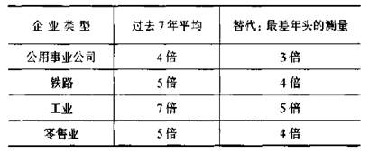

# 第二篇 股票选择的原则

非专业投资者如何分析证券:一般方法

我可以肯定，如果有100个从事证券分析的人被分配做这一项工作，那么很少会发生相同的选择，许多人相互之间有完全不同的意见。

   
财务分析现在被及时地建立起来，并成为流行的职业，或第二职业。由各种财务分析者协会组成的美国联邦财务分析者协会拥有的成员已经超过8000人，其中大部分人靠这种专门的脑力劳动为生。这些年，有一种趋势，"证券分析"这个一般概念被"财务分析"所代替。在华尔街，后者也许有更广泛的联系，并且就描述最微观分析来说更合适。财务分析者通常认为证券分析太多地局限在股票和证券的考察和评估上，而财务分析本身不仅包含这些工作，还加上投资政策(证券选择)决定，加上大量的一般的经济分析。①这一章，我将尽可能使用最合适的名称，主要强调证券分析者本身的工作。

    ①见由graham david l.
dodd，sidney cottle和charles tatham所著的教科书《证券分析》(
ncgraw-hill第四版，1963年)。该版保持1934年的名称，包括财务分析的大部分内容。

证券分析者处理过去、现在和将来任何给定的发行的证券，也描述商情;他概述它的操作结果和财务状况;他预测将来它涨落的高点和低点，它的可能性和危险;他估计它将来在各种假定情况下的收益能力、或作一种"最好的推断"。他详加比较各类公司或相同公司在各个时期的业绩。最后，他对证券的安全性表示意见，不论它是一种债券还是达到投资标准的优先股:他还对普通股购买力的魅力发表意见。

   
在做所有这些事情时，证券分析者利用许多技术，从简单的到最深奥的。.他可以完全修正公司每年发表的报告上的数字，即使它们具有职业会计师的印章，他特别注意这些比实际说的更多或更少的报告。

   
证券分析者发展和应用了安全标准，由此他能推断一个给定的债券或优先股是否具有足够的投资购买的合理性。这些标准关系着最初到最后的收益，也和资本结构、流动资本、资产价值及其他事项有关。

   
在对普通股的处理中，证券分析者直到最近才有很少的像债券和优先股一样成熟的可应用的安全标准。多数时间，他满足于过去情况的摘要，对未来多少有些一般的预测-下一年度的1月特别重要-和相当任意的推断。后者是并仍然是经常只用一只眼睛瞄在股票行情或市场图表上。但是，近几年，对成长股价值问题的专门分析得到了更多的注意。许多这样的证券过去和现在已经卖到了如此高的价格，以致推荐它们的那些人感到有一种特别的义务，通过对不远的将来期望获取的收益十分明确的预测，提出购买依据。当然，为了支持评价成功，他们必然求助于一种相当复杂的计算技术。

   
稍后，我将以简略的方式介绍这些技术。这里我必须指出一种麻烦的矛盾的情况，即在那些数学计算已十分盛行的领域，人们也许认为它们最缺乏可靠性，因为对未来的预料更多地依赖于价值计算(更少地依靠过去的历史数字)，就会有更多的误差和严重的错误。大部分高值成长股价值的发现，来自未来与过去情况明显不同的计划，也许本身增长率除外。今天证券分析者会发现，自己追求每个领域最大的"数学化"和"'科学化"，将导致降低自己结论的准确性。

   
虽然如此，我们还是着手同更重要的因素一起来讨论证券分析。目前，直接针对投资者需求的是高度浓缩的处理方法，最低限度，投资者应该知道证券分析讨论什么和怎样使用它，如果可能，他应该准备区分现象分析与实质分析。

   
对于非专业投资者来说，证券分析可以首先从一家公司的每年年终报告的说明着手。这是在一本为外行写的套装书中已涉及的内容，该书名为《年终报告的说明》①。下面，让我们继续探讨投资选择的两个基本问题:安全检验公司债券的主要方法是什么?构成普通股评价的主要因素是什么?

①charles
mogolrek,harper&row 1964.

债券分析

   
最可靠的并因此最受尊敬的证券分析是关于债券发行和具有投资价值的优先股安全或质量方面的分析。公司债券常使用的主要指标，是过去一些年头中所得收益与总利息相比的倍数;在优先股方面，则是收益与利息及股利之和相比的倍数。

   
标准的应用将随着不同的专家而变化，因为分析实际上是任意的，无法正确决定最合适的标准。1961年《证券分析》的修改版介绍了某种"平均"的标准。

    a.具有投资价值的债券

表20介绍债券和优先股的最小"平均"

(税前收益与总固定费用的最低比率)

    b.具有投资价值的优先股

   
以上相同的最低数字要求由所得税前收益与总固定费用加双倍的优先股利的比率来表示。

   
双倍的优先股利考虑这个事实，即优先股利不可排除所得税，而利息收入则可排除。

    c.其他种类的债券和优先股

   
以上给出的标准不能用在:(1)公用事业控股公司;(2)金融公司;(3)不动产公司。这些特别类型的条件在这里受到限制。

   
我们的基本任务仅是在一段时期内应用这些平均的结果，其他的专家也需要用每年最低平均值去思考。我赞同用一种"最差年头"的检验作为对7年平均检验的替代;对于债券或优先股，这两个标准都可以使用。

   
对于收益范围的分析，通常应用许多其他指标。它们包括:

   
企业规模。一个公司的营业规模有一个最低标准，这个标准因工业、公用事业和铁路等行业而异;就一个城镇的人口来说也有一个最低标准。

   
股权比率。这是低级上市股票市场价格与总账面债务的比率，或与债务加优先股的比率。它是一种粗略的安全性或"垫子，，测量，是由于最初必须抵御不利发展因素的冲击而追加投资导致的。这个因素包含了企业未来前景的市场评价。

   
财务价值。由资产负债表显示的或评估出来的资产价值，以前用于债券发行中的安全和保护。经验表明在大多数事例中，安全依赖于收益能力，如果收益能力不充分的话，资产就会丧失大部分的名誉价值，而资产价值在三类企业上保持着各自测定的很大的安全性，这三类企业是:公用事业(因为主要依靠资产投资发展)、不动产公司和投资公司。

   
在这点上，灵敏的投资者会问:"就过去和现在的情况来看，安全测定的可靠性如何?从实际来看，支付本利依靠未来会带来什么?"只有靠经验才能找到答案。投资历史显示，债券和优先股已经历了令人信服的安全性测定，根据过去存在的大量事例能成功地判断未来的兴衰。这在大部分铁路债券上已被惊人地证明。铁路债券是一个破产或严重亏损的灾难频繁的领域。近些年，陷入麻烦的铁路长时间负债过高，在一般的繁荣期中，显示了固定费用不适当的支出，因此会被应用精确的安全性测定的投资者排除在外，实际上受到这样测试的每一条铁路都陷入财政困窘之中。近些年，前面所说的事情被40年代和50年代初大量铁路重组的财政历史惊人地证明了。

   
以上观察的结果，对于公用事业，在很大程度上提供了债券投资的第二个原则:一个完全资本化的公用事业公司或系统的财务清算几乎是不可能的。由于证券与外汇管理委员会的设立，因此在大多数控股公司制度中止的同时，公用事业财政已被健全，从此破产就未听说过。30年代电力和煤气事业的财政麻烦几乎完全归因于财政越权和管理错误，在公司资本结构上留下了它们的印记。因此简单而令人信服的安全测试会警告投资者远离迟迟不偿付债务的证券。

   
在工业债券中，长期记录是不同的。虽然工业类作为一个整体显示了比铁路或公用事业的收益能力更好的增长性，但对于私人公司和商业企业，它则显示了较低程度的固有的稳定性。至少，在过去有充分的理由限制工业债券和优先股的购买，它不仅规模较大而且在过去显示其经不住严重经济萧条的冲击。

   
1950年出现了设有延期债务的工业债券，但这个事实部分地归因于长期缺乏大的经济萧条。我并不准备建议投资者依靠这种对未来有利情况连续的模糊看法，从而在工业和其他类别债券选择上放松标准。

普通股分析

   
分析相对于现行价格的证券价值的理想形式，将决定证券是否是一种有吸引力的购买对象。证券的价值，通常先通过测定未来数年市场平均收益，再通过预测资本比率来发现。举一个具体的例子，一个分析者可以在1958年以相对于过去平均2.73美元的收益，预测通用汽车公司将来每股收益约为3.75美元。如果他使用一个"13"标准倍数到这些期望收益上，将获得现价45美元，与此相对应，那年的平均价格是43美元，低价是34美元。在1958年低价格水平上，他将称这种股票价格"低估"了(但他几乎不能预料它的总净收益在1963年达到1.6亿美元的记录，每股收益5.5美元，1964年它的价格高达102美元)。

但是证券分析者测定将来市场收益和适当的资本化率的方法是什么?在两种测定中，没有有利的神赐的启示使他成为一个预言家。作为一个可怜的替代，他求助于三方面资料:过去公司的记录，已知的并一般公认的影响将来的因素，由"专家鉴定报告"所引证的有关事项。

   
事实的陈述几乎总是密切地依靠过去的记录。在那么做时，他有一个合理的逻辑，如果一般记录的收益能完全依赖债券安全的测定，它们必须在典型情况中对普通股一般的收益提供一个通用的线索，甚至过去平均收益在将来将重复的相当粗糙的假设，也比一些由乐观主义或悲观主义气氛所带来的其他数字更可以成为发现价值的可靠基础。但是，最好的未来收益预测方式，或许是把过去的数字、细心的研究以及现在商业活动的方方面面全都置之度外-对于忙碌的证券分析者，这是一个很少利用的方法，他必须用一部分知识来使许多公司得到满足。

   
证券分析者那么勤勉地专心于研究和整理过去数字的理由，主要是在那里证券分析者受到激发。有了它们，他才处在坚实的基础上。他能计算比率，指出趋势，甚至不予考虑会计师提交的正确的收入账项目，除非这个项"有助于"正常收益力"的全面分析。胜任的分析者主要应体现出在给定的情况下，区别数字和因素重要与不重要的能力。

收益能力的预测

   
预测将来收益能力的标准程度，通常是从过去实物数量、正常价格、营业毛利的一般资料开始，到将来用美元的交易被设计在超出原水平的价格、数量变动的假定基础上。它首先是对国民生产总值的一般经济预测，其次是对工业和公司的问题作专门的适当的预测。

   
这个方法的意义可以使用1959年出版的书及最新得到的结果来说明。《价值曲线》作为一种投资指南，通过以上概述的方法对将来收益和股利作出预测，并根据过去某种关系，对每个证券使用评价的公式来推断"价格可能性"数量。在第10章表25和表26上，我复制了1959年作出的对1962年至1964年的预测，并且与1963年实际实现的收益、股利和平均的市场价值相比较。

   
在这个例子中，可以看到所预料的收益和股利有太高的倾向，但是这种过于乐观的倾向完全被比1963年实际发生的市场收益和股利更低的数值的预测所抵消。结果，道·琼斯30种工业股票1962年至1964年的价格可能性的总指数证明与1963年它的平均价格707美元相当接近(在这个表中，有几个1958年后得到的数字作为替代，但是它们对其后平均的价格波动没有大的影响)。

读者会注意到，一些个别的预测与后来实际情况相差太远。这是支持我的一般观点的一个例子，即集合的或成组的预测比个别公司的那些预测更可靠。也许，理想的证券分析者应该选取三或四家他最熟悉并能最大限度预知其未来走势的公司，把自己和顾客的注意力集中到他所作的预测上。不幸的是，在能够信赖的那些个别预测和受大错支配的那些个别预测之间事先作出区别几乎是不可能的，实际上，这正是投资基金广泛多样化经营的一个原因。的确，与其仅仅因为多样化的理由而把你的利润降到一个二流的水平，不如最好集中在你了解的一种股票上投资。但这是做不到的，因为它不能可靠地做到。①广泛多样化的流行，本身就是"选择性"迷信实际被拒绝的过程，对此，华尔街不变地提供口头服务。

①至少，大部分证券分析者和投资者做不到，除非证券分析者能预先告诉你什么公司有希望受到彻底的研究，并有实现的方便和可能。详细的讨论见philip
fisher《普通股和非普通股利润》(harper&row 1960)

影响资本化率的因素

   
虽然将来平均收益被认为是决定价格的重要因素，但是证券分析也多少会让一定的其他因素进入报告，这些因素多数将影响它的资本率，它能依靠股票的"质量"，在广泛的范围内变动。虽然两个公司可以有相同的每股收益预期量，比如在1965年至1968年为4美元，但其价值或许一个是32美元，另一个为80美元。让我们简略地讨论一下构成这些不同数值的因素。

(1)一般的长期前景.

没有人真正知道久远的将来会发生的事情，分析者和投资者在这个问题上有明显相同的观点。这些观点反映在个别公用和工业群组市盈率之间的实质差别上。例如，1963年，道·琼斯化学公司以比石油公司更高的价格出售股票，预示着前者比后者的前景更好。这种由市场造成的差异常常有充分的根据，但当它们主要听命于过去的成就时，多半似是而非。

(2)管理

   
在华尔街，人们大量地经常地谈起这个问题，但对实际几乎没有真正的帮助。直到客观的、定量的、合理可靠的管理能力测定被发明和应用，这个因素才透过迷雾被看到。公平地说，一个杰出的公司会有显著的良好的管理，这显示在以往的记录中，还会显示在下一个5年的预测中，并更多地作为影响长期前景的因素出现。在另一个时间，它会带着乐观的考虑估计它的趋势，并易导致价值的高估。我认为管理是最通常的因素，在最近发生变化的那些事例中还没有时间从实际数字上显示它的意义。

   
这一类型中有两个惊人事件是与克莱斯勒汽车公司相关联的。第一个事件要追溯到1922年，当时沃尔特·克莱斯勒接管了几乎重组的马克斯韦尔汽车公司，并在几年内使它成为一个大的并且有高利润的企业，同时，大量的其他汽车公司被迫停业。第二个事件发生在1962年，当时克莱斯勒已经从它曾有过的高峰持续跌落，其股票卖价降到了多年以来的最低点。随后，与统一煤炭公司联合带来的新利益取代了原来的管理，收益从1961年的每股1.24美元增加到1963年的17美元，价格从1962年38.5美元的低点提高到1963年的将近200美元的高点。

①克莱斯勒价格的激烈争论无疑部分地是由于1963年发生的两种2:1

股票分割引起的，一个大公司的没有先例的现象。

(3)财力和资本结构

   
拥有大量公积金并且在普通股之前没有优先股、债券的公司股票，显然比每股收益相同且有大银行贷款和先期发行证券的股票更值得购买。这种因素是存在的，并被证券分析者认真地列入报告。但是，一笔适量的债券或优先股，对于普通股不一定是一种损害，也不是适当的周期性地使用银行信用的障碍(偶然地，资本过大的结构-普通股相对于债券和优先股太少-也许在顺利的状态下给普通股造成巨大的"投机"利润，这就是所谓的"杠杆作用"因素)。

(4)股利记录

   
一个最有说服力的高质量的测定是过去许多年支付股利的不间断的记录，在第13章，本书将讨论150家公司的例子，它包含30种道·琼斯工业股票，30种纽约证券交易所即nyse工业公司的股票，30种其他交易的品种，以及60种未上市的股票，各公司股利记录的不同的确是惊人的。第二组30种未上市的证券中，包括1963年未支付股利的16种证券，仅在1960年或过后一年支付股利的10种证券，只有4家有持续4年以上支付股利的记录。通过对照，道·琼斯30种股票的每一种至少自1940年起都持续支付了股利。我认为，追溯25年或更多年份的股利记录对评估公司质量等级是一个重要因素。的确，防御型投资者中了解这种测定的那些人限制他的购买是理所当然的。

〔5)当期股利率

最后提到的因素对于应付令人满意的时尚是最困难的。幸运的是，大部分公司有所谓标准股利政策。它意味着它们平均收益约2/3用于分配，除非近期高利润和通货膨胀要求更多的资本使这个比率相对趋于降低(对于道，琼斯股票平均价来说，1963年它是57%，全美公司平均值为66%)。在股利极为依赖于收益的地方，价格评估可以用两种方法中的任何一种，而不影响实质性的结果。例如，一个典型的次级公司预期每股收益3美元，每股股利2美元，那么这种股票可以估价为其收益的12倍或其股利的18倍，两种情况下，总价值都是36美元。

   
但是，数量日益增多的成长型公司正背离支付60%或更多收益给股利的以往的标准政策，公司力求通过保留几乎全部利润去扩张财力，在这个基础上来更好地为股东利益服务。这样，就提出了考虑证券细致差异的问题和要求。我将适当的股利政策这个重要问题放到后面的第15章去讨论，在那里，我把它作为管理者与股东关系的一般问题的一个部分来处理。

证券分析的其他方面

 前面我已经有一点轻率地提到，证券分析者能够从不同的方面使用和整理公司提供给他的财务资料。这个工作有重要的意义。因为，过去记录有关将来，所以用这样一种能看出真实的经营成就的方法研究记录是重要的，一些读者对证券分析这些因素的简单目录也会感兴趣。

   
在个别年头的研究报告中，从正式经营结果中分离出非正常发生的利润和亏损是重要的，这些非正常发生的项目有多种，可以举例如下:

   
①由于固定资产出售导致的盈利或亏损;

   
②市场上证券出售导致的盈利或亏损;

    ③到期资本发生的拆价或滋价;

    ④人寿保险政策的收入;

    ⑤退税及其利息(或相反);

    ⑥诉讼成功或失败;

   
⑦库存资产账面价值的暂时减少;

   
⑧应收账款账面价值的暂时减少;

    ⑨持续的非经营性财产成本。

    当以上这些重要的项目被以"普通的收益"或"一般的收益"的名称包括在公司收入账上时，分析者应该将其作为非正常发生的交易而加以区分;相反，对于分公司或子公司的收益这样重要的数据，则应加进这一年的账目予以统计-如果公司没有加进它的账目。在这项工作中，这些项目除去或附加的收入税也必须在修订的统计中除去或附加。在其他方面，一个时期的平均收益的计算，如7至8年，一般应包括所有这些非正常发生的项目的影响，因为这些项目可以作为过

去长时期结果的一部分来考虑。

   
就折旧费和损耗费而论，收益报告有广泛的领域要研究并作出可能的调整。自我们有两种不同的标准后，可同样应用于库存品的评估-老的"较低成本市价"和新的"lifo"(先出后进)财务结果显示，在一定的年头，公司之间按照这种或那种库存评估方法，财务结果可以有较大的差异。在1946年至1953年间，这是很重要的，但自那时以来，差异减轻了。通货膨胀如果加速出现，它会再一次变得重要，相当多的研究将不得不在账目中把这个因素认真地加以考虑。

   
意外准备金的储备问题有时也是非常重要的。人们通常考虑到将来的困窘，而从收益中将其任意地扣减。在珍珠港事件之后，它们频繁地出现在收益账上，给证券分析增添了复杂性(幸运的是，会计学会后来对贮存的临时费用概念发动了一次成功的清理战役)。类似这个问题的是收益报告中所得税扣除的调整。

   
一个好的分析结果将包括这个时期开始与结束的资产负债表比较，这不仅将为收益报告提供重要的核查依据，而且也将揭示公司地位可能发生的重要的变化。它必须出现在收益能力的统计上。在许多情况下，过量或不足的流动资本问题是重要的。分析者在他的统计中，对属于老证券可变特权的存在和影响也将作出扣除，因为这些可以减少或摊薄普通股的收益能力。

工业股分析

由于企业一般的前景主要依赖于市场价格的建立，所以证券分析者对于工业经济形势和工业中个别公司的状态投入大量的注意就是自然的。这类研究能进行得极为详细，有时，它们能非常可贵地洞察出重要的因素。这些因素在将来是有效的但被现行市场认识不足。那种取自高度可靠因素的结论，为投资决策提供了充分的根据。

   
然而，我们自己的观察多少会引导我们轻视大多数对于投资者有益的工业研究的实际价值。实际发展通常和公众完全熟悉的情况是类似的，并且极大地影响市场行情。人们很少发现一家经纪公司的研究，用使人信服的一系列事实，指出一个流行的工业将率先跌落或一个不流行的工业将导致繁荣。华尔街较长时期的预计常常出错是有名的，这必定影响作为指导各种工业利润预测过程的重要研究。

   
但是，我们必须承认，近些年技术迅速和普遍地发展，对于证券分析者的劳动和态度有明显影响。在将来的10年间，根据有关的新产品、新方法，分析者也许有机会来预先评价典型的公司是否会比过去有更多进步或退步。因此，通过分析者室外活动，与研究人员多交谈，并用自己的有效工作，无疑将会出现一个有希望的领域。主要来自对未来的展望而推出的投资结论具有偶然性，并且不提供目前可论证的价值。即使十分接近于依靠实际的结果并通过严肃的计算作出的价值数值，仍具有同等的偶然性。投资者不能掌握两种方法中的任何一种。他能想像并为高利润去操作，这种高利润是对通过事件证明的洞察力的报酬，但随之，他必须冒或多或少错误计算的相当大的风险。或者，他处于保守状态，拒绝在没有把握的情况下支付更多的费用;但那时，他必须预先为以后可能出现的黄金机遇作准备。

证券分析的应用

 在后面的章节中，我将提供与证券分析技术相关的例子，但它们仅仅是就有关问题进行说明而已。如果读者认为自己还不能胜任证券买卖的决策，又对这个问题有兴趣，他就应该去系统地、彻底地研究它。
