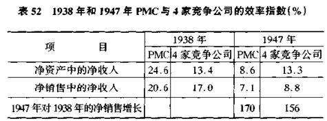

# 第三篇 作为公司所有者的投资者

## 股东与管理层

如果公共股持有人拥有大部分股票，他们将有能力运用投票权强制执行有利于自己的有效率的资本运行的标准。为了达到这一点。他们需要有比现在所展示的更多的知识和进取精神。

股东和管理层之间的关系可分为三级不同的情况:

第一级是法定权力机制。在这一级中，股东具有至高无上的权力，根据股东的多数意见有权雇用和解雇管理人员，并使他们能完全依据股东们的意愿行事。尽管股东分布十分分

散，但这并不妨碍他们在任何问题上的意见一致性。实际上，证券交易委员会已经采用一系列代理原则(这些原则已在大量公众股公司中采用)，以便于股东发表意见，并求得共同支持。

第二级是股东权力在实际运行中是否得到贯彻实施。在这一级中，股东近乎于一个"失败者"。除非受到猛烈攻击而被迫采取行动，一般情况下，他们显得既无才智又反应迟钝。他们对管理层的提议如绵羊般动作迟缓，在管理状况很差时也不迅速采取行动去通过公司决议或委任新的管理职务;而采取行动的决定都是由单个股东或某一小团体来完成，因此这些决定良莠不齐，有些值得支持，有些毫无意义。如果股东内部反对派在持股上有很大比例，他们可以获得足够的票数使提案通过，否则无论提案多好也得不到支持。同样，我们也几乎找不到这样的案例，即最初由普通股股东投票通过而被管理层反对的主张能得以执行。

第三级是股东是否得到管理层的实际对待。这种情况绝不说明公司状况不好。典型的管理层应建立在真诚、胜任和平等的关系上，从而作出正确的决策(尽管偶尔也决策失误)。或许我们能得出如下结论:出色的管理层造就愚笨的股东;而一旦效率低下、欺诈善骗的管理人员掌握生杀大权，则迫使股东们迅速清醒过来并采取行动。

公司情况不错，则不必大惊小怪了。但情况整体不错，却仍会出现若干小问题。如果一家公司1 /10的管理人员平庸无能或1
/10的股东未得到恰当的尊重，那么公司的大股东就需采取明智的行动。1/10这个数字似乎不算很大，但发展下去将一发不可收拾，最终整个公司将垮掉。

我们可以把问题归结为以下两个方面，这是股东们需关注的根本性问题:

   
(1)管理层是否富有效率?

   
(2)外部股股东的利益是否得到合适的认可?

令人奇怪的是，尽管在股东和管理层争论时，这些问题都会提出，但中心议题却有些偏颇，往往纠缠于雇员薪金及个别事情不适当处理等问题上。

对管理层的过高报酬决不是一件可忽略的事情。这里存在着权力滥用的情况，特别是通过那些对管理层过多的股份选择权的承诺及一次又一次不适当的自由奖金与津贴计划。雇员薪金与管理效率之间的关系并不密切。出色的公司管理并未使管理层有过高的薪金，差的管理才将报酬定得很高。而对于股东来说，工资支出很大并无收益。

管理效率

把世界经济管理分为效率高及效率低显得简单而幼稚。第一，我们对管理效率影响投资方向的重要性缺乏认同;第二，无法用理性的测试方式来决定管理效率的高低，人们所说的和所相信的都是公司成功程度的见闻和推论;第三，我们对用客观方式来改进或替换那些效率低下的管理方式并不怀有兴趣。不妨听听原始的却一语破的的美国商业管理名言吧:"如果你对管理毫无兴趣的话，干脆把股票卖掉!"

我们或许对这样矛盾的事实颇有微词，即上帝似乎比任何股东更有经验。至少《新约全书》中的四个寓言中说明了这个事实:一个人的财富和他委托管理其财富的人之间有很强的联系。对于这种联系多数结果是一个有钱人对浪费其资源的管家或雇员的指责:你的管理拙劣，你不能再做管家。

表示股东与管理层关系正常的先决条件，首先，是他的员工是否优秀及忠于职守，这一点须引起股东的重视;其次，区分优秀的和劣等的雇员要有一套简单易行的标准，这种标准体系的建立，使得对管理能力高低的调查可以井然有序地顺利进行。在无法蒙蔽资产所有人的情况下，表明管理不成功或无效率的信号有三种:

①在经济繁荣时期，连续几年内对股东投资没有满意的回报;

②销售的边际利润未达到整个行业的边际利润;

③每股收益的增长未能达到整个工业的平均增长。

当三个信号同时出现时，股东很容易意识到管理出了问题。实际上，每个信号的出现都会在股东大会上提出并要求管理层寻求解决方案。如果管理层对股东的反应敏感的话，他们将意识到需要一个合理的解释，于是迅速寻找答案以便在受质疑时应付。

股东或其代言人，怎样确定上述三种情况是否存在呢?如果资料齐全或经纪公司的研究部门统计无误，问题极易解决，仅需以下几个指数:一定时期的工业群，销售的累积边际利润，净资产价值的盈利，该工业群中每一公司每股盈利增长。那些低于平均水平的就是那些股东们可认定管理低下的企业。

本书首版时，曾列出一种运用上述比较方法的饶有兴趣的例子，尽管时隔多年，但仍值得提供出来以飨读者。主要原因是:(1)由于近期未曾出现此类典型例子;}2)它的结果有一些与众不同的特征。

这个比较出现在菲利浦·莫里斯公司(pmc } 1948年3月的年报上，它包括1938年至工1947年的分析结果。它并非仅含菲利浦·莫里斯1家公司的数据，而是同时含有4家大的竞争公司的数据。表52列出了第一年及最后一年的数据。

上面数据显示出在过去几年里菲利浦·莫里斯公司在销售上的优势地位，然而，其他指标却都下降了。起初，菲利浦·莫里斯公司显示出很好的销售及资本盈利，并超过了其他竞争者。到1947年，尽管在数量上仍获得很大增长，但比率下降，优势尽失。税后净利润率8.6%这个数字，听起来不错，却不值一谈，因为它小于本年度制造业的一般税后利润率。更重要的是，那年菲利浦·莫里斯公司利润的很大一部分为借贷资本所得，贴除利息后其税后净利润率低于2%。

这20年的数据，展示出一个迅猛发展的公司由于竞争而成为一个普通公司的真实而极富传奇色彩的过程。

上例对股东与管理层的关系给予了极具特征的说明:菲利浦·莫里斯公司报告的数据并未引起股东对此事的重视，盈利能力的降低在会上未被提出，在运作效率方面该公司落后于竞争者这一事实也未涉及。表面的销售增长蒙蔽了股东，以致他们认为公司已取得了很大的成就。

菲利浦·莫里斯公司的例子清楚地告诉我们:管理效率与管理结果需保持一致。除非结果是好的，否则，对管理者自身不能作出任何有意义的评价。自然，为了获得股东认可及好的评价，某一方面的成功引起股东注意是件好事，但股东或其代理商应注意，表面的成功与实质的下降并不意味着管理效率好，尽管数字相同，实则差异很大。股东们因此有必要寻找根源或改变现状。

让我们再次注目于1938年至1947年菲利浦·莫里斯公司销售上的"辉煌"增长吧。尽管公司的盈利能力在下降，公司股东却对销售这一战绩表示满意并有点沾沾自喜。本书对该公司10年中评价管理效率的指标，即以销售而不是以利润来评价公司经营业绩提出质疑。具体来说，就是对扩大销售情有独钟，这大体是由于大多数情况下管理人员的薪金基于销售数字而非盈利值，同时大概是由于销售额越大，公司就显得越大，地位也更重要。

我对许多管理人员以牺牲利润来换取销售增长的做法提出很大的疑问。我理解菲利浦·莫里斯公司的年报重视销售额是基于每股利润增加额;同时，许多公司在年报中对资本投资利润率持续下降这种不好的状况并未指出来，我也表示理解。最后，值得一提的是在过去的10年里，尽管销售增长了，整个美国公司净资产盈利却明显下降了。这一状况在呈送股东大会越来越详尽的年报里都未提出来并受到质疑。这使那些能力强而易于献身的管理人员，不自觉地走向片面强调销售增长而忽视每股利润和每美元所含股东的股票数量的歧路。

董事会

下面来谈一谈董事会在决定管理者能力方面所扮演的角色。股东们对这一问题长期忽视的一个理由是:他们信任由自己挑选出来的董事会，相信他们有职责并有权力对管理人员进行判决。既然股东们远离经济舞台而由董事会来代表，那么，他们的惰性自然就会重现，这限制了他们通过选举董事会成员-他们的名字出现在正式的代理权书上-来运用自己的权力，因此一切由董事会来负责。

问题在于董事会往往与管理层密不可分，他们应当和管理层职权分离，但却做不到这一点。经常是从管理层中选出董事，而不是由董事会选择管理层。在许多情况下，行政人员或经理们往往组成董事会的大多数，这意味着股东不能控制管理情况。但其他情况下并没有什么改变，即使董事不是管理人员，但管理人员往往也是其密友从而他能插手管理。甚至当董事长老迈无用或已不能胜任工作时，却因具有与管理层的私交而未卸职。

那么，股东能通过什么方法得到出色的管理人员以代替无能的管理者呢?

第一步，大股东们应当明白改变现状的必要性并将行动贯彻始终。

第二步，大股东们应当足够开明，经常阅读管理人员上呈的资料，为股东和管理层双方权衡利弊以解决事端。他们至少能够知道何时公司业绩不行并寻求客观实在的手段来改变不利局面。

第三步，聘用外部管理公司来实施政策和执行管理，这在公司各方面数字处于平均水平之下时特别有用。一旦外聘管理公司的制度确立，察觉和消除低劣的管理就相对简单，而不是像以前那样显得不能改变。

外聘管理公司并不由现存董事会雇用，也不需对董事会汇报工作。外聘管理公司由股东们为此特设的独立委员会选择，同时直接向股东们汇报情况，研究费用由原公司承担。有许多现存的经济代理商能够对公司管理作出贡献，它们在处理问题上富有经验，并对股东们有很大影响。它们包括重大投资基金会、股票交易公司联盟、金融分析家联合会、金融服务机构以及重要投资咨询公司。所有这些公司避开了业务领域的麻烦事。我认为它们正失去为投资公众提供服务的机会，它们等待着聘用以完成其良好的意愿。

在这种情况下，尽管可通过成立控股投资基金以解决这一问题，但聘用外部管理公司来调查管理效率仍显得十分必要，即使在看上去正常运作的公司也一样。一旦大股东已提供有说服力的证据证明公司情况不妙，就应当支持外聘管理公司。如果股票掌握在公众手中，外聘公司的建议通过大股东的支持就能被公众所知并被采用。没有大股东的支持，公众就会继续对公司管理漠不关心。

也可用另一种方法，选用几个阅历丰富而独立的董事直接管理。他们应当有各方面的经验，能以独特的和专家的眼光将公司的问题洞察得一清二楚。因他们的阅历和技巧，薪水自然要高。他们向独立的机构单呈年报，对股东直接负责，并对股东关注的主要问题提出他们的观点;公司的业绩是否令人满意?业绩不好，出于何因?该从什么地方入手以解决问题?

上述两种方法并不对任何公司适用，两者仅为与其他公司相比较经营结果处于窘境的公司提供参考。正如第2章所言:令人失望的平均市场价格一定会提供明显而强有力的证据以引起外部股东对公司的注意。

平均市场价格可以被称为不充分的价格，它来自下面两个标准:(l)如果它远低于股东的股值，即账面价值;(2)如果公司价格与账面价值的平均比率比整个工业的平均值低得多。第一个标准不能单独作为最后的评判，因为对于某个工业不适用，例如铁路工业便是一个明显的例子。即使是优秀的管理团体，也不会赚取足够的资金来支撑账面价值。在多数情况下，平均市场价格能很好地反映出财团对管理质量的综合评价。因此，如果价格情况不令人满意，根据以上的检验标准来判断，就能很自然地得出结论:管理未达到一般水平。显然，应当对管理进一步评价和研究，但股东对此并不感兴趣。

一般股东的合理待遇

管理有效却未使外部股东的股息达到最佳，这种情况的发生有许多原因，下面是最主要的几个原因:

   
(1)未支付与利润及股东股值相对应的红利。这些红利可以用股票形式或现金形式支付(但一个成长型公司可免除这些限制)。

   
(2)以相对低利润的方式来运用外部股东的资金。

   
(3)用股东的投资资金以低价反购公司股票。

   
(4)仅维持现有公司体制，而由外部股东直接控制内部资产时公司盈利情况将更好。

在讨论这些问题之前，应对"外部股东"这个词予以说明。外部股东是指所有人，因此不应该认为由他们中的单个来直接参与及控制公司政策。很显然，每一个公开发行股大于9%的上市公司，拥有发行股的股东即外部股东。内部股持有人很少，但在大部分情况下他们拥有了大量的股息。

虽然在某些重要方面，内外部股东拥有相同的股息，其他方面情况就不同了或完全相反。当然，这两个不同群体，都希望股票有大的收益以及大的内部价，但内部股东一般不愿意通过改变管理来提高收益，因为这无疑等于解雇他们。更重要的是，对与外部股东直接相关的两个问题-分红和股票平均市场价，他们将以特殊的眼光来看待。

在投资上处于根本地位的是分红和市场价。它们是外部股东收回他们投资的惟一具体的方式，诚然，收益、经济强大及资产增加这些因素对他们也很重要，但这些只有在立即或最终影响他们的分红和市场价时才显得那么重要。这意味着在考虑股东股息时，必须加上时间因子。若股息在几年内减少了，对外部股东来讲，股票价值便甚微。

首先，可以用代数的方式来确定未来收益的现在价值。若投资期很长或不能确定，可以用公式推出"利润"的精确值，例如以付较低的红利(未定)在实际中有一个很大的折扣作为因子来确定现有价值的未来价值。

其次，根据公共持股公司的特性，在投资期间有大量股票参与流通或所有权转让。当实施降低现有市场价的政策时，表面上看是为了以后价值的增加，却会使卖出股份的人将来要承受不必要的损失，可能是很大的损失。私下里说，董事会常认为，对于外部股东因对公司没有信心的心理或投机的心理而卖出股票的行为，他们没有必要承担责任。这个观点是错误的。对于投资公众来说，卖出的一个重要动机是已有一个很好的卖方市场。卖出和买入是一样合法的行为。每个股东不但要在他卖出时有一个公平的市场，而且要有公平的机会去得到一个相对公正的价格，在这一点上，合理的公司政策能给他们提供机会。

为什么内部股东对提供一种合理分红及平均市场价的政策毫无兴趣呢?奇怪的是我们对此知之甚少。内部股东不依靠分红和平均市场价来确定他们持股的价值，它的价值与他们想何时处理股份及是否处理股份的做法有关。如果想通过提高红利的方式来确保价值，他们就提高红利;如果确保价值可以通过把股票卖给其他公司或资本重估，或收回不必要的现金资产，或放弃控股的公司，他们就可用其中的任何一种方式。

内部股东从未因过低的市场价而遭受损失，他们有权力调整市场价，想卖时，就改变市场状况以利于他们卖出。同时，在许多方面他们有机会获得收益。例如，在讨价还价时获得更多的股票份额的机会，以较小的估价而少付资产(或未来资产)税，分红付出多时可减少附加税。对他们来说，这仅意味着钱从一个部门转移到另一个部门。

持股公司

外部股东和内部股东在根本地位上存在着很大的差距，这一点在合作群体即持股公司上得以充分体现。我并不想来细谈持股公司的类型，即仅简单地把它理解为在不同国家和地区公司经济运营的一种便捷形式。从这一点来说，美国钢铁公司、通用汽车公司、美国电话电报公司都是持股公司，但华尔街通常并不如此理解。这个含义一般应用于一个新企业形成时，其主要目的是从一个或多个老公司上获得控股收益。

本世纪20年代是一个疯狂投机以及公司大规模扩张的时期，上述形式的持股公司得到迅猛发展并在华尔街风靡一时。这种惊人的推动使该类型的持股公司在市场上显得异常活跃，因此在市场上抛售股票总有赚头，人们愿意把操作公司的股票转向持股公司的股票(转让股票通常意味着一般持股公司转向超级持股公司，这是公用事业领域常发生的事。凌驾于实际操作企业之上，不少于6家持股公司，这就是著名的isull金字塔式)。

自1929年至1933年的大灾难后，持股公司不再盛行。这一点很好解释，因为投资者损失巨大。这形成一个普遍的市场规律，非控制型股东的股价低于资产价。换句话讲，他们(这些股东)卖出股票时，价格已打上了折扣。

这种情况意味着持股公司用两种价格对待不同的股东，外部股东是一个价，而内部股东(实际控制者)的价格却高出40 %-- 50
%。对于内部股东，他们可以通过随意地撇除折扣、简单地解散持股公司或以适当的方式重购股票就能做到这一点。这有许多例子可以证明。当然，在有些时候，外部股东也可通过市场价的提高而获得收益。但是，这是随机的和不可预测的，大部分外部股东总是在抛出股票时选错了时机。总之，大家都认同这一点:一个持股公司，利用价格上的折扣进行业务是毫无道理的;

诚如在1935年的公开上市持股公司法案所体现的那样，遵照法律强迫解散那些持股公司。整个历史过程极具讽刺意义。企业董事会对这一法案的"死亡判决"提出抗议并作出强烈反击，他们尽量争取其股民的支持以阻止该法案通过，并在年报中指出他们的努力将在法庭上取得胜利，好像由此他们就能保持住他们的证券持有人的利益一样。但近年来市场价有力地证明:解散持股公司，股东将从中获利而不致造成损失。母公司证券由操作公司证券代替，来自母公司的价格折扣消失而股民将从证券中获利。

所有懂得市场价持股公司的股民都知道这种情况，但很少有人作出努力去迫使他们的董事会解散持股公司而不是为它的存在与法案作斗争，大多数人仍每年坚持在持股公司上签名。

mission公司的例子

让我以mission公司为例来说明外部股东在持股公司中的状况。这家公司的股票在纽约证券交易所上市。除带有持股公司的共同特点外，这家企业有一些特殊的地方。它成立于1935年，并拥有两个石油公司的股份-tidewater联合公司及skelly石油公司。市场折扣越来越大，到1937年底达35％，并且这是以后10年折扣的平均数字。

持股公司对公众的不吸引人之处在以下一点上可以得到说明:尽管在这一时期另一家石油公司-西太平洋石油公司曾通过大量购股而获得45%的控股权，mission公司股的市场价与资产价间的折扣仍然很大。

   
1947年，欲通过mission公司与sunray油田合并的方法来结束mission公司的存在。这一合并不同寻常。控股的西太平洋石油公司由此可得到7900万美元的现金，mission公司的外部股东(股民)将得到sunray油田普通股，含大量债券并有优先权。股民们同意这一交易吗?这个交易看起来不平等，但股票却以高于mission公司的市场价售出，因为mission股中含有大量的折扣。

这时引入了新的因素，最近辞职的mission公司总裁(也是skelly石油公司总裁)斥责合并中有许多不公平因素，并诉诸法律以禁止合并，使合并最终成为泡影。1947年底，mission的价格从破产清理价中又打了5%的折扣。

在与合并作斗争的过程中出现了一些有意义的言论，其中最有名的是前总裁的预言:如果交易被禁，他将采取紧急措施，对mission公司财产进行清算，以使得每个股民对skelly油公司和tidewater联合公司有直接控股权。这就使得公司内部群体中有一部分人认为持股公司的存在与外部股民的地位是对立的。

应当指出，mission公司在以后几年里情况良好，尽管仍有折扣这一因素存在。这种情况的出现，很大程度上来自skell石油公司盈利及市场价格的提高，只有一小部分来自tidewate:联合公司。我们并未发现证据以表明控股对它以后的顺利发展有值得称道的地方，但上面详尽的事实说明，内部提供的优势超过了外部所提供的。

结果，直到1964年mission公司的组成都没有变化，而它的价格却随着skelly股票价格的提高而提高。到1963年底，mission公司仅以净资产的很小折扣出售。

弗兰克一怀俄明石油公司(fwo)的例子

该公司股票在美国境外上市，上市所为巴黎交易所。它从1958年至1962年报告的盈利率在每股1.52%一1.50%之间，每股红利1.20美元，1963年成交价为36美元。

1964年4月，一家纽约和巴黎联台银行lazard freres),代表某些合作公司以每股55美元来收购fwo的股份，并指出这是远高于5年内每股的最高价。但公司董事会指使股东反对这一报价，并宣称单独的公司债券投资价就超过了40美元，若加上法国相当大的资产，公司有信心使每股收入增加2美元。董事会又指出:"我们所有资产保值不变，保守地讲每股也将超过80美元。"同时董事会声称:"从股东的利益出发，通过交涉将获得更高的价值。"

董事会真正的含义是其政策压低了市场价，使它比公司合理股价低了一半。对高石油储备、低产量及低产出的这一投资债券而言，每股合理价为80美元的股票，仅有2%的盈利及1.5%的红利回报，而且没有什么能显示出过去及将来盈利的增长系数。

这里产生了持股公司外部股民起反作用的经典例子。在这种情况下，未来的市场低价将持续一段时间，直到某些领导人因他们的利益而意识到股票的潜在价值(当然，这依他们意愿而定)，或者，一些外部经济利益显示能够用标价的方法(使价格处于市场低价及资产合理价之间的某个位置上)，把存在的利润潜力和无助的股东分离。

   
fwo的独特而惊人的做法是，董事会正在控告lazard年度收购计划及计划中的所有条款，并宣称:"控告理由是交易与公众利益相背，因为它建立了一个与巴黎交易所官方指数相背离的价格。fwo为股民的利益及公司的信誉着想，有义务去捍卫由巴黎交易所供需状况确定的价格。"

董事会所说似乎是为股民的利益考虑，以使得他们的股票不能以高于目前市场价50%的价格出售。而董事会及巴黎交易所有权使股票以远低于真正价格的价格出售，并禁止任何人擅自改动。好个如意算盘!

由于董事会的反对并施以威胁，使所有低于报价的股票以55美元的价格售出。更令人感兴趣的是，不低于报价(55美元)的股票猛涨至70美元售出，有的成交价甚至涨到110美元。

对于上述收购接管方面的努力，引起了很多方面的批评及反对。这种高于市场价的购股报价，常被称为"抢掠者"。不仅将被取代的原公司董事会这么说，其他人也这么说。我的观点正好相反，当然，我从接管操作的角度出发，也并不是完全公正的。购股的报价仅与欲购者和外部股东有关。没有股东会反对以高于目前市场价来报价，也不会反对市场正常的价格提升。如果他愿意持有股票，没有人能迫使他卖掉。在没有报价的情况下，他保留它们是期望升值(不愿看到自己处于不利局面)。像fwo例子中的其他许多情况，与收购接管报价前相比，它的股票价格在接管后提高了许多。

董事会有什么权力去反对这种为股民提供的高于市场价的报价呢?是否它拥有法定的权力可以继续无视其糟糕的管理，并可用其他手段使市场价远低于真实价呢?实际上，接管(公开报价一次性收购及长期性收购)是股民从董事会的不公正待遇中解脱出来的惟一办法。既然股东总是漠不关心及表现懒散，那么只有通过外部或新的利益集团来改变这一状况而使情况好转。股东自然希望公司股价在未来高于其收购报价，这样他们将为自己的努力得到补偿。如果董事会想确保自己不被取代，它所要做的就是把公司处理好，公正地对待股民，尽一切所能防止股票不断以低于真实价的价格售出。

过剩的现金资产

现在我们对持有过多现金的问题简要谈一谈。

许多相对不太成功或是不够大众化的企业往往会随着时间的推移而积累相当多的额外现金资产。这些现金有时来自前几年的股票生意，而现在作为不必要的资产持有;有时来自大量固定资产贬值及耗尽而逐年积累的现金，实质上是原始资产被转化成了现金;有时来自数目巨大的临时收入。现金资产只会产出很小的收益，一般形式为国家债券，而且企业经营达不到最佳状态。相比较于持有流动资产，它们的市场价格也倾向于反映出较小的创造利润的能力。

只要这些过量资金保留在企业中，外部股东将很少从分红或市场价格中获利。对于这部分过量资金来说，一个较好的出路是用低于公平价的价格购买外部股。内部股股东能评估出这些现金形式的资产对他们而言的全部价值，因为这些现金在其控制之下，如果他们想得到与资产比例相对应的股票额，可以轻易地安排一次分红。

   
1929，一个公司重新购买自己的股份已成为一个被广泛采用的标准的操作方法。金融权威们对于重购中出现的公平待遇问题未引起足够重视，而股东也未考虑这一点。故而，在这里须采用一个基本原则:一个公司必须公平地对待它所有的股东，它应该给予投资者一个公平的价格。

如果这样一个公平的价格高于市场价-这种情况经常发生-那么重购必须以竞争性的招标方式进行，最高的投标价应与公平的价格相当。

在投资基金领域和持股公司系统形成的公用事业领域，sec(证券交易委员会)已制止了一些不平等的重购政策，但也仅在这些领域sec才对购买股份者有裁决权。如果我们能提高股东在处理这些事情上的智力水平，那么公正待遇也就随之而来，以替代那些专制的法规，而且它也会应用于每一个公共持股的企业。

这里需指出，在第11章曾将美国夏威夷轮船公司作为低估价值的公司，就是我们讨论过的两种情况中的一个例子。它的现金资产不能反映它的市场价格，因为它只产出了很小的收益，而且现在和将来的运行结果也未被看好。它的相当一部分现金资产已经持续数年被用于重购股份，并往往低于公平的价格，大概有20%的资产是以这种低价方式收回的。

在第10章曾提及的burton-dxie公司，在市场价每股20美元的情况下以每股16元拥有现金资产。好像它将会成为一个通行的例子:拥有超过需要的现金，导致股东的投资权益不充分。

金融效率的概念

本章中两个主要分支可用"金融效率"的概念统一起来。一个公司可以管理得很好，但同时却没有给外部股东以同样的回报，这是因为它的"效率"仅局限于操作运行，而没有扩展到资本的最佳利用。其实，有效率的运行是以低成本产出最高利润，有效率的金融都需求股东的资产并以适合他们最大利益的方式运作。而这一问题，对管理者来说兴趣很小。事实上，管理者总是从股东手中获取尽可能多的资本来减小自己的金融问题。这样，一个典型的管理方式在操作上往往需要更多的资本，如果股东允许的话(事实上他们经常允许)。

一般不能指望一个大型企业的公众股东们能像一个年轻而精力充沛的企业家一样，为了从自己投入的资本中获取最大收益而艰苦努力。我不能提供完美的建议，以教股东应该怎样对管理者提出恰当的要求。但我能够作出这样的结论:现有资本不能取得足够收益去支持它的公正的市场价格。这种严厉的批评态度得到部分股东的大力支持。他们的质问事实上应该延伸到这个问题:使用的资金数目和使用的方式对企业的要求和结果是否合宜。

对于控制企业的股东(大股东)，保留过量资金还不是一件糟糕透顶的事，因为他们尚有能力在想退出时收回资本。诚如上面所述，这是一个给内部股东不正当收益的重要途径。如果公众股持有人拥有大部分股票，他们将有能力运用投票权强制执行有利于自己的有效率的资本运行的标准。为了达到这一点，他们需要有比现在所展示的更多的知识和进取精神。如果内部股东有足够多的股票来构成有效的表决控制权，外部股东即使有保护自己的强烈要求也无能为力。为了处理这些相当常见的情况，我确信有必要进一步发展现有的法律体系，以便界定企业控制者对于那些无权力影响企业的外部股东所应有的信用和责任。

证券交易委员会与投资者保护

众所周知，证券交易委员会(sec)于1933年组建，随后立法，以纠正财政滥用和保护公众投资者。它是一个有力而且活跃的实体，拥有很多不同的功能以及达到目的的途径。但若认为该委员会是投资者权益的全能保护人，这无疑是一个错误。它的工作在八条不同的法令下协同进行，每条法令都给予它明确但有节制的权力和义务。①

①这些法令是:(1)1933年《证券法》，内容是关于证券的发行;(2)1934年《证券交易法》，关于机构参与的市场中的交易;(3)1938年《马隆法》。关于未上市股票交易的范围；(4)1935年《公用事业持股公司法案》，关于制止该领域非正当行为;(5)1938年《杂货商法》，增加了《破产法》的第十章，建立了法人重组的新秩序;(6) 1939年《信托契约法》，明确了公司债务托管人的资任;(7)1940年《投资公司法》。规定了公众持有的投资基金;(8)1940年《合伙投资顾问法》。

委员会在新的证券发行中拥有广泛权力，但只涉及信息方面，它没有义务深察证券的价值或出售价格的公平性。同样，它有权力广泛调查和惩罚证券交易中的垄断行为，但它对证券价格却不负责任(它在未立项交易中也拥有相类似的权力和义务)。在破产法第五章指导下，它在公司重组中发挥积极作用，而且努力作出对不同股票持有者公平合理的财政计划。但在这些领域中，它没有直接的判决权，而只充当向法庭提建议的角色。它在投资公司、投资建议、债券信用方面主要保证相关的许多不同法令被遵循。

   
1935年的《公用事业持股公司法案》准予委员会在与证券相关联的其他领域发挥更广泛的作用。一方面它被授予义务去改造一个一般不令人满意的公司，这包括打破金字塔式拥有企业和在空问上铺得太大的交流，以及扼制选出没有充分公众股的公司，并对优先股、普通股之间的表决权进行等量分配。除了这些，委员会对控制公司系统中每个组成部分之间的财务转移拥有最大的权力，并应用到新股发行、老股撤出以及各种形式的账务出人等领域中去。现在，这项法案已通过了30年，只有一小部分公用事业持股公司还存在着，因此委员会在这个领域的活动已大量减少。这项困难的工作如此好地得到完成，着实令投资公众好生感激。

委员会有权要求发售新股的公司和正在交易的公司以它规定的方式定期作工作汇报。它协调代理人在年度或特别会议上的各种要求，它也收集、惩罚内部的以自己的股票做交易的人-官员、企业领导人、大股东等。

以上列出的权力和责任是令人生畏的。我不想去贬低sec在控制企业财政行为方面的重要性，但无论怎么说，它向投资者提供的是不完全的(这一点可预计出来)，而且也是不规则的东西。以重购资本计划为例，如果它处于《公用事业持股公司法案》的调节下，那么每个细节都必须经sec的监督和批准;即使证券持有人想急于接受这一计划，但委员会如果认为条款不完全公正也会不予批准。但在工业公司有偿债能力的情形下，它并没有义务和权力去通过这一计划，它的作用仅限于确信代理声明的理由是充足的。

用法律的态度使股票持有人具有作出强有力决断的能力，存在着相类似的矛盾。对于那些无力偿债的公司，债券持有人或股票持有人无法解决自身的困难，只能依靠法庭。sec及一些公正的机构将为他们作出公平合理的判别。由于完整的机制已建立，从而能保护投资者以反对由董事会及利益控制集团所作的不适当的决定。对于那些有偿债能力的公司，法律相信外部股票持有人能对董事会决议提出独立而有创见的观点，包括那些公司机构是否延续的问题。但经验指出股票持有人并地作出决定。

sec的功能并不包括股票持有人和董事会间的两个主要问题，即管理效率及内部股持有人对外部股持有人的公正待遇(当然指的是正常的有偿债能力的公司)。委员会的能力和努力仅限于提出一些代理股票原则，使得外部股持有人的观点易于被重视。这已是不小的进步了。但对于外部股东来说，他们对公司管理方面的反对意见仍不能被公司内部人士接受，除非他们大比例地控股。其部分原因是，董事会可以花费大量的资金来反对外部股持有人的提案。另一重要原因是，股票持有人懒散、漠然，习惯于遵从现行的管理模式，并对他们的建议能否被采纳没有信心。

如果委员会对于股票持有人的要求具有仲裁的权力，那么，现在正缺乏的重要因素就得以补全，它也会作为一个权威而公正的机构受到股票持有人的尊重。

